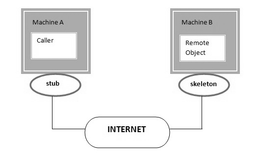

Java4 Features
==========

# RMI(1.1V)

RMI used to invoke methods which is running on one JVM from another JVM



>   stub and skeleton in RMI

**1. Stub**

The stub is an object, acts as a gateway for the client side.if we invokes
method on the stub object, it does the following tasks:

-   It **initiates a connection with remote Virtual Machine (JVM),**

-   It **writes and sends** (marshals) the parameters to the remote Virtual
    Machine (JVM),

-   It waits for the result

-   It **reads** (unmarshals) the **return value or exception**, and

**2. Skeleton:** The skeleton is an object, acts as a gateway for the server
side object. All the incoming requests are routed through it. When the skeleton
receives the incoming request, it does the following tasks:

-   It reads the parameter for the remote method

-   It invokes the method on the actual remote object, and

-   It writes and transmits (marshals) the result to the caller.

<br>

<u>Steps to Create Skeleton / Client</u>

1.  Create an **Interface by implementing Remote** interface with methods you
    want to share

2.  Create a **Class** by exctending UnicastRemoteObject & also implement above
    methods

3.  Create a **class to Share the Remote Class Object** over the Network


<u>1.Interface by implementing Remote</u>
```java
public interface RemoteInterface extends Remote {
public String show(String name);
}
```

<u>2.Class by exctending UnicastRemoteObject</u>
```java
public class RemoteClass extends UnicastRemoteObject implements RemoteInterface {
	protected RemoteClass() throws RemoteException {
		super();
	}
	@Override
	public String show(String name) {
		// TODO Auto-generated method stub
		return "Your Name Is : " + name;
	}
}
```

<u>3.Create a class to Share the Remote Class Object over the Network</u>
```java
public class RemoteObject {
public static void main(String[] args) throws RemoteException, MalformedURLException, AlreadyBoundException {
	RemoteInterface obj = new RemoteClass();
	Naming.rebind("obj",  obj);
 }
}
```


4.stub class - Client
```java
public class Client {
	public static void main(String args[]) throws Exception
RemoteInterface st=(RemoteInterface) Naming.lookup("rmi://"+args[0]+ "/obj");
		System.out.println(st.show("Satya"));
	}
}
```

# JDBC(1.1V)
We know it already.


# Assertions

Assert keyword is used to check the given statement is **TRUE or FALSE**

There are two types of using assert in our program
```java
1. assert (boolean expression);  				           //Simple assert
2. assert (boolean expression1) : (anytype expression2);  	//Agumented assert
```


Assertion is disabled by default. To enable we have to use **java –ea
classname** or **-enableassertions**

The main advantage of assert is for **DEBUGGING**. If we write s.o.p’s for
debugging after completion of code we have to munually remove the s.o.p’s. But
if we use assertions for debugging after completion of code we don’t need to
remove the code, just DISABLING assertion is enough.


<br>

<u>Simple assert</u>
```java
assert (boolean expression);
```
-   Here the Expression Should be **Boolean** type.

-   If expression is TRUE it wont return anything,

-   Otherwise it will throws **Runtime Exception** : **java.lang.AssertionError:
    Not valid**
```java
public class AssertDemo {
public static void main(String[] args) {
	int i = 100;
	assert (i>10);
	System.out.println(i); //100
}
}
```

If we give **int** i = 10; it will throws **java.lang.AssertionError: Not
valid**

<u>Agumented assert</u>
```java
assert (boolean expression1) : (anytype expression2);  	//Agumented assert
```


Expression2 is used to Disply some message along with Error Message

-   Here the 1st Expression Should be **Boolean** type, 2nd Expression can be
    **Any type**

-   If expression is TRUE it wont return anything,

-   Otherwise it will throws **Runtime Exception** : **java.lang.AssertionError:
    expression2**
```java
public class AssertDemo {
	public static void main(String[] args) {
		int i = 1;
		assert (i > 10) : "This is Anytype";
		System.out.println(i);
	}
}
Exception in thread "main" java.lang.AssertionError: This is Anytype
	at features.AssertDemo.main(AssertDemo.java:6)
```


- To ENABLE assertions we have to use **java –ea classname or –enableassertions**

- To DISABLE assertions we have to use **java –da classname or
–disableassertions**

- To ENABLE assertions in **ECLIPSE** File Run As Run Config.,>Vm args = -ea >
Save>Run


# RegExp 

**Java.util.regex** or Regular Expression is an API to **define pattern for
searching or manipulating strings.** It is widely used to define constraint on
strings such as **password and email validation.**

It provides following classes are widely used in java regular expression.

-   Pattern class -it represents the Complied pattern

-   Matcher class -used for performing matching operations on complied pattern

-   PatternSyntaxException - checks syntax error in a regular expression
    pattern.

**1. Pattern class** it represents the Complied pattern

| **Method**                                                        | **Description**                                              |
|-------------------------------------------------------------------|--------------------------------------------------------------|
| static Pattern **compile**(String regex)                          | Compiles the given regex and return the instance of pattern. |
| Matcher **matcher**(CharSequence input)                           | Retuns charsequence to be comapir with patten                |
| **static** boolean **matches(String regex, String CharSequence)** | Direcly we can compare Expression with Sequence              |
| **String pattern()**                                              | returns the regex pattern.                                   |

**2. Matcher class** -used for performing matching operations on complied
pattern

| **Method**              | **Description**                                                                 |
|-------------------------|---------------------------------------------------------------------------------|
| boolean **matches()**   | Test whether the regular expression matches the pattern.                        |
| boolean find()          | Finds the next expression that matches the pattern.                             |
| boolean find(int start) | Finds the next expression that matches the pattern from the given start number. |
| String group()          | Returns the matched subsequence.                                                |
| int start()             | Returns the starting index of the matched subsequence.                          |
| int end()               | Returns the ending index of the matched subsequence.                            |
| int groupCount()        | Returns the total number of the matched subsequence.                            |
```java
public class REDemo {
   public static void main(String[] args) {
	Pattern p = Pattern.compile(".a");// only 2 char end with a
	Matcher m = p.matcher("sa");
	boolean b1 = m.matches();
	System.out.println(b1);//TRUE

	boolean b2 = Pattern.matches("s.", "sa"); //only 2 char Start with s
	System.out.println(b2); //TRUE
	}
}
```


<br>

**1.Regex Character classes**

| **Character Class** | **Description**                                         |
|---------------------|---------------------------------------------------------|
| **[abc]**           | a, b, or c (simple class)                               |
| **[\^abc]**         | Any character except a, b, or c (negation)              |
| **[a-zA-Z]**        | a through z or A through Z, inclusive (range)           |
| **[a-d[m-p]]**      | a through d, or m through p: [a-dm-p] (union)           |
| **[a-z&&[def]]**    | d, e, or f (intersection)                               |
| **[a-z&&[\^bc]]**   | a through z, except for b and c: [ad-z] (subtraction)   |
| **[a-z&&[\^m-p]]**  | a through z, and not m through p: [a-lq-z](subtraction) |

**2.Regex Quantifiers**  
The quantifiers specify the number of occurrences of a character.

| **Regex**  | **Description**                                 |
|------------|-------------------------------------------------|
| **X?**     | X occurs once or not at all                     |
| **X+**     | X occurs once or more times                     |
| **X\***    | X occurs zero or more times                     |
| **X{n}**   | X occurs n times only                           |
| **X{n,}**  | X occurs n or more times                        |
| **X{y,z}** | X occurs at least y times but less than z times |

**3.Regex Metacharacters**  
The regular expression metacharacters work as a short codes.

| **Regex**   | **Description**                                         |
|-------------|---------------------------------------------------------|
| **. (dot)** | Any character (may or may not match terminator)         |
| **\d**     | Any digits, short of [0-9]                              |
| **\D**     | Any non-digit, short for [\^0-9]                        |
| **\s**     | Any whitespace character, short for [\\t\\n\\x0B\\f\\r] |
| **\S**     | Any non-whitespace character, short for [\^\\s]         |
| **\w**     | Any word character, short for [a-zA-Z_0-9]              |
| **\W**     | Any non-word character, short for [\^\\w]               |
| **\b**     | A word boundary                                         |
| **\B**     | A non word boundary                                     |

```java
public class REDemo {
	public static void main(String[] args) {
S.o.p("1.Regex Character classes\n--------------");
S.o.p(Pattern.matches("[amn]", "abcd"));//false (not a or m or n)  
S.o.p(Pattern.matches("[amn]", "a"));//true (among a or m or n)  S.o.p(Pattern.matches("[amn]", "ammmna"));//false(m &a morethan once)
		
S.o.p("\n2.Regex Quantifiers\n--------------");
S.o.p("? quantifier ....");  
S.o.p(Pattern.matches("[amn]?", "a"));//true (a or m or n comes one time)  
S.o.p(Pattern.matches("[amn]?", "aaa"));//false (a comes more than one time)  
S.o.p(Pattern.matches("[amn]?", "aammmnn"));//false (a m and n comes more than one time) 
		
S.o.p("+ quantifier ....");  
S.o.p(Pattern.matches("[amn]+", "a"));//true (a or m or n once or more times)  
S.o.p(Pattern.matches("[amn]+", "aaa"));//true (a comes more than one time)  
		
		
S.o.p("\n3.Regex Metacharacters\n--------------\n");
S.o.p(Pattern.matches("\\d", "abc"));//false (non-digit)  
S.o.p(Pattern.matches("\\d", "1"));//true (digit and comes once)  
S.o.p(Pattern.matches("\\d", "4443"));//false (digit but comes more than 1)  
	}
}
```


# Logging API

In common we use **System.out.println ()** statements for DEBUGGING. But these
are printed at console and they will lost after closing the Console.so these
results are not savable

To overcome these problems apache released **Log4j.** With Log4j we can store
the flow details of our Java/J2EE in a file or databases

We have mainly 3 components to work with Log4j

-   **Logger class -for printing LOG messages**

-   **Appender interface -to store messages in Files/Databases**

-   **Layout -which Fomate the message should Save(HTML,Text,etc)**

<br>

<u>1.Logger class</u>

-   Logger is a class, in org.apache.log4j.\*

-   We need to create **Logger object one per java class**,it will enables Log4j
    in our java class

-   Logger methods are used to generate log statements in a java class instead
    of sopls

-   So in order to get an object of Logger class, we need to call a **static
    factory method**

```java
static Logger log = Logger.getLogger(YourClassName.class.getName())
```


We have following methods to print debugging statements on Logger

1.  **log.debug (“ ")**

2.  **log.info (“")**

3.  **log.warn (“")**

4.  **log.error (“")**

5.  **log.fatal (“")**

Here **human identification purpose names are different**, all 5 methods will
print one text message only.

**Priority Order: debug < info < warn < error < fatal**


<u>2. Appender interface</u>  
Appender job is to write the messages into the **external file or database or
SMTP**In log4j we have different Appender implementation classes

-   **ConsoleAppende**r [ Writing into console ]

-   **FileAppender** [ writing into a file ]

-   **JDBCAppender** [ For Databases ]

-   **SMTPAppender** [sent logs via Mails ]

-   **SocketAppender** [ For remote storage ]

<u>3. Layout</u>  
This component specifies the format in which the log **statements are
 written into the destination** by the appender

-   **SimpleLayout**

-   **PatternLayout**

-   **HTMLLayout**

-   **XMLLayout**
```java
public class LogDemo {
public static void main(String[] args) {
	Logger logger = Logger.getLogger(LogDemo.class.getName());
	Layout layout = new SimpleLayout();
	Appender a = new ConsoleAppender(layout);
	logger.addAppender(a);

	logger.debug("Debug Message");
	logger.info("Info Message");
	logger.warn("Warning Message");
	logger.error("Error Message");
	logger.fatal("Fatal Message");	
}
}
```

In above Example we used **Layout, Appenders** programmatically which is NOT
RECOMMENDED.we have to use **log4j.properties** to configure those.
```java
Log4j.properties Structure
---------------------------------------
log4j.rootLogger=DEBUG, CONSOLE, LOGFILE
log4j.appender.CONSOLE=
log4j.appender.CONSOLE.layout=
log4j.appender.CONSOLE.layout.ConversionPattern=
log4j.appender.LOGFILE=
log4j.appender.LOGFILE.File=
log4j.appender.LOGFILE.MaxFileSize=
log4j.appender.LOGFILE.layout=
log4j.appender.LOGFILE.layout.ConversionPattern=
```

- If we use .properties file, we **no need to import any related classes** into our java class

- if we wrote **log4j.rootLogger = WARN,abc** then it will prints the messages in l.warn(), l.error(), l.fatal() and ignores l.debug(), l.info(). Means Warn level only it prints

>Make sure LOG file should be placed in /src Folder

<br>

<u>Example programe to Store LOG’s in a FILE</u>
```java
public class LogDemo {
	static Logger logger = Logger.getLogger(LogDemo.class.getName());
	public static void main(String[] args) {
		logger.debug("Debug Message");
		logger.info("Info Message");
		logger.warn("Warning Message");
		logger.error("Error Message");
		logger.fatal("Fatal Message");
	}
}
```

**Log4j.properties**  
```java
log4j.rootLogger = DEBUG,abc
log4j.appender.abc = org.apache.log4j.FileAppender
log4j.appender.abc.file = logfile.log
log4j.appender.abc.layout = org.apache.log4j.SimpleLayout
```


**logfile.log**
```java
DEBUG - Debug Message
INFO - Info Message
WARN - Warning Message
ERROR - Error Message
FATAL - Fatal Message
```


The above example only saves log’s to file. You can’t see logs on console .if
want both use below. Use same java program, but change log4j.properties file

<br>

**log4j.properties in Real world Applications**
```java
log4j.rootLogger=DEBUG,CONSOLE,LOGFILE
log4j.appender.CONSOLE=org.apache.log4j.ConsoleAppender
log4j.appender.CONSOLE.layout=org.apache.log4j.PatternLayout
log4j.appender.CONSOLE.layout.ConversionPattern=%-4r [%t] %-5p %c %x – %m%n
log4j.appender.LOGFILE=org.apache.log4j.RollingFileAppender
log4j.appender.LOGFILE.File=logfile.log
log4j.appender.LOGFILE.MaxFileSize=1kb
log4j.appender.LOGFILE.layout=org.apache.log4j.PatternLayout
log4j.appender.LOGFILE.layout.ConversionPattern=[%t] %-5p %c %d{dd/MM/yyyy HH:mm:ss} – %m%n
[main] DEBUG log.LogDemo 15/09/2016 19:23:38 â?? Debug Message
[main] INFO  log.LogDemo 15/09/2016 19:23:38 â?? Info Message
[main] WARN  log.LogDemo 15/09/2016 19:23:38 â?? Warning Message
[main] ERROR log.LogDemo 15/09/2016 19:23:38 â?? Error Message
[main] FATAL log.LogDemo 15/09/2016 19:23:38 â?? Fatal Message
```
