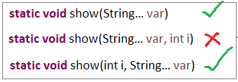
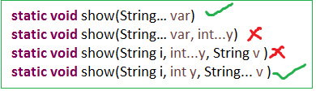
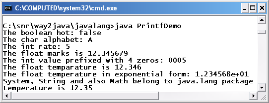

Java5 Features(2005)
================

# Annotations

Java **Annotation** is a tag that represents the *metadata* i.e. attached with
class, interface, methods or fields to indicate some additional information
which can be used by java compiler and JVM.

Annotations have a number of uses, among them:

-   **Information for the compiler** — Annotations can be used by the compiler
    to detect errors or suppress warnings.

-   **Compile-time and deployment-time processing** — Software tools can process
    annotation information to generate code, XML files, and so forth.

-   **Runtime processing** — Some annotations are available to be examined at
    runtime

The annotation can include *elements*, which can be named or unnamed, and there
are values for those elements:
```java
@Author(
   name = "Benjamin Franklin",
   date = "3/27/2003"
)
class MyClass() { ... }
```

<br>

If there **is just one element** named value, then the name can be omitted, as
in:
```java
@SuppressWarnings("unchecked")
void myMethod() { ... }
```

<br>

If the annotation has no elements, then the parentheses can be omitted
```java
example  : @Override
```

<br>

It is also possible to use multiple annotations on the same declaration:
```java
@Author(name = "Jane Doe")
@EBook
class MyClass { ... }
```

<br>

If the annotations have the same type, then this is called a repeating
annotation Repeating annotations are supported as of the Java SE 8 release.
```java
@Author(name = "Jane Doe")
@Author(name = "John Smith")
class MyClass { ... }
```
<br>

**Java Custom annotations** or Java User-defined annotations are easy to create
and use. The *@interface* element is used to declare an annotation.

-   Method should **not have any throws clauses**

-   Method should **return something**

-   Method **should not have any parameter**.

-   It **may assign a default value to the method.**
```java
@interface MyAnnotation{  
int value() default 0;  
}
```


<u>Example</u>  
Suppose Every class in a given Project should contain author info. Writing
Author info in each every class is deficult like below
```java
public class GenrateWorkSheet extends DataList {

   // Author: John Doe
   // Date: 3/17/2002
   // Current revision: 6
   // Last modified: 4/12/2004
   // By: Jane Doe
   // Reviewers: Alice, Bill, Cindy

   // class code goes here

}
```

By Using Annotation we can provide above information.for doing this we need to
create an annotation & all properties should define using methods.
```java
@interface ClassPreamble {
   String author();
   String date();
   int currentRevision() default 1;
   String lastModified() default "N/A";
   String lastModifiedBy() default "N/A";
   // Note use of array
   String[] reviewers();
}
```

Once annotation reday, you can write that annotation top of the each class with
values
```java
@ClassPreamble (
   author = "John Doe",
   date = "3/17/2002",
   currentRevision = 6,
   lastModified = "4/12/2004",
   lastModifiedBy = "Jane Doe",
   // Note array notation
   reviewers = {"Alice", "Bob", "Cindy"}
)
public class Generation3List extends Generation2List {
// class code goes here

}
```


# Autoboxing

The automatic conversion of primitive data types into its equivalent Wrapper
type is known as boxing and opposite operation is known as unboxing.

Upto JDK 1.4, all the data structures of Java stores only objects and when
retrieved returns objects. Autoboxing permits to store data types directly in DS
and retrieve back data types.

If a **method(remember only method – not direct)** requires Integer Object
value, we can directly pass primitive value without issue. Autoboxing will take
care about these.

We can also do direct initializations (1.8 V)
```java
Integer i = 10;// it will create Integer value of 10 using Autoboxing
int j = i;// ;// it will convert Integer to int using Autoboxing
```


Previously it shows
```java
Integer i = 10;// it will create Integer value of 10 using Autoboxing
int j = i;//But we cant assign int to Integer Type mismatch: cannot convert from Integer to int
```

<br>


# Generics

Generics are introduced in Java 1.5 Version to solve **Type-safity** &
**Type-casting** problems
```java
public class Student {
	public static void main(String[] args) {
		ArrayList l = new ArrayList(); //1>
		l.add("Satya");
		String s = (String) l.get(0); //2
		System.out.println(s);
	}
}
```

-   At **line 1.** ArrayList is **NOT generic** type – so we can add any type of
    elements results **Type-Safety**

-   At **line 2.** It returns added String data as Object. So manually we have
    to **Type-cast to String**

> To resolve above problems Generics are introduced
```java
public class Student {
	public static void main(String[] args) {
		ArrayList<String> l = new ArrayList<String>(); // 1
		l.add("Satya");
		String s = l.get(0); // 2
		System.out.println(s);
	}
}
```

Generics solves ClassCastException, beacause TYPE-CHECKING done at COMPILE-TIME
itself

<br>

**Generics can be used in following areas**

-   *Class level*

-   *Interface level*

-   *Constructor level.*

-   *Method level*


<u>Sample Generic class</u>
```java
class SmlGen<T> {
	T obj;

	void add(T obj) {
		this.obj = obj;
	}
	T get() {
		return obj;
	}
}
```

The **<T>** indicates that it can refer to any type (like String, Integer, and
Student etc.). The type you specify for the class, will be used to store and
retrieve the data


<u>1.Type Parameter<T> Naming Conventions</u>  
In above <T> refers any type. Similary we have to follow below naming
convensions to where to use which Naming conevsions. It improves readability.
These are NOT compulsory but recommended to use

1.  **T – Type - Any Type, can be use any level (Class, Interface, Methods...)**

2.  **N – Number - Indicates it allows Number Types (int,long,float etec)**

3.  **E – Element - Exclusively used in Collection (ArrayList<E>)**

4.  **K – Key - Map KEY area**

5.  **V – Value - Map Value area**

6.  **S,U,V etc. - 2nd, 3rd, 4th types**

<br>

**1. Generics at Class /Method /Constructor level**  
A generic class is defined with the following format.
```java
class SmlGen<T> {				//1.Class Level
	T obj;
	public SmlGen() {
			}

	public SmlGen(T obj) {		//2.Constrcutor Level
		this.obj = obj;
	}

	void add(T obj) {
		this.obj = obj;
	}

	T get() {				//3.Method Level
		return obj;
	}
}

public class Student {
	public static void main(String[] args) {
		SmlGen<String> s = new SmlGen<String>();
		s.add("Satya");
		System.out.println(s.get());
	}
}
```

**2. Generics at Interface level**

A generic interface is same as gereric class.
```java
public interface List<T> extends Collection<T> {
...
}
```
<br>


### Wildcard in Generics

**?** Operator is used to represents wildcards in generics. We have to types of
Wildcards

1.  **Unbounded wildcards**

2.  **Bounded wildcards**

**1. Unbounded wildcards**  
Unbounded wildcard looks like <?> - means the generic can be any type.it is
not bounded with any type.

**2. Bounded wildcards**  
<? extends T> and <? super T> are examples of bounded wildcards

<? extends T> : means it can accept the **Child class Objects of the
type<T>**

<? super T> : means it can accept the **Partent class Objects of the
type<T>**

<br>

# Covariant Return Type (Java 5)

Before Java5, it was not possible to override any method by changing the return
type. But now, since Java5, it is possible to override method by changing the
return type if subclass overrides any method whose return type is Non-Primitive
but it changes its return type to subclass type.

###### Enhanced for loop

-   For-each loop introduced in **Java 1.5 version as an enhancement of
    traditional for-loop**

-   Main advantage is we **don’t need to write extra code** traverse over array
    / collections

-   Mainly used for traverse on **Array Elements & Collection Elements**
```java
for (Datatype temp_variable : Array/Collection Variable){}
```
<br>

<u>1.for-each loop on Array Elements</u>
```java
public class Foreach {
	public static void main(String[] args) {
	int i[] = { 1, 2, 3, 4, 5, 6, 7, 8, 9, 10 };
		for (int b : i) {
			System.out.print(b+", ");
		}
	}
}
1, 2, 3, 4, 5, 6, 7, 8, 9, 10,
```

<u>2.for-each loop on Collection Elements</u>
```java
public class Foreach {
	public static void main(String[] args) {
		ArrayList<String> l = new ArrayList<String>();
		l.add("A");
		l.add("B");
		l.add("C");
		l.add("D");
		l.add("E");
		for (String s : l) {
			System.out.print(s + ",");
		}
	}
}
A, B, C, D, E
```

<br>

# Varargs

Some times we don’t know no.of arguments used in our method
implementation.var…args are introduced in 1.5v to solve these type of situations  

`static returntype methodname(Datatype … variblename)`

```java
public class Varargs {
	static void show(String… var) {
		System.out.println(“Show() called");
	}
	public static void main(String[] args) {
		Varargs v = new Varargs();
		v.show();
		v.show(“A");
		v.show(“A", “B", “C");
	}
}
Show() called
Show() called
Show() called
```


<u>Rules for using Var-args</u>  
**1. Var-args must be as the last argument in method signature**


**2**. **Only one Var-arg is allowed per a Method**



<br>

# Enums

Enum in java is a data type that contains fixed set of constants.

-   enums improves **type safety**

-   easily used in **switch**

-   enum can be traversed

-   enum class is a just like normal class, we can write FIELDS, Constrcutors,
    Methods in enum class

-   enum **CANNOT extend any class** because it internally extends Enum class

-   enum may **implement many interfaces**

> ALL fields in Enums by Default **PUBLIC STATIC FINAL**


1.Simple ENUM Example
```java
enum Days {
	MONDAY, TUESDAY, WEDNESDAY, THURSDAY, FRIDAY, SATURDAY, SUNDAY
}

public class EnumDemo {
	public static void main(String[] args) {
		for (Days s : Days.values()) {
			System.out.print(s + ",");
		}
	}
}
MONDAY, TUESDAY, WEDNESDAY, THURSDAY, FRIDAY, SATURDAY, SUNDAY,
```


**2.Enum with Values**

To write Enum with values we have to follow below steps

-   Enum values must be placed inside ( ) *MONDAY(1)*

-   Take public instance variable to Store enum value *public int Enum_Value;*

-   Write **private constructor** which can take enum value as argument
    **private Days(int Enu_Val)**

```java
enum Days {
MONDAY(1), TUESDAY(2), WEDNESDAY(3), THURSDAY(4), FRIDAY(5), SATURDAY(6), SUNDAY(7);
	public int Enum_Value;
	private Days(int Enum_Value) {
		this.Enum_Value = Enum_Value;
	}
}
public class EnumDemo {
	public static void main(String[] args) {
		for (Days s : Days.values()) {
			System.out.println(s + ":"+s.Enum_Value);
		}
	}
}
MONDAY	:1,  TUESDAY:2,  WEDNESDAY:3,  THURSDAY	:4,  FRIDAY:5,  SATURDAY:6  SUNDAY:7
```

<br>

# Static imports

The static import feature of Java 5 facilitate the java programmer to access any
static member of a class directly. There is no need to qualify it by the class
name.

From 1.5 version onwords we can access any static member of a class directly.
There is no need to qualify it by the class name.
```java
import static java.lang.System.*;

public class StaticImport {
	public static void main(String[] args) {
		out.println("Static Import");
	}
}
```

<br>

# C-lang printf()

**printf()** is an extra method added to **PrintStream** class from JDK 1.5
version. **printf()** is used to print at command-prompt
```java
public class PrintfDemo
{
  public static void main(String args[])
  {
    boolean hot = false;
    char alphabet = 'A';
    int rate = 5;
    float temperature = 12.3456789f;

    System.out.printf("The boolean hot: %b", hot);      // place holder b for boolean
    System.out.printf("\nThe char alphabet: %c", alphabet);                // c for char                
    System.out.printf("\nThe int rate: %d", rate);                         // d for int
    System.out.printf("\nThe float marks is %f", temperature);             // f for float
    System.out.printf("\n value prefixed with 4 zeros: %04d", rate);// filling with zeros
    System.out.printf("\float temp %.3f", temperature); // precision to three decimal values
    System.out.printf("\nThe float temperature in exponential form: %e", temperature);
    System.out.printf("\n%s, %s and also %s belong to java.lang package", "System","String","Math");
    System.out.printf("\ntemperature is %4.2f", temperature); // width is 4 and precision to 2 decimal points
  }
}
```



> Java6 does not have many features

