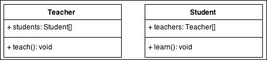
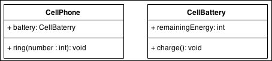
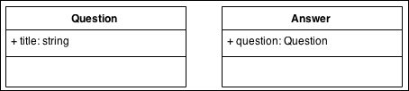

Inheritance
==============

###### 1.IS-A Relationship

-   Also known as **‘Inheritance’.**

-   By using **extends** keyword we can implement inheritance.

-   The main advantage is re-usability.

    ```java
    class P {
    	public void m1() {
     System.out.println("Parent method");
    	}
    }
    
    class C extends P {
    	public void m1() {
     System.out.println("Child method");
    	}
    }
    public class Test {
    public static void main(String[] args) {
     C p = new C();
     p.m1();
    	}
    }
    -----------------------
    Child method
    ```

-   Every java class is a direct Child class of ‘Object’ class
    ```java
    Object
      |
    Class A
    ```


-   If our java class extends any other class, then it is indirect child class
    of Object
    ```java
    Object
           |    
       Class B
           |
    Class A extends B
    ```


-   Cyclic inheritance is not allowed in java
    ```java
    class A extends B{ 
     
    }
    
    class B extends A{
    	
    }
    ------------------------
    Test.java:3: error: cyclic inheritance involving A
    class A extends B{
    ^
    1 error
    ```
<br>

###### 2.Has-A Relationship

Has-a relationship is one in which an **object of one class is created as a data
member in another class**.
```java
class Student
{
  int sno;
  String name;
  Address address; 
}
```
<br>


###### 3.Uses-A Relationship

Uses-a relationship is one in which an **Object of one class is created inside a
method of another class.**
```java
class Student {
	int sno;
	String name;

	public static void main(String[] args) {
 Address address = new Address();
	}
}
```
<br>

[Association, Aggregation and
Composition?]($)

**Association**: We call association those relationships whose objects have
an independent lifecycle and where there is **no ownership between the
objects**.

Let’s take an example of a teacher and student. Multiple students can associate
with a single teacher, and a single student can associate with multiple
teachers, but both have their own lifecycles (both can be create and delete
independently); **so when a teacher leaves the school, we don’t need to delete
any students, and when a student leaves the school, we don’t need to delete any
teachers**.



**Aggregation:** We call aggregation those relationships whose objects have an
**independent lifecycle, but there is ownership**, and child objects cannot
belong to another parent object.

Let’s take an example of a cell phone and a cell phone battery. A single battery
can belong to a phone, but if the phone stops working, and we delete it from our
database, the phone battery will not be deleted because it may still be
functional. So in aggregation, while there is ownership, objects have their own
lifecycle.



**Composition:** We use the term composition to refer to relationships whose
**objects don’t have an independent lifecycle**, and if the parent object is
deleted, all child objects will also be deleted.

Let’s take an example of the relationship between questions and answers. Single
questions can have multiple answers, and answers cannot belong to multiple
questions. If we delete questions, answers will automatically be deleted.



<br>

# Overloading

Two methods are said to be overloaded, iff the method names are same, but
arguments are different.
```java
class Test {
	public void m1() {
 System.out.println("no-args");
	}
	public void m1(int i) {
 System.out.println("int-args");
	}
	public void m1(double d) {
 System.out.println("double-args");
	}

	public static void main(String[] args) {
 Test t = new Test();
 t.m1();
 t.m1(10);
 t.m1(10.5f); // Pramoted to next level
	}
}

no-args
int-args
double-args
```


The overloading method resolution is the responsibility of compiler based on
reference type and method arguments. Hence overloading is considered as
**compile-time polymorphism**

-   In the case of overloading if there is no method with the required argument
    then the compiler won’t raise immediately compile time error. First it will
    promote arguments to next level and checks is there any matched method with
    promoted arguments, if there is no such method compiler will promote the
    argument to the next level and checks for the matched method. After all
    possible promotions still the compiler unable to find the matched method
    then it raises compile time error.

-   In the case of overloading the more specific version will get the chance
    first. If Specfific version is not avaible **Child version will get more
    priotity than Parent version**
    ```java
    class Test {
    	public void m1(String s) {
     System.out.println("String Version");
    	}
    
    	public void m1(Object o) {
     System.out.println("Object Version");
    	}
    
    	public static void main(String arg[]) {
     Test t = new Test();
     t.m1("raju"); // String Version
     t.m1(new Object());// Object Version
     t.m1(null); // String(child) ' Object(parent)
    	}
    }
    -----------------------------------
    String Version
    Object Version
    String Version
    ```


-   In case of Same level of Child classes available, it will **thows Abiguty error**
      ```java
    class Test {
    	public void m1(String s) {
     System.out.println("String Version");
    	}
    	public void m1(StringBuffer o) {
     System.out.println("StringBuffer Version");
    	}
    	public static void main(String arg[]) {
     Test t = new Test();
     t.m1("raju"); // String Version
     t.m1(null); // Ambiguty Version  
    	}
    }
    ----
    Test.java:13: error: reference to m1 is ambiguous
                    t.m1(null); // Ambiguty Version
                     ^
      both method m1(String) in Test and method m1(StringBuffer) in Test match: 1 error
    ```
  


-   var-arg method will always get least priority i.e if no other method matched
    then only var-arg method will get chance for execution

<br>

# Overriding

If the child class is not satisfied with the parent class implementation then
the child is allowed to overwrite that parent class method to provide it’s own
specific implementation, this concept is nothing but **-overriding".**

**Rules**

**1.Only inherited methods can be overridden.**

<br>

**2.Final and static methods cannot be overridden.**

[private](http://java67.blogspot.sg/2012/08/can-we-override-private-method-in-java.html), [static](http://java67.blogspot.sg/2012/08/can-we-override-static-method-in-java.html) and [final
method](http://javarevisited.blogspot.sg/2011/12/final-variable-method-class-java.html) can
not be overridden in Java. By the way, **you can hide private and static
method** but trying to override final method will result in compile time error
"**Cannot override the final method from a class**"
 ```java
case1:
----------------------
class P {
public final void m1(){
System.out.println("m1");
  }
}
class Test extends P {
public	void m1() {
  }
}
------------------------
Test.java:8: error: m1() in Test cannot override m1() in P
        public  void m1(){
                     ^
  overridden method is final
1 error


case2:
----------------------
class P {
	public static void m1(){ System.out.println("m1");
	}
}
class Test extends P {
	public void m1(){	
	 }
}
---------Output---------
Test.java:8: error: m1() in Test cannot override m1() in P
        public  void m1(){
                     ^
  overridden method is static
1 error


case3:
----------------------
class P {
	private void m1(){ 
	System.out.println("m1");	
	    }
}
class Test extends P {
public static void main(String a[]){
Test ob = new Test();
Ob.show(); 
  }
}
---------Output---------
Demo.java:14: error: cannot find symbol
 ob.show();
  symbol:   method show()
  show() method not visble to Test class
1 error
```

 
 
 <br>
 

**3: The overriding method must have same return type (or Child
type/subtype/Covariant).**
```java
class P{
	public Object m1(){
 return null;	
	}
}
class Test extends P {
	public String m1(){
 return null;
	 }
}
```
<br>


**4**. **The overriding method must not have lesser access modifier.**
```java
class P{
	public String m1(){
 return null;	
	}
}
class Test extends P{
	protected  String m1(){
 return null;
	 }
}
Test.java:8: error: m1() in Test cannot override m1() in P
        protected String m1(){
                          ^
  attempting to assign weaker access privileges; was public
1 error
```
<br>


**5**. **The overriding method must not throw new or broader
CheckedExceptions.It can have allowed to throw Child Exceptions or remove throws
keyword from method signature.**
```java
class P{
	public String  m1() throws IOException{
 return null;	
	}
}
class Test extends P{
	public String m1() throws Exception{
 return null;
	 }
}
Test.java:10: error: m1() in Test cannot override m1() in P
        public String m1() throws Exception{
                      ^
  overridden method does not throw Exception : 1 error
```

<br>


# Confusing Cases

-   final method can’t be overridden in child classes. Private methods are not
    visible in the child classes. Hence they won’t participate in overriding.
    Based on our requirement we can take exactly same declaration in child
    class, But It is not overriding.

-   A static method can’t be overridden as non-static , and a non-static method
    can’t be overridden as static method

-   If both parent and child class methods are static, then there is no compile
    time error or run time error it seems that overriding is happened but it is
    not overriding this concept is called -method hiding". All the rules of
    method hiding are exactly similar to overriding, except both methods
    declared as static.

-   In the case of method hiding method resolution will take care by compiler
    based on reference type(But not runtime object).

-   Overriding concept is not applicable for variables. And it is applicable
    only for methods. Variable resolution always takes care by compiler based on
    reference type  

```java
class P {
	int i = 888;
}
class C extends P {
	int i = 999;
}
class Test {
  public static void main(String arg[]) {
     // Case1:
     P p = new P();
     System.out.println(p.i); // 888
    
     // Case2:
     C c = new C();
     System.out.println(c.i); // 999
    
     // Case3:
     P p1 = new C();
     System.out.println(p1.i); // 888
  }
}
```
