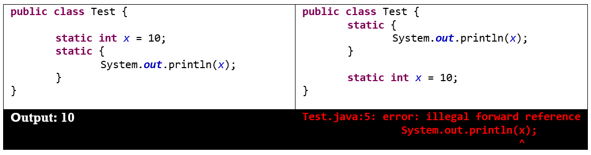
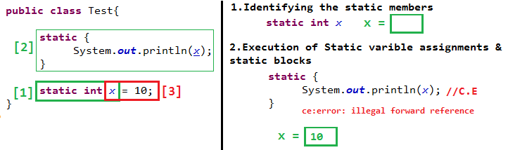

Static & Instance Control flows
==================================

## static Blocks

If we want to perform some activity at the time of class loading, Then we should
define that activity at static blocks because these (static blocks) will execute
at the time of class loading only.

We have to load native libraries at the time of class loading. Hence we have to
define this activity inside the “*static block*".
```java
class Native
{
static
{
System.loadLibrary("native Library path");
}
}
```


### Static Control Flow

whenever child class being loaded automatically its parent classes will be
loaded

1.  **Identifying the static members** from parent to child (top to bottom).

2.  Execution of **static variable assignments & static blocks** from parent to
    child.

3.  Execution of child class main method

During these phases there is one such state called RIWO(Read Indirectly Write
Only) for a static variable.  
<br>

<u>Read Indirectly Write Only(Read should Indirect & Write is allowd anyway)</u>

If a variable is RIWO state , we can’t perform Read operation Directly, if we
try to do that it will throw Compiletime Error : **illegal forward reference**



To resolve this, instead of direct read, we should go for indirect read. Line
use method in-between.
```java
public class Test{
	static {
		m1();
	}
	static void m1(){
		System.out.println(x);
	}
	static int x = 10;
}
Output : 0
```
class's static default initialization normally happens immediately before the
first time one of the following events occur:

-   an instance of the class is created,

-   a static method of the class is invoked,(this is in above case)

-   a static field of the class is assigned,

-   a non-constant static field is used

<br>

#### <u>Static Control flow example</u>
```java
class Base {
	static int x = 10;

	static {
		m1(); // a static method of the class is invoked so, y=[0]
		System.out.println("Base Class : static block");
	}
	
public static void main(String[] args) {
		m1();
		System.out.println("Base Class : Main method");
	}	

public static void m1() {
		{
			System.out.println("y ==>" + y);
		}
	}
	static int y = 20;
}

class Derived extends Base {
	static int i = 100;

	static {
		m2();
		System.out.println("Derived Class : Static block");
	}

	public static void main(String[] args) {
		m2();
		System.out.println("Derived Class : Main method");
	}

	public static void m2() {
		System.out.println("j ==> " + j);
	}

	static {
		System.out.println("Derived Class : Static block at the end");
	}
	static int j = 200;
}
========================================
C:\Users\src\main\java>java Base
y ==>0
Base Class : static block
y ==>20
Base Class : Main method

C:\Users\src\main\java>java Derived
y ==>0
Base Class : static block
j ==> 0
Derived Class : Static block
Derived Class : Static block at the end
j ==> 200
Derived Class : Main method
```

<br>

## Instance Control flow example

static control flow is only one-time activity and it will be performed at the
time of class loading but instance control flow is not one-time activity for
every object creation it will be executed. 

Whene**ver we care trying to create child class object**, the following events
will be performed automatically**.(Remember , here we are creating Child class
Object in the main)**

**1.Identification of instance members from parent to child (top to bottom).**

**2.Parent Class**

-   Execution of instance variables assignments and instance blocks only in
    parent class.

-   Execution of parent class constructor.

**3.Child Class**

-   Execution of instance variables assignments and instance blocks only in
    child class.

-   Execution of child class constructor. 

All static initializers are executed in textual order in which they appear, and
execute before any instance initializers.
```java
class Parent {
	int i = 10;
	{
		System.out.println("First parent Instance block");
	}
	Parent() {
		m1();
		System.out.println("Parent Constructor");
	}
	public static void main(String[] args) {
		Parent p = new Parent();
		System.out.println(" parent main");
	}
	public void m1() {
		System.out.println(j);
	}
	static {
		System.out.println("parent static block");
	}

	int j = 20;
}

class Child extends Parent {
	int x = 20;

	{
		m2();
		System.out.println("First child Instance block");
	}

	Child() {
		System.out.println("Child Constructor");
	}

	public static void main(String[] args) {
		Child c = new Child();
		System.out.println(" Child main");
	}

	public void m2() {
		System.out.println(y);
	}

	{
		System.out.println("Second child instance block");
	}

	int y = 200;
}
--------------------------------
C:\Users\kaveti_S\Downloads\JUnitHelloWorld\src\main\java>java Parent
parent static block
First parent Instance block
20
Parent Constructor
parent main

C:\Users\kaveti_S\Downloads\JUnitHelloWorld\src\main\java>java Child
parent static block
First parent Instance block
20
Parent Constructor
0
First child Instance block
Second child instance block
Child Constructor
Child main
```

<br>


**If child class object is not created then Output is**
```java
E:\Users\Kaveti_S\Desktop\Codes\NotepadExamples>java Child
parent static block
 Child main
```

<br>

## Combining Both

> **1.First Static – Only once**


**1.Identification of static & instance members from parent to child (top to
bottom).**

**2.** Execution **of static variable assignments & static blocks** from parent
to child.

> **Second - Instance**


**3.Parent Class**

-   Execution of instance variables assignments and instance blocks only in
    parent class.

-   Execution of parent class constructor.

**4.Child Class**

-   Execution of instance variables assignments and instance blocks only in
    child class.

-   Execution of child class constructor. 
