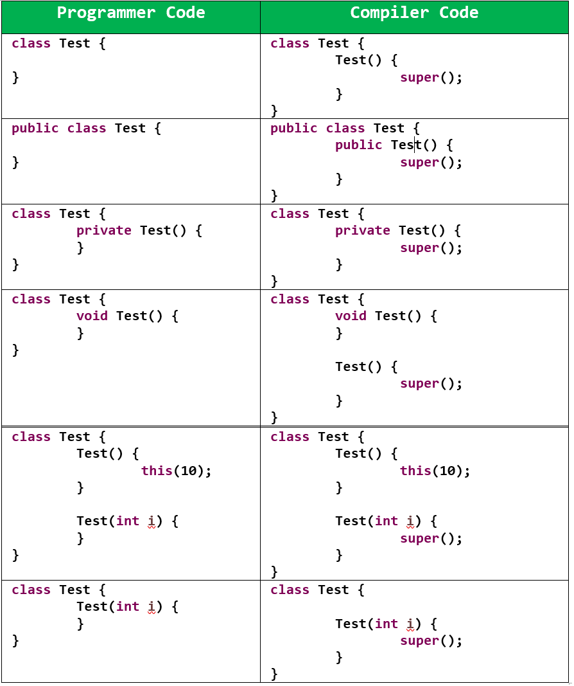
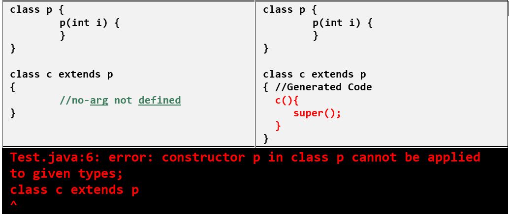

Constructor
==============

At the time of Object Creation some peace of code will execute automatically to
perform initialization that peace of code is nothing but “*Constructor*". Hence
the main Objective of constructor is to perform initialization.

**<u>Rules for writing Constructor</u>**

-   The name of the constructor and name of the class must be same.

-   The only allowed modifiers for the constructors are **public, private,protected, <default>.** If we are using any other modifier we will get **C.E(Compiler Error).**
    ```java
    class Test
    {
    static Test(){
    ----
    }
    }
    C.E:- modifier static not allowed here.
    ```

    
-   return type is not allowed for the constructors even void also. If we are
    declaring return type, then the compiler treats it as a method and hence
    there is no C.E and R.E(RuntimeError).

    ```java
    class Test
    {
    void Test(){
    System.out.println("Hai .....");
    }
    public static void main(String arg[]){
    Test t = new Test();
    }
    }
    ```


-   If we are not writing any constructor, then the compiler always **generate default constructor**.

-   If we are writing at least one constructor, then **the compiler won’t
    generate any constructor**. Hence every class contains either programmer
    written constructor or compiler generated default constructor but not both
    simultaneously.
    


-   **super() & this() in constructor**

    -   we should use as first statement in constructor.
    
    -   We can use either super or this but not both simultaneously.
    
    -   we can invoke a constructor directly from another constructor only

-   Inheritance concept is not applicable for constructor, so overriding is also
    not applicable

-   Recursive Constructor invocation leads to Compile-time Exception.
    ```java
    class Test {
    	Test() {
    		this(10);
    	}
    
    	Test(int i) {
    		this();
    	}	 
    }
    Test.java:6: error: recursive constructor invocation
            Test(int i) {
            ^
    1 error
    ```


-   whenever we are writing parameterized constructor, it is recomended to
    provide no-arument constructor as well. If parent class contains
    parameterized constructor, then while writing child class constructor we
    should take a bit care
    


-   If the parent class constructor throws **checked exception**, Compulsory the
    child class constructor should throw the same checked exception or it’s
    parent other wise we will get compile time error
    ```java
    class p {
    	p() throws IOException {
    	}
    }
    
    class c extends p {
    	c() {
    		super();
    	}
    }
    Test.java:10: error: unreported exception IOException; must be caught or declared to be thrown
                    super();
                         ^
    ```


-   If the parent class constructor throws **unchecked exception,** then child
    class constructor **not required to throw that exception.**
