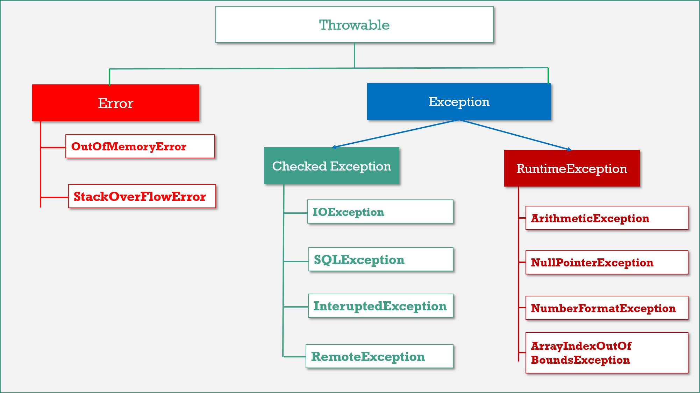

Exception Hierarchy
======================



**Throwable** is the parent of entire java exception hierarchy. It has 2 child
classes

1.  **Exception.**

2.  **Error**.

### 1.Exception

These are recoverable. Most of the cases exceptions are raised due to program
code only.

**Checked Exceptions:** They Cheeked by Compiler, they will check that the given
resource is existed or not, they are usually occur interacting with outside
resources/ network resources e.g. database problems, network connection errors,
missing files etc. **Java forces you to handle these error scenarios in some
manner in your application code**

**Unchecked Exceptions:** occurrences of which are not checked by the compiler
like coding, initialization, Primitive data errors. They usually result of bad
code in your system.**Runtimeexception** and its child classes, **Error** and
it’s child classes are considered as unchecked exceptions and all the remaining
considered as checked

<br>

### 2.Error

Errors are non-recoverable. Most of the cases errors are due to lack of system
resources but not due to our programs.  
**JVM +Memory+ OS level issues. OutofMemory, StatckOverFlow**

**Partially Checked Vs Fully Checked**  
A checked exception is said to be fully checked iff all its child classes also
checked.  
**Ex: - IOException.**

A checked exception is said to be partially checked if some of it’s child
classes are not checked.  
**Ex: - Exception, Throwable.**

<br>

> Number of ways to find details of the exception


<u>1.Using an object of java.lang.Exception</u>
```java
try
{
int x=Integer.parseInt ("10x");
}
catch (Exception e)
{
   System.out.println (e); // java.lang.NumberFormatException : for input string 10x
} 				name of the exception	   ||  nature of the message
```


<u>2.Using printStackTrace method</u>
```java
e.printStackTrace (); // java.lang.ArithmeticException : / by zero : at line no: 4
                 name of the exception         || nature of the message || line number
```


<u>3.Using getMessage method**:</u>  
```java
System.out.println (e.getMessage ()); // / by zero
                 nature of the message
```

