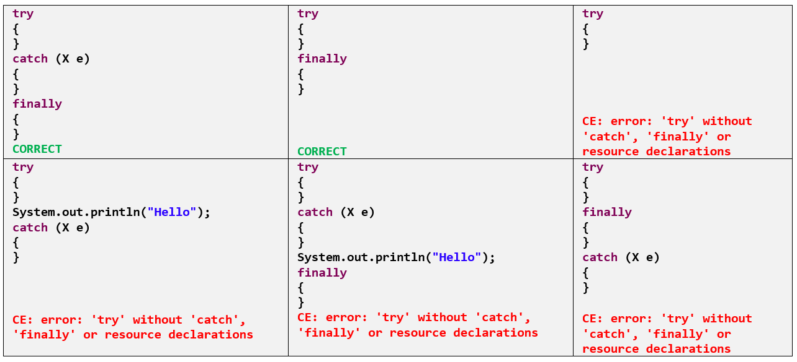

try, catch, finally 
=======================

-   We have to place the risky code inside the try block and the corresponding
    exception handling code inside catch block.
    ```java
    --------------------------------
    Without try-catch
    --------------------------------
    class Test {
     public static void main(String arg[]) {
       System.out.println("Statement 1");
       System.out.println(10 / 0);
       System.out.println("Statement 2");
       }
     }
     Statement 1
     Exception in thread "main" java.lang.ArithmeticException: / by zero

    ---------------------------------
    With try-catch
    --------------------------------
    class Test {
      public static void main(String arg[])
       {
          System.out.println("Statement 1");
       try {
          System.out.println(10 / 0);
       }
            catch (ArithmeticException e) 
            {
          System.out.println(10 / 2);
       }
       System.out.println("Statement 2");
       }
    }
    Statement 1
    5
    Statement 2

    ```


    

-   In the case of try with multiple catch blocks the order of catch blocks is
    important. And it should be from child to parent, otherwise Compiler Error.
    Saying Exception xxx has already been caught.

-   If there is no chance of raising an exception in try statement, then we are
    not allowed to maintain catch block for that exception. If we do so,
    violation leads to compile time error. but this rule is applicable only for
    fully checked exceptions.
    ```java
    class Test {
    	public static void main(String arg[]) {
    		try {
    			System.out.println("Hi");
    		} catch (IOException e) {
    		}
    	}
    }
    Test.java:7: error: exception IOException is never thrown in body of corresponding try statement
                    } catch (IOException e) {
    ```


-   It is not recommended to maintain cleanup code with in the catch block.
    because there is no guaranty of execution of particular catch block.

-   finally block should always execute irrespective of whether the exception is
    raised or not and handled or not handled.

-   The finally block won’t be executed ,if the system itself exists(JVM
    shutdown) i.e in the case of System.exit() finally block won’t be executed.

<br>

**Possible combinations of try, catch, finally**

```java
class Demo {
	public static void main(String arg[]) {

		try{			
			statement1;
			statement2;
			statement3;					

		} catch (Exception e) 
		{
			statement4;
		} finally 
		{
			statement5;
		}
		statement6;
	}
}
```


-   if there is no exception, then the statements **1, 2, 3, 5, 6** will execute
    with normal termination.

-   if an exception raised at **statement-2** and the corresponding catch block
    matched, then the statements **1, 4, 5, 6** will execute with normal
    termination.

-   if an exception raised at **statement-2** but the corresponding catch block
    not matched then the statements **1, 5** will execute with abnormal
    termination.

-   if an exception raised at **statement-2** and while executing the
    corresponding catch block at **statement–4** an exception raised then the
    statements **1, 5** will execute with abnormal termination.

-   if an exception raised at **statement-5** or at **statement-6** then it is
    always abnormal condition.  
    
<br>

**What happens if we put return statement on try/catch? Will finally block
execute?**  
Yes, finally block will execute even if you put a return statement in the try
block or catch block.
```java
try {
    //try block
    ...
    return success;
}
catch (Exception ex) {
    //catch block
    .....
    return failure;
}
finally {
    System.out.println("Inside finally");
}
```
The answer is yes. **finally** block will execute. The only case where it will
not execute is when it encounters **System.exit().**

<br>

**What happens when a finally block has a return statement?**  
Finally block overrides the value returned by try and catch blocks.
```java
public static int myTestingFuncn(){
  try{
     ....
     return 5;
  } 
  finally {
     ....
     return 19;
   }
}
```
This program would return value 19 since the value returned by try has
been overridden by finally.

****

# Throws

If our code may be a chance of raising ***checked exception*** then compulsory we
should handle that checked exception either by using try, catch or we have to
delegate that responsibility to the caller using throws keyword otherwise **`C.E
: must be caught or declared to be thrown`**

Throws will give an indication to the calling function to keep the called
function **under try and catch blocks**.

It gives an information to the programmer that there may occur an exception so
it is better for the programmer to provide the exception handling code so that
normal flow can be maintained

```java
class Cal {
	public void div(String a, String b) throws ArithmeticException,NumberFormatException {
		int c = Integer.parseInt(a) / Integer.parseInt(b);
	}
}

public class A {
	public static void main(String[] args) {
		Cal ob = new Cal();
		try {
			ob.div("a", "b");
		} catch (ArithmeticException e) {
			System.out.println("Divide By Zero");
		} catch (NumberFormatException e) {
			System.out.println("Enter Only INT's");
		} catch (Exception e) {
			System.out.println(" Some Other " + e);
		}
	}
}
Enter Only INT's
```


In above **throws `ArithmeticException, NumberFormatException`** Indicates it may
throws these exceptions so please put `ob.div(str,str)` method in try,catch block  


# Throw

**Throw** keyword is used to explicitly throw an exception.

In above we didn’t create any Exception class Object in throws because JVM
automatically creates Objects. If you want to create Exception class object
manually and throw exception using **throw** keyword
```java
public class Marks {
	public void pass(int marks) {
		if (marks < 35) {
			throw new ArithmeticException("You are Failed");
		} else {
			System.out.println(" You are Pass : " + marks);
		}
	}
	
	public static void main(String[] args) {
		Marks m = new Marks();
		m.pass(26);
	}
}
Exception in thread "main" java.lang.ArithmeticException: You are Failed
	at excep.Marks.pass(Marks.java:9)
	at excep.Marks.main(Marks.java:18)
```


