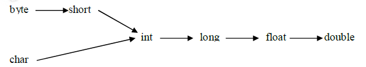
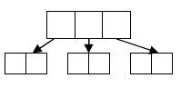
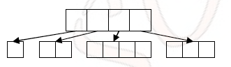
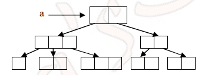

2.Datatypes
===========

| **Data Type** | **Default Value** | **Default size** |
|---------------|-------------------|------------------|
| boolean       | false             | 1 bit            |
| char          | '\\u0000'         | 2 byte           |
| byte          | 0                 | 1 byte           |
| short         | 0                 | 2 byte           |
| int           | 0                 | 4 byte           |
| long          | 0L                | 8 byte           |
| float         | 0.0f              | 4 byte           |
| double        | 0.0d              | 8 byte           |

`int` : The size of int is always fixed irrespective of platform hence the chance of failing java program is very less if u r changing the platform hence the java is considered as Robust

Literals
--------

A literal represents a constant value which can be assigned to the variables

**`int x = 10;`**  
***int*** – Datatype, ***x*** – variable, ***10 – Literal***  

###### **1.Integral Literal:**

We can specify an integral literal in the following ways.

-   **Decimal literals:** allowed digits are 0 to 9

-   **Binary literals** (digits 0–1): which uses the number 0 followed by b or B
    as a prefix—for example, 0b10

-  **Octal literals** (digits 0–7) : which uses the number 0 as a prefix—for
    example, 017

-   **Hexadecimal literals** (digits 0–9 and letters A–F), which uses the number
    0 followed by x or X as a prefix—for example, 0xFF(A=10, B=11, c=12, D=13,
    E=14, F=15)

```java
System.out.println(56); // 56
System.out.println(0b11); // 3	// 1*(2)1 +1*(2)0  (1*2) + (1*1) == 3 
System.out.println(017); // 15	// 1*(8)1 +7*(8)0  (1*8) + (7*1) == 15
System.out.println(0x1F); // 31	// 1*(16)1 +F*(16)0  (1*16) + (15*1) == 31
```
<br>

By default, every **integral lateral is of int datatype**. An integral literal is of long type by suffixing with l or L.
-   10 - int value.
-   10L - long value

There is no way to specify explicitly an integral literal is of type **byte and
short**. If the integral literal is within the range of byte then the JVM by
default treats it as byte literal.



<br>

###### 2.Floating – Point literals

By default floating-point literals are `double` type we can specify explicitly
as float type by suffixing with **‘f’ or ‘F’.**
```java
float f = 10.5; // C.E possible loss of precision
float f = 10.5f;
```
<br>

Floating point literals can be specified only in decimal form. i.e we can’t use
octal and hexa decimal representation for floating point literals. But we can
assign Octal & hexa interger values to float.
```java
Double d = 0x123.456; // C.E Invalid hex literal number
Double d = 0x123; //But we can assign Octal & hexa interger values to float
```
<br>


added in Java 7. You can have underscores in numbers to make them easier to
read:

You can add underscores anywhere **except**
-   at the beginning of a literal
-   the end of a literal
-   right before a decimal point, or right after a decimal point.
-   Prior to an F or L suffix
```java
int million1 = 1000000;
int million2 = 1_000_000;

double notAtStart = _1000.00; // DOES NOT COMPILE
double notAtEnd = 1000.00_; // DOES NOT COMPILE

double notByDecimal = 1000_.00; // DOES NOT COMPILE
double annoyingButLegal = 1_00_0.0_0; // this one compiles
```
<br>

The following example shows other ways you can use the underscore in numeric
literals:
```java
long creditCardNumber = 1234_5678_9012_3456L;
long socialSecurityNumber = 999_99_9999L;
float pi =  3.14_15F;
long hexBytes = 0xFF_EC_DE_5E;
long hexWords = 0xCAFE_BABE;
long maxLong = 0x7fff_ffff_ffff_ffffL;
byte nybbles = 0b0010_0101;
long bytes = 0b11010010_01101001_10010100_10010010;
```


<br>

Following are Invalid Locations
```java
long x1 = 999_99_9999_L; // Before L
int x2 = 52_;		// At the End Not allowed
int x3 = 5_______2;	//correct : Any no.of _'s will allowed between numbers

int x4 = 0_x52;	// cannot put underscores in the 0x radix prefix
int x5 = 0x_52;	// cannot put underscores  at the beginning of a number

int x6 = 0x5_2; correct
```

<br>


###### 3. Character literal

A char literal can be represented as a single character with in single quotes.
```java
char ch = 'a';
char ch = 'ab'; C.E: unclosed character literal.
```
<br>

we can represent a char literal by it’s Unicode value. For the allowed Unicode
values are 0 to 65535.
```java
char ch = 97;
System.out.println(ch); 	O/P: a

char ch = 65535;
char ch = 65536; C.E : possible loss of precision found : int required :char
```
<br>

we can represent a char literal by using Unicode representation which is nothing
but `'\uxxxx’(0-F)`
```java
char ch = '\u0061'
System.out.println(ch); --> O/P:a
char ch = '\ubeef'; --> O/P: ? (No charater defiend with this value)
char ch = '\uface'; --> O/P: ?
```
<br>

we can also represent a char literal by using escape character.
```java
char ch = '\\b';
char ch = '\\n';
char ch = '\\l';
```

<br>

Arrays
------

An array is a data structure that represents an index collection of fixed no of homogeneous data elements.  
<br>

###### 1.Declaring Arrays

you can type the [] before or after the name, and adding a space is optional.
This means that all four of these statements do the exact same thing:
```java
int[] numAnimals;
int [] numAnimals2;
int numAnimals3[];
int numAnimals4 [];
```
<br>

The following are the valid declarations for multidimensional arrays.
```java
int[][] a;
int a[][];
int [][]a;
int[] a[];
int[] []a;
```
<br>

we can specify the dimension before name of variable also, but this facility is
available only for the first variable.
```java
int[] a[],b[];
int[] []a,[]b; //Wrong
```
<br>

###### 2.Construction of Arrays

**Single Dimension:** Arrays are internally implemented as object hence by using
new operator we can construct an array.

Compulsory at the time of construction we should specify the size otherwise
compile time error.
```java
int[] a = new int[10]; _//correct
int[] a = new int[]; C.E : error: array dimension missing
```
<br>

It is legal to have an error with size 0 there is no C.E or R.E
```java
int[] a = new int[0]; // it will create Empty Array [] (no elemets inside it)
```
<br>

If we are specifying array size with some –ve integer, we will get
`R.E:NegativeArraySizeException.`
```java
int[] a = new int[-10]; // Exception in thread "main" java.lang.NegativeArraySizeException
```
<br>

The only allowed Data type to allow the size are byte, short, char, int. if we
are using any other datatype we will get a C.E.
```java
int[] a = new int[10];

int[] a1 = new int[10l];

int[] a = new int[10L]; --> C.E:incompatible types:possible loss of precision
found: long required: int
```
<br>

**Multi Dimension:**  
In java multidimensional arrays are implemented as single
dimension arrays. This approach improves performance with respect to memory.

```java
int[][] a = new int[3][2];
```
  
First Row has 3 locations, each locaton has 2 elements, total tree height will be 2




```java
int[][] a = new int[4][]

a[0] = new int[1];
a[1] = new int[2];
a[2] = new int[4];
a[3] = new int[3];
```




declare an array for the following diagram


```java
a[][][] = new int[2][][];
a[0] 	= new int[3];
a[0][1] = new int[1];
a[0][2] = new int[2];
a[0][3] = new int[3];
a[1] 	= new int[2][2];
```
<br>

###### 3.Initialization of arrays

Once we created an array all it’s elements initialized with default values.
```java
int[] a = new int[3];
System.out.println(a[0]); O/P: 0
System.out.println(a); O/P: [I@10b62c9

int[][] a = new int[3][2];
System.out.println(a); --> [I@10b62c9
System.out.println(a[0]); --> [[I@82ba41
System.out.println(a[0][0]); --> 0

int[][] a = new int[3][];
System.out.println(a); --> [I@10b62c9
System.out.println(a[0]); --> null
System.out.println(a[0][0]); --> NullPointerException
```
<br>

###### 4.Declaration and Initialization Array in a single line

```java
int[] a = {10,20,30};
String[] s = {“Chiru","Allu","Ram","Akil"}
```
<br>


###### 5.length Vs length();

**length:** It is the final variable applicable for array objects. It represents the size of the array.
```java
int [] a = new int[5];
System.out.println(a.length()); --> C.E
System.out.println(a.length); --> 5
```
<br>


**length():** It is the final method applicable only for String Objects. 
```java
String s = "raju";
System.out.println(s.length); --> C.E
System.out.println(s.length()); --> 4
```
