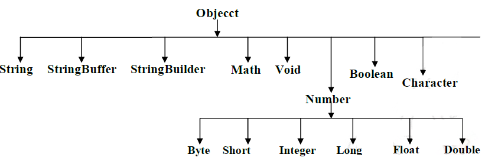

java.lang package
=====================

The most commonly used and general purpose classes which are required for any
java program are grouped into a package which is nothing but a
`"java.lang.package".`

All the classes and interfaces which are available in this package are by
default available to any java program. There is no need to import this class.



1.  **Object Class**

2.  **String class**

3.  **StringBuffer Class**

4.  **StringBuilder Class**

5.  **Wrapper Classes**

1.Object Class
--------------

The most common general methods which can be applicable on any java object are
defined in object class. Object class is the parent class of any java class,
whether it is predefined or programmer defined, hence all the object class
methods are by default available to any java class. **Object class define the
following 11 methods**

1.  toString()

2.  equals(Object otherObject)

3.  hashcode()

4.  clone()

5.  finalize()

6.  Class getClass()

7.  void wait()

8.  void wait(long ms)

9.  void wait(long ms, int nano)

10. void notify()

11. void notifyAll()  
<br>


**1.String toString():** Returns a string representation of the object.  
-   Whenever we are passing object reference as argument to s.o.p() internally
    JVM will call toString() on that object.

-   If we are not providing implementation to toString() method, then Object
    class toString() will be executed which is implemented as follows
```java
public String toString() {
 return getClass.getName() + '@' + Integer.toHexString(HashCode);
}
```  


**2.boolean equals(Object otherObject)** – As method name suggests, is used to
simply verify the equality of two objects. It’s default implementation simply
check the object references of two objects to verify their equality. ***By
default, two objects are equal if and only if they are stored in the same memory
address**.*

*In `String` class(not `StringBuilder`, not `StringBuffer`) & All Wrapper classes
`equals()` method is overridden for Content Comparison*

**<u>equals () at Object comparision level</u>**  
-   If we are comparing **non-String Objects** eqauls() method it **comapiars
    refrences of Objects**.

-   **It is same as “== “ Operator**

**<u>equals() at String Comparision Level</u>**

-   If we are comparing **String data on** .eqauls() method **comapiars only
    content**.

-   **References are doesn’t matter**.

<br>

**3. int hashcode()** – Returns a unique integer value for the object in
runtime. By default, integer value is mostly derived from memory address of the
object in heap (but it’s not mandatory always).

**<u>Relation between `equals()` & `hashcode()` methods</u>**

-   If two objects are equal according to the equals(Object) method, then
    calling the hashCode method on each of the two objects must produce the same
    integer result.

-   **Whenever we override the equals() method, we should override hashcode()
    method.**

-   In **String class(not StringBuilder, not StringBuffer) & All Wrapper classes
    equals()** method is overridden for Content Comparison

**<u>Compare two employee Objects based on Their Id?</u>**
```java
public class Employe {
  int id;
  String name;
  //Setters & Getters
  @Override
  public boolean equals(Object obj) {
    Employe e = (Employe) obj;
    boolean flag = false;
    if (this.getId() == e.getId()) {
      flag = true;
    }
    return flag;
  }
  public static void main(String[] args) {
    Employe e1 = new Employe();
    Employe e2 = new Employe();
    e1.setId(101);
    e2.setId(101);
    System.out.println(e1.equals(e2)); //true
  }
}
```


So are we done? Not yet. Let’s test again above modified Employee class in
different way.
```java
public static void main(String[] args) {
 Employe e1 = new Employe();
 Employe e2 = new Employe();
 e1.setId(101);
 e2.setId(101);
 
 Set<Employe> set = new HashSet<>();
 set.add(e1);
 set.add(e2);
 System.out.println(set); //[basic.Employe@15db9742, basic.Employe@6d06d69c]	
	}
```
Above class prints two objects in print statement. If both employee objects have
been equal, in a Set which stores only unique objects, there must be only one
instance inside HashSet.

We are missing the second important method hashCode(). As java docs say, if you
override equals()method then you *must* override hashCode() method
```java
public class Employe {
  int id;
  String name;

  @Override
  public boolean equals(Object obj) {
    Employe e = (Employe) obj;
    boolean flag = false;
    if (this.getId() == e.getId()) {
      flag = true;
    }
    return flag;
  }

  @Override
  public int hashCode() {
    return getId();
  }
  public static void main(String[] args) {
    Employe e1 = new Employe();
    Employe e2 = new Employe();
    e1.setId(101);
    e2.setId(101);

    Set < Employe > set = new HashSet < >();
    set.add(e1);
    set.add(e2);
    System.out.println(set); //[basic.Employe@65] 
  }
}
```


[Apache commons](https://commons.apache.org/proper/commons-lang/) provide two
excellent utility
classes [EqualsBuilder](https://commons.apache.org/proper/commons-lang/apidocs/org/apache/commons/lang3/builder/EqualsBuilder.html)
**&**
[HashCodeBuilder](https://commons.apache.org/proper/commons-lang/apidocs/org/apache/commons/lang3/builder/HashCodeBuilder.html) 
for generating hash code and equals methods.

<br>

**4. Object clone():** Creates a new object of the same class as this object
which implements Clonable interface.
```java
Test t1 = new Test();
Test t2 = (Test)t1.clone();
```


An Object is said to be cloneable iff the corresponding class has to implement
**java.lang.cloneable** interface. It doesn’t contain any methods it is a marker
interface.

Creates and returns the exact copy (clone) of the object.

<u>Rules</u>
-   *To clone an Object it must implement `java.lang.Clonable` Interface*

-   *Otherwise it will return `CloneNotSupportedException`.*  


```java
public class Student implements Cloneable {
  int sno;
  String name;
  public Student(int sno, String name) {
    this.sno = sno;
    this.name = name;
  }

  public static void main(String[] args) throws CloneNotSupportedException {
    Student s1 = new Student(101, "Satya");
    Student s2 = (Student) s1.clone();
    System.out.println("S1 data : " + s1.sno + ":" + s1.name);
    System.out.println("S2 data : " + s2.sno + ":" + s2.name);
  }
}

------------------------------------------
S1 data: 101 : Satya
S2 data: 101 : Satya
```


##### We have two types of Cloning in java

1.  Shallow Cloning
2.  Deeply Cloning

##### i.Shallow copy Cloning
-   The default version of **clone()** method creates the shallow copy of an
    object.

-   The shallow **copy of an object will have exact copy of all the fields of
    original object**.

-   If original object has **any references** to other objects as fields, then
    *only references of those objects are copied* into clone object, copy of
    those objects are not created

-   Any **changes** made to those objects **through clone object will be
    reflected in original object or vice-versa**.

-   Shallow copy is not 100% independent of original object.  


```java
class Address {
  String dno;
  String city;
  
  public Address(String dno, String city) {
    super();
    this.dno = dno;
    this.city = city;
  }
}

-------------------------------------

class Student implements Cloneable {
  int sno;
  String name;
  Address address;
  
  public Student(int sno, String name, Address address) {
    super();
    this.sno = sno;
    this.name = name;
    this.address = address;
  }
  
  @Override
  protected Object clone() throws CloneNotSupportedException {
    return super.clone();
  }
}
-------------------------------------
public class ShallowClone {
  public static void main(String[] args) throws CloneNotSupportedException {

    Address addr = new Address("3-100", "HYDERABAD");
    Student s1 = new Student(101, "Satya", addr);
    Student s2 = (Student) s1.clone();
    System.out.println(s1.address.city + " : " + s2.address.city); //HYDERABAD : HYDERABAD

    s1.address.city = "KANURU"; //Changing the Value	 
    System.out.println(s1.address.city + " : " + s2.address.city); //KANURU : KANURU

    //S1,S2 are dependent to each other, sharing same Object reference 
  }
}
```

##### Deeply copy Cloning

-   To create the deep copy of an object, you have to **override clone()
    method**

-   Deep **copy of an object will have exact copy of all the fields of original
    object just like shallow copy**.

-   But in additional, if original object has any references to other objects as
    fields, then copy of those objects are also created by calling clone()
    method on them.

-   That means clone object and original object will be 100% disjoint. They will
    be 100% independent of each other

-   Changes won’t reflect each other.  
   

```java

class Address implements Cloneable {
  String dno;
  String city;
  
  public Address(String dno, String city) {
    super();
    this.dno = dno;
    this.city = city;
  }
  
  @Override
  protected Object clone() throws CloneNotSupportedException {
    // TODO Auto-generated method stub
    return super.clone();
  }
}
----------------------------------
class Student implements Cloneable {
  int sno;
  String name;
  Address address;

  public Student(int sno, String name, Address address) {
    super();
    this.sno = sno;
    this.name = name;
    this.address = address;
  }

  @Override
  protected Object clone() throws CloneNotSupportedException {
    Student student = (Student) super.clone();
    student.address = (Address) address.clone();
    return student;
  }

}

----------------------------

public class DeeplyClone {
  public static void main(String[] args) throws CloneNotSupportedException {

    Address addr = new Address("3-100", "HYDERABAD");
    Student s1 = new Student(101, "Satya", addr);
    Student s2 = (Student) s1.clone();

    System.out.println(s1.address.city + " : " + s2.address.city); //HYDERABAD : HYDERABAD

    s1.address.city = "KANURU"; //Changing the Value

    System.out.println(s1.address.city + " : " + s2.address.city); //KANURU : KANURU

    //S1,S2 are dependent to each other , sharing same Object reference	
  }
}
HYDERABAD: HYDERABAD
KANURU: HYDERABAD

```


The shallow copying of this object will be pointing to the same memory reference
as the original object. So a change in myData by either original or cloned
object will be reflected in other also.

But in deep copying there will memory allocated and values assigned to the
property will be same. Any change in object will not be reflected in other


**5.void finalize():** Called by the garbage collector on an object when garbage
collection determines that there are no more references to the object.

**6.Class getClass():** Returns the runtime class of an object.getClass(), or the
Class literal 

`<ClassName>.class` (Foo.class) return a Class object, which contains some metadata about the class. Which includes following data
-   name
-   package
-   methods
-   fields
-   constructors
-   annotations

we can create Class object by following ways
```java
//1. Using Class method
Class c = Class.forName("StudentBO")

//2. Using <ClassName>.class
Class c = StudentBO.class

//3. Using getClass() method of Object Class
Class c = a.getClass();

```


```java
public static void main(String[] args) throws Exception {
  TestApp a = new TestApp();
  Class c1 = a.getClass();

  Class c = Class.forName("java.lang.String");
  System.out.print("Class represented by c : " + c.toString());

  Object obj = c.newInstance();
}

------------------------------------------

public class Test {
  public static void main(String args[]) throws IOException,
  ClassNotFoundException {
    Class c = Class.forName("java.lang.Object");

    System.out.println("Name : " + c.getName());
    System.out.println("getConstructors :" + c.getConstructors());
    System.out.println("getFields : " + c.getFields());
    System.out.println("getMethods : " + c.getMethods());

  }
}
```


**7.void wait():** current thread will wait, until another thread notifies

**8.void wait(long ms):** current thread will wait for the specified
milliseconds, until another thread notifies

**9.void wait(long ms, int nano):** current thread will wait for the specified
milliseconds and nanoseconds, until another thread notifies.

**10.void notify():** Wakes up a single thread that is waiting on this object's
monitor.

**11.void notifyAll():** Wakes up all threads that are waiting on this object's
monitor.
