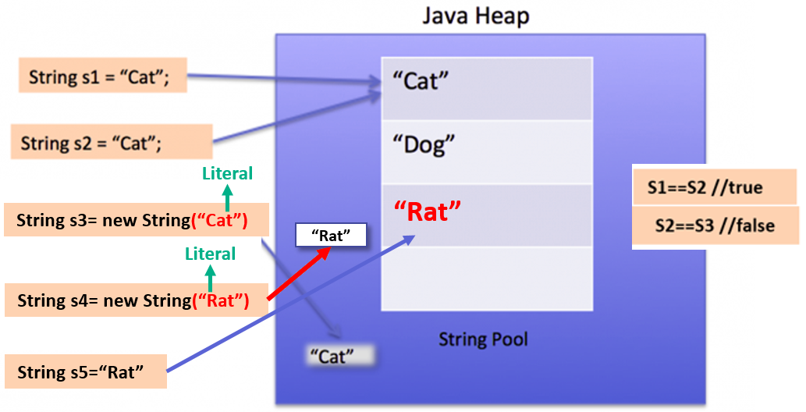
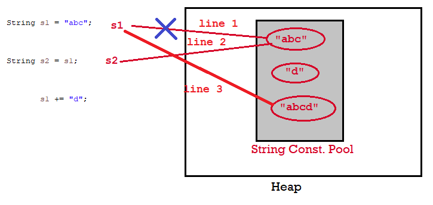
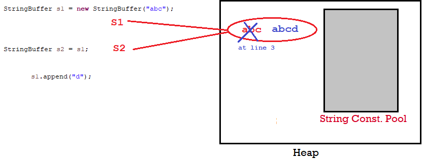
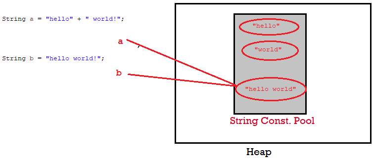
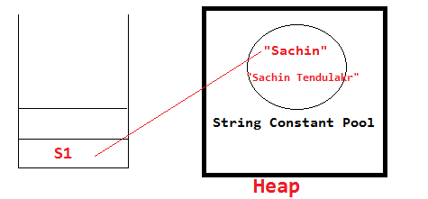

2.String Class
===============

There are two ways to create String object:

**1.By string literal**
```java
String s1="Welcome";  
String s2="Welcome";//It doesn't create a new instance
```


**2.By new keyword**
```java
String s1=new String("Welcome");//creates two objects and one reference variable
```

<br>


Understand the following cases

###### Case 1 : literal VS Object
```java
public class StringDemo {
  public static void main(String[] args) {
    String s1 = "Cat";
    String s2 = "Cat";

    String s3 = new String("Cat");

    System.out.println(s1 == s2); // true
    System.out.println(s1 == s3); // false
  }
}
```




-   first line of code is **literal type**, so first it will search in SCP,
    String ’Cat’ is existed or not. here ‘cat’ not exist on the **String pool
    so, “Cat" will create in SCP& it will** reference to s1.

-   second line of code is **literal type**, so first it will search in SCP,
    String ’Cat’ is existed or not. here ‘cat’ already exist on the **String
    pool so** s2 reference to existed "Cat".

-   Third line of code is **Object type**, **but it has literal** ’Cat’ ,so
    first it will serach “Cat" in SCP, it is alredy present, so it wont create
    literal in SCP, then it will create String Object with given string **no
    matter if Object with same String literal already exist or not.**

-   Fourth line of code is **Object type**, **but it has literal** ’Rat’ ,so
    first it will serach “Rat" in SCP, it is not present, so it will create
    literal in SCP, then it will create String Object with given string.

-   Fifth line of code is **literal type**, so first it will search in SCP,
    String ’Cat’ is existed or not. here ‘cat’ already exist on the **SCP,** but
    it doest have any references. so s5 reference to existed "Rat".

###### Case 2:
```java
String s1 = "abc";
String s2 = s1;
       s1 += "d";
System.out.println(s1 + ", " + s2 + ", " + (s1 == s2));
--------------------------------------
abcd, abc, false
```




###### Case 3:
```java
StringBuffer s1 = new StringBuffer("abc");
StringBuffer s2 = s1;
             s1.append("d");
System.out.println(s1+", "+s2+", "+(s1==s2));
---------------------------------
abcd, abcd, true
```


**StringBuffer operates on Same Object .**



Whenever we created String of Object type, first it will store in SCP & then
String of Object type will be created.

###### Case 4:
```java
String a = "hello" + " world";
String b = "hello world";
System.out.println(a==b); //TRUE
```


When concatenating two string literals `"a" + "b"` the jvm joins the two values
and then check the string pool, then it realizes the value already exists in the
pool so it just simply assigns this reference to the String.

###### Case 5 : (+= uses StringBuilder Inside to Create & Append String)
```java
String a = "Bye";
       a += " bye!";
       
String b = "Bye bye!";

System.out.println(a == b);//FALSE
```
This case is kind of different tho, because you’re using the += operator which
when compiled to bytecode it uses StringBuilder to concatenate the strings, so
this creates a new instance of StringBuilder Object thus pointing to a different
reference. (string pool vs Object)

Oracle Says, to improve performance, instead of using string concatenation,
use StringBuffer.append(). String objects are immutable

###### Performance

It’s better to use StringBuilder (it’s an unsynchronized version; when do you
build strings in parallel?) these days, in almost every case, but here’s what
happens:

When you use + with two strings, it compiles code like this:  
```java
String third = first + second;
```


To something like this  
```java
StringBuilder builder = new StringBuilder( first );
builder.append( second );
third = builder.toString();
```


for example, you might be using many different appending statements, or a loop
like this:
```java
for( String str : strings ) {
  out += str;
}
```

In this case, a new `StringBuilder` instance, and a new `String` (the new value
of out – Strings are immutable) is required in each iteration. This is very
wasteful. Replacing this with a single StringBuilder means you can just produce
a single String and not fill up the heap with Strings you don’t care about

 

To get the String which is created in SCP while executing String(“welcome"), we
use `intern()` method
```java
String s=new String("Welcome");  
String s2=s.intern();  
System.out.println(s2);// Welcome
```

 

In java, **string objects are immutable**. Immutable simply means unmodifiable
or unchangeable.
```java
class Testimmutablestring{  
 public static void main(String args[]){  
   String s1="Sachin";  
   s1.concat(" Tendulkar");//concat() method appends the string at the end  
   System.out.println(s1);//Sachin, because strings are immutable objects  
 }  
}
```


