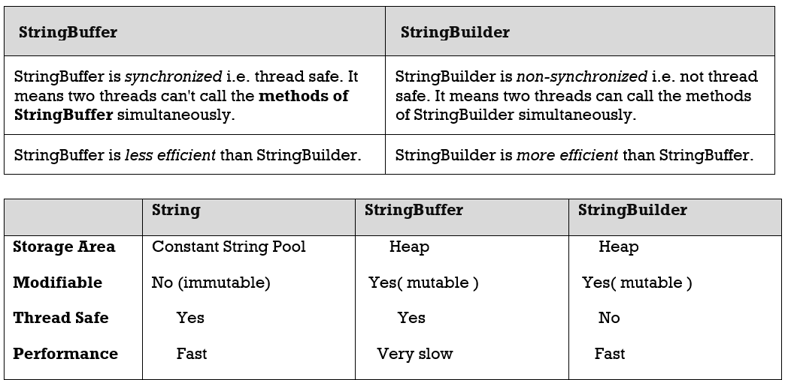

3.StringBuffer, 4.StringBuilder
======================================

| **String**                                                                         | **StringBuffer**                                                                                                               |
|--------------------------------------------------------------------------------------------------------------------------------|--------------------------------------------------------------------------------------------------------------------------------|
| String class is immutable.                                                                                                     | StringBuffer class is mutable.                                                                                                 |
| String is slow and consumes more memory when you concat too many strings, because every time it creates new instance.           | StringBuffer is fast and consumes less memory when you concat strings.                                                         |
| String class overrides the equals() method of Object class. So you can compare the contents of two strings by equals() method. | StringBuffer class doesn't override the equals() method of Object class.                                                       |
| **String** is  synchronized i.e. thread safe                                                                                   | **StringBuffer** is synchronized i.e. thread safe. It means two threads can't call the methods of StringBuffer simultaneously. |

Creates an empty StringBuffer object with default initial capacity 16.If it
reaches max capacity then a new StringBuffer object will be created with new
**capacity = (currentcapacity + 1) \* 2**

 ```java
StringBuffer sb = new StringBuffer();
```



###### 1.What is immutable object? Can you write immutable object?

*Don’t confuse over SingleTon class*

Immutable classes are Java classes whose objects cannot be modified once
created. 

1.  Declare **the class as final** so it can’t be extended.

2.  Make all **fields private & final** so that direct access is not allowed &
    it’s values can be assigned only once.

3.  **Initialize** all the fields via a **constructor**

4.  Write getters only**, not setters**.

```java
// An immutable class
final class Student {

  final int sno;
  final String name;

  public Student(int sno, String name) {
    this.name = name;
    this.sno = sno;
  }

  public String getName() {
    return name;
  }

  public int getsno() {
    return sno;
  }
}

//--------------------------------------
// Driver class
public class Test {
  public static void main(String args[]) {

    Student s1 = new Student(101, "Satya");
    s1.name = "Vijay";
  }
}
//--------------------------------------
Exception in thread "main" java.lang.Error: Unresolved compilation problem: 
	The final field Student.name cannot be assigned
```

All String & Wrapper class objects are Immutable

<br>

###### 2.What is Singleton? Can you write critical section code for singleton?

**A Singleton class is one which allows us to create only one object for JVM.**

**Rules:**

-   **Create Singleton class Object make it as PRIVATE**, so no other classes
    will access it.

-   **Create PRIVATE constructor**, so no other classes won’t create Object
    using new Student(), because it is not visible to out the classes.

-   Every Singleton class contains **at least one static factory method**, make
    it public so, it is visible other classes  
    
```java
class Student {

  private static Student st;

  private Student() {
    System.out.println("OBJECET Created FIRST TIME");
  }

  public static Student getObject() {
    if (st == null) {
      st = new Student();
    } else {
      System.out.println("OBJECET ALREDAY CREATED");
    }
    return st;
  }
}

//-------------------------------------------

public class Test {
  public static void main(String args[]) {

    Student s1 = Student.getObject();
    System.out.println("s1 : " + s1.hashCode());

    Student s2 = Student.getObject();
    System.out.println("s2 : " + s2.hashCode());

    System.out.println("s1==s2 : " + (s1 == s2));
  }
}

//-------------------------------------------

OBJECET Created FIRST TIME
s1 : 1829164700
OBJECET ALREDAY CREATED
s2 : 1829164700
s1==s2 : true
```

In above code, it will create multiple instances of Singleton class if called by
more than one thread parallel

*Double checked locking of Singleton* is a way to ensure only one instance of
Singleton class is created through application life cycle.

This will bring us to **double checked locking pattern**, where only critical
section of code is locked. Programmer call it double checked locking because
there are two checks for \_instance == null, one without locking and other with
locking (inside synchronized) block. Here are how double checked locking looks
like in Java

```java
public static Singleton getInstanceDC() {
        if (_instance == null) {                // Single Checked
            synchronized (Singleton.class) {
                if (_instance == null) {        // Double checked
                    _instance = new Singleton();
                }
            }
        }
        return _instance;
}
```
<br>

###### How do you reverse a String in Java without using StringBuffer?

The Java library provides String Buffer and StringBuilder class with
**reverse()** method, which can be used to reverse String in Java.
```java
String reverse = "";
String source= "My Name is Khan";
        for(int i = source.length() -1; i>=0; i--){
            reverse = reverse + source.charAt(i);
        }
```
<br>

###### How to Print duplicate characters from String?
```java
public class RepreatedChar {
	public static void main(String[] args) {
 String a = "success";

 // 1.convert into char array. [‘s’, ‘u’, ‘c’, ‘c’, ‘e’, ‘s’, ‘s’,]
 char[] c = a.toCharArray();

 // 2.create Hashmap store key as character, count as value
 HashMap map = new HashMap<>();
 for (char ch : c) {

 	// 3.Check if Map contains given Char as <key> or not
 	if (map.containsKey(ch)) {
  // if their, get the value & increment it
  int i = (int) map.get(ch);
  i++;
  // add updated value to it
  map.put(ch, i);
 	} else {
  // if not their , add key & value as 1
  map.put(ch, 1);
 	}
 }
 	
  Set  set =  map.entrySet();
  Iterator iterator = set.iterator() ;
  while (iterator.hasNext()) {
 	Map.Entry entry = (Entry) iterator.next();
 	System.out.println(entry.getKey()+" : "+entry.getValue()); 	
 }
	}
}
s : 3
c : 2
u : 1
e : 1
```

<br>

###### Is String contains Number or not
```java
public class RegEx {
	public static void main(String[] args) {
 // Regular expression in Java to check if String is number or not
 Pattern pattern = Pattern.compile(".*[^0-9].*");  
 String[] inputs = { "123", "-123", "123.12", "abcd123" };
 /* Matches m = pattern.match(input);
  * boolean ch = m.match();	 */ 

 for (String input : inputs) {
System.out.println("does " + input + " is number : " + !pattern.matcher(input).matches());
 }

	// Regular expression in java to check if String is 6 digit number or  not
 String[] numbers = { "123", "1234", "123.12", "abcd123", "123456" };
 Pattern digitPattern = Pattern.compile("\\d{6}");
 // Pattern digitPattern = Pattern.compile("\\d\\d\\d\\d\\d\\d");

 for (String number : numbers) {
  SOP("does " + number + " is 6 digit number : " + digitPattern.matcher(number).matches());
 }
	}
}
```

<br>

###### Reverse Words in a String
```java
public class RevWords {
	public static void main(String[] args) {
 // using s.split("\\s");
 String s = "My name is Satya";
 String words[] = s.split("\\s");
 String rev = "";
 int len = words.length;
 for (int i = (len - 1); i >= 0; i--) {
 	rev = rev + words[i];
 }
 System.out.println(rev);

 // using Collections.reverse(str)
 List<String> word = Arrays.asList(s.split("\\s"));
 Collections.reverse(word);
 System.out.println(word);
	}
}
```
