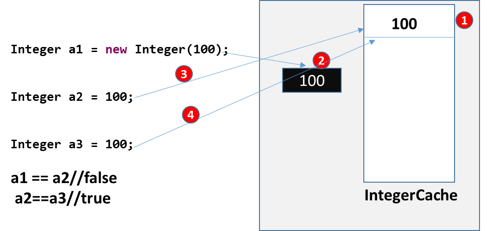

Wrapper classes
==================

Collections in Java deal only with objects; to store a primitive type values in
one of these Collection classes, you need to Convert the primitive type to
Object Type.

The main objectives of wrapper classes are:

-   To Wrap primitives into object form. So that we can handle primitives also
    just like objects.

-   To Define several utility functions for the primitives (converting primitive
    to the string form etc)

Each primitive type has a corresponding wrapper class.

| **Primitive Type** | **Wrapper Class** |
|--------------------|-------------------|
| **double**         | **Double**        |
| **float**          | **Float**         |
| **long**           | **Long**          |
| **int**            | **Integer**       |
| **short**          | **Short**         |
| **byte**           | **Byte**          |
| **char**           | **Character**     |
| **boolean**        | **Boolean**       |

<br>

###### Primitive type to wrapper class

1.using **constructors**
```java
// 1. using constructor
Integer object = new Integer(10);
```


2.using **static factory methods** such as valueOf() (except Character)
```java
// 2. using static factory method
Integer anotherObject = Integer.valueOf(10);
```


Similarly, we can convert other primitive types like boolean to Boolean, char to
Character, etc.

<br>

###### Wrapper class to primitive type

Converting from wrapper to primitive type is simple. We can use the
corresponding methods to get the primitive type.
e.g. **intValue()**, **doubleValue()**, **shortValue()** etc.
```java
Integer object = new Integer(10);
 
int val = object.intValue();    //wrapper to primitive
```

<br>

###### Autoboxing and Unboxing

Beginning with JDK 5, Java added two important
features: *autoboxing* and *auto-unboxing*.

**Autoboxing** is the automatic conversion of the primitive types into their
corresponding object wrapper classes. For example, converting an int to
an Integer, a char to a Character, and so on.

We can simply pass or assign a primitive type to an argument or reference
accepting wrapper class object. e.g.
```java
List<Integer> integerList = new ArrayList<>();
 
for (int i = 1; i < 50; i += 2)
{
    integerList.add(Integer.valueOf(i));        //autoboxing
}
```


**Unboxing** happens when the conversion happens from wrapper class to its
corresponding primitive type. It means we can pass or assign a wrapper object to
an argument or reference accepting primitive type. e.g.
```java
public static int sumOfEven(List<Integer> integerList)
{
    int sum = 0;
    for (Integer i: integerList) {
        if (i % 2 == 0)
            sum += i;           //Integer to int
    }
    return sum;
}
```

In above example, the remainder (%) and unary plus (+=) operators does not apply
on Integer objects. The compiler automatically converts an Integer to an int at
runtime by invoking the intValue()method.
```java
Integer i = 10;// it will create Integer value of 10 using Autoboxing
int j = i;// ;// it will convert Integer to int using Autoboxing
```

<br>


###### Wrapper Classes Internal Caching

**Wrapper classes are immutable in java, Right? “YES".** So, like string pool,
they can also have their pool, right? “Great Idea". Well, it’s already there.
JDK provided wrapper classes also provide this in form of instance pooling i.e.
each wrapper class store a list of commonly used instances of own type in form
of cache and whenever required, you can use them in your code. It helps in
saving lots of byes in your program runtime.

In **Integer.java** class, there is an inner class i.e. **IntegerCache**. When
you assign a new int to Integer type like below
```java
Integer i = 10; //OR
Integer i = Integer.valueOf(10);
```


An already created Integer instance is returned and reference is stored in i.
Please note that if you use new Integer(10); then a new instance of Integer
class will be created and caching will not come into picture. Its only available
when you use Integer.valueOf() OR directly primitive assignment (which
ultimately uses valueOf() function)
```java
public class IntegerCacheDemo {
 
    public static void main(String[] args) {
 
 Integer a1 = new Integer(100);
 Integer a2 = 100;
        Integer a3 = 100;
 
        System.out.println(a1 == a2);
        System.out.println(a2 == a3);    }
}
 
Output: 
false
false
```




If you want to store a bigger number of instances, you can use runtime parameter
as below:
```java
-Djava.lang.Integer.IntegerCache.high=2000
```

