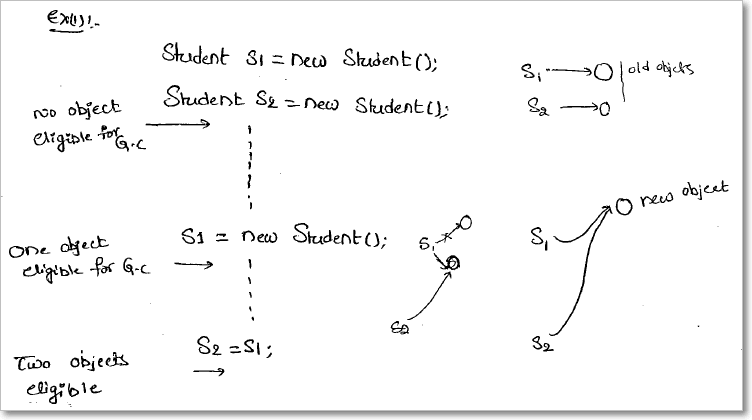
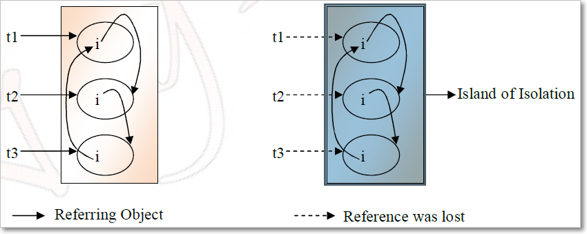

Garbage collection
=====================

-   In C/C++, programmer is responsible for both creation and destruction of
    objects. Usually programmer neglects destruction of useless objects. Due to
    this negligence, at certain point, for creation of new objects, sufficient
    memory may not be available and entire program will terminate abnormally
    causing **OutOfMemoryErrors**.

-   But in Java, the programmer need not to care for all those objects which are
    no longer in use. Garbage collector destroys these objects.

-   Garbage collector is best example of [Daemon
    thread](https://www.geeksforgeeks.org/daemon-thread-java/) as it is always
    running in background.

-   Main objective of Garbage Collector is to free heap memory by
    destroying **unreachable objects**

# The ways to make an object eligible for Garbage Collector

Even though the programmer is not responsible for destruction of objects it’s
good programming practice to make an object eligible for Garbage Collector if it
is no longer required.

The following are different ways for this

#### 1.Nullifying the reference Variable

If an object is no longer required assign null to all its reference variables.
```java
Student s1 = new Student();
Student s2 = new Student();
```


<br>

#### 2. Reassigning the reference Variable

If an object is no longer required then, assigning its reference variables to
some other objects then that old object automatically eligible for garbage
collection.



<br>

#### 3.The Objects Created inside a method

The objects which are created in a method are by default eligible for Garbage
Collector once the method completes.

**Case 1:**
```java
class Test
{
public static void main(String arg[])
{
    m1();
//Two Objects s1,s2 eligible for gc

}
public static void m1()
{
  Student s1 = new Student();
  Student s2 = new Student();
//No Objects eligible for gc
}
}
```


**Case 2:**
```java
class Test
{
public static void main(String arg[])
{
Student s = m1();
//One Object s2 eligible for gc


}
public static Student m1()
{
Student s1 = new Student();
Student s2 = new Student();
return s1;//returning s1
}
}
```

<br>

#### 4. The Island of Isolation

Object 1 references Object 2 and Object 2 references Object 1. Neither Object 1
nor Object 2 is referenced by any other object. That’s an island of isolation.


Basically, an island of isolation is a group of objects that reference each
other but they are not referenced by any active object in the application.
Strictly speaking, even a single unreferenced object is an island of isolation
too.
```java
class Test
{
Test i;
public static void main(String[] args)
{
Test t1 = new Test();
Test t2 = new Test();
Test t3 = new Test();
t1.i = t2;
t2.i = t3;
t3.i = t1;

t1 = null;
//No Object eligible for Garbage Collector

t2 = null;
//No Object eligible for Garbage Collector

t3 = null;
//All Objects eligible for Garbage Collector

}
}
```


<br>

#### 5.Static variables Garbage Collection

Static variables cannot be eligible for garbage collection while the class is
loaded. They can be collected when the respective class loader drops the class
or is itself collected for garbage.

**<u>The methods to request JVM to run Garbage Collector</u>**  
We can request JVM to run Garbage Collector but **there is no guarantee**
whether JVM accepts our request or not. We can do this by using the following
ways.

**1.By System class**  
‘System’ class contains a static ‘gc’ method for requesting JVM to run Garbage
Collector.  
```java
System.gc();
```


**2.By Using Runtime Class**  
A java application can communicate with JVM by using Runtime Object. We can get Runtime Object as follows.
```java
Runtime runtime = Runtime.getRuntime();
Runtime.gc()
```


Once we get Runtime Object we can apply the following methods on that object.

**freeMemory():** returns the free memory available in the loop

**totalMemory():** returns heap size

**gc():** for requesting JVM to run GarbageCollector

**gc() method available in the System class is static method but gc() method
available in Runtime classis an instance method.**

<br>

### finalize()

-   Just before destroying any object Garbage Collector always calls
    **finalize()** to perform clean up activities.

-   **finalize()** is available in the **Object** class which is declared as
    follows.
    ```java
    protected void finalize() throws Throwable
    {
    }
    ```


***case1**:*  
Garbage Collector always calls finalize() on the Object which is
eligible for Garbage Collector and the corresponding class finalize method will
be executed.
```java
class Test
{
public static void main(String arg[])
{
String s = new String("raju");
//Test s = new Test();
s = null;
System.gc();
System.out.println("end of main method");
}
public void finalize()
{
System.out.println("finalize method called");
}
}
O/P:- end of main method.
```

In this case String Object is eligible for G.C and hence String class finalize()
method has been executed.

In the above program if we are replacing String Object with Test Object then
Test class finalize() will be executed. In this case **O/P** is end of main
method.
```powershell
finalize method called
end of main method
```

<br>

***case2:***   
we can call finalize() explicitly in that case it will execute just
like a normal method and object won’t be destroyed.

While executing finalize() method if any exception is uncaught it is simply
ignored by the JVM but if we are calling finalize method explicitly and if an
exceptions is uncaught then the program will be terminated abnormally.
```powershell
class Test
{
public static void main(String arg[])
{
Test s = new Test();
//s.finalize();
s = null;
System.gc();
System.out.println("End of main method");
}
public void finalize()
{
System.out.println("finalize method");
System.out.println(10/0);
}
}
O/P:- finalize method
end of main method
```

<br>

<u>Difference between final, finally and finalize</u>

| **No.** | **final**                                                                                                                                                                      | **finally**                                                                                       | **finalize**                                                                             |
|---------|--------------------------------------------------------------------------------------------------------------------------------------------------------------------------------|---------------------------------------------------------------------------------------------------|------------------------------------------------------------------------------------------|
| 1)      | Final is used to apply restrictions on class, method and variable. Final class can't be inherited, final method can't be overridden and final variable value can't be changed. | Finally is used to place important code, it will be executed whether exception is handled or not. | Finalize is used to perform clean up processing just before object is garbage collected. |
| 2)      | Final is a keyword.                                                                                                                                                            | Finally is a block.                                                                               | Finalize is a method.                                                                    |

<br>

###### Types of Garbage Collectors

When an object is no longer used, the garbage collector reclaims the underlying
memory and reuses it for future object allocation. This means there is no
explicit deletion and no memory is given back to the operating system.


Java has **four types of garbage collectors**,

-   [Serial Garbage
    Collector](https://javapapers.com/java/types-of-java-garbage-collectors/#serial-garbage-collector)

-   [Parallel Garbage
    Collector](https://javapapers.com/java/types-of-java-garbage-collectors/#parallel-garbage-collector)

-   [CMS Garbage
    Collector](https://javapapers.com/java/types-of-java-garbage-collectors/#cms-garbage-collector)

-   [G1 Garbage
    Collector](https://javapapers.com/java/types-of-java-garbage-collectors/#g1-garbage-collector)

Each of these four types has its own advantages and disadvantages. Most
importantly, we the programmers can choose the type of garbage collector to be
used by the JVM. We can choose them by passing the choice as JVM argument

#### 1. Serial Garbage Collector

-   It is designed for **the single-threaded environments**.

-   It **uses just a single thread for garbage collection**.

-   It freezes(stops) all the application threads while performing garbage
    collection.

-   it may not be suitable for a server environment. It is best suited for
    simple command-line programs.

Turn on the **-XX:+UseSerialGC **JVM argument to use the serial garbage
collector.

#### 2. Parallel Garbage Collector

-   It is the **default garbage** collector of the JVM.

-   It uses **multiple threads for garbage collection**.

-   Similar to serial garbage collector this also freezes(siops) all the
    application threads while performing garbage collection.

#### 3. CMS Garbage Collector

Concurrent Mark Sweep (CMS) garbage collector uses **multiple threads to scan
the heap memory** to **mark instances** for eviction and **then sweep the marked
instances**.

Turn on the **XX:+USeParNewGC** JVM argument to use the CMS garbage collector.

#### 4. G1 Garbage Collector

-   G1 garbage collector is used for large heap memory areas.

-   It separates the heap memory into regions and does collection within them in
    parallel.

-   G1 also does compacts the free heap space on the go just after reclaiming
    the memory.

-   G1 collector prioritizes the region based on most garbage first.

Turn on **the –XX:+UseG1GC JVM** argument to use the G1 garbage collector.

**Java 8 Improvement**

Turn on the -XX:+UseStringDeduplication JVM argument while using G1 garbage
collector. This optimizes the heap memory by removing duplicate String values to
a single char[] array. This option is introduced in [Java
8](https://javapapers.com/java/java-8-features/) u 20.

Given all the above four types of Java garbage collectors, which one to use
depends on the application scenario, hardware available and the throughput
requirements.

#### Garbage Collection JVM Options

**Type of Garbage Collector to run**

| **Option**                  | **Description**                              |
|-----------------------------|----------------------------------------------|
| **-XX:+UseSerialGC**        | **Serial Garbage Collector**                 |
| **-XX:+UseParallelGC**      | **Parallel Garbage Collector**               |
| **-XX:+UseConcMarkSweepGC** | **CMS Garbage Collector**                    |
| **-XX:ParallelCMSThreads=** | **CMS Collector – number of threads to use** |
| **-XX:+UseG1GC**            | **G1 Gargbage Collector**                    |

**GC Optimization Options**

| **Option**          | **Description**                       |
|---------------------|---------------------------------------|
| **-Xms**            | **Initial heap memory size**          |
| **-Xmx**            | **Maximum heap memory size**          |
| **-Xmn**            | **Size of Young Generation**          |
| **-XX:PermSize**    | **Initial Permanent Generation size** |
| **-XX:MaxPermSize** | **Maximum Permanent Generation size** |
