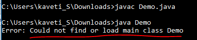

28.Java.io - Interview Questions 
=================================

###### Can a top-level class be private or protected?

Top level classes in java can’t be private or protected, but inner classes in
java can. The reason for not making a top-level class as private is very
obvious, because nobody can see a private class and thus they cannot use it

###### What Happens if we compile Empty java file?

Compiles but Runtime Error.



###### Is it possible to make array volatile in Java?

Yes, it is possible to make an array volatile in Java, but only the reference
which is pointing to an array, by reassigning it

###### What is a.hashCode() used for? How is it related to a.equals(b)?

According to the Java specification, two objects which are identical to each
other using equals() method needs to have the same hash code

###### Explain Liskov Substitution Principle.

According to the Liskov Substitution Principle, methods or functions which use
super class type must be able to work with object of subclass without issues.
**Co-Variant** return types are implemented based on this principle .

###### What is a compile time constant in Java? What is the risk of using it?

Answer: **Public static final variables** are also known as the compile time
constant, the public is optional there. **They are substituted with actual
values at compile time because compiler recognizes their value up-front, and
also recognize that it cannot be altered during runtime**.

One of the issues is that if you choose to use a public static final variable
from in-house or a third party library, and their value changed later, then your
client will still be using the old value even after you deploy a new version of
JARs.

###### What is double checked locking in Singleton?

**Singleton** means we can create only one instance of that class

**Rules:**

-   Create Singleton class Object make it as PRIVATE

-   Create PRIVATE constructor

-   Every Singleton class contains at least one factory method  


```java
class Student {
  private static Student st;
  private Student() {
    System.out.println(“OBJECET Created FIRST TIME”);
  }
  public static Student getObject() {
    if (st == null) {
      st = new Student();
    } else {
      System.out.println(“OBJECET ALREDAY CREATED”);
    }
    return st;
  }
}
public class Singleton {
  public static void main(String[] args) {
    Student s1 = Student.getObject();
    Student s2 = Student.getObject();
    System.out.println(s1.hashCode());
    System.out.println(s2.hashCode());
  }
}
```


**Double checked locking in Singleton means,** at any cost only one instance is
created in multi-threaded environment.

In this case at null checking make Block as Synchronized.  

```java
public static Singleton getInstanceDC() {
  if (_instance == null) {
    synchronized(Singleton.class) {
      if (_instance == null) {
        _instance = new Singleton();
      }
    }
  }
  return _instance;
}
```


###### When to use volatile variable in Java?

-   Volatile keyword is used with only variable in Java

-   it guarantees that value of volatile variable will always be read from main
    memory and not from Thread's local cache.

-   So, we can use volatile to achieve synchronization because its guaranteed
    that all reader thread will see updated value of volatile variable once
    write operation completed

**Difference between static and dynamic binding in Java? (**[detailed
answer](http://java67.blogspot.sg/2014/02/static-vs-dynamic-binding-in-java.html)**)**  
**static binding is related to overloaded method** and **dynamic binding is
related to overridden method**. Method like private, final and static are
resolved using static binding at compile time but virtual methods which can be
overridden are resolved using dynamic binding at runtime.

**Which design pattern have you used in your production code?**

-   **Dependency injection -in Spring**

-   **Factory pattern - Connection Object**

-   **Adapter Design pattern**

-   **Singleton**

**Decorator **[design
pattern](https://www.journaldev.com/1827/java-design-patterns-example-tutorial) is
used to modify the functionality of an object at runtime.

###### How to create an instance of any class without using new keyword

**Using `newInstance()` method of Class class**

```java
Class c = Class.forName("StudentBo");
StudentBo bo = (StudentBo) c.newInstance();
```


**Using clone() of java.lang.Object**

```java
NewClass obj = new NewClass();
NewClass obj2 = (NewClass) obj.clone();
```

