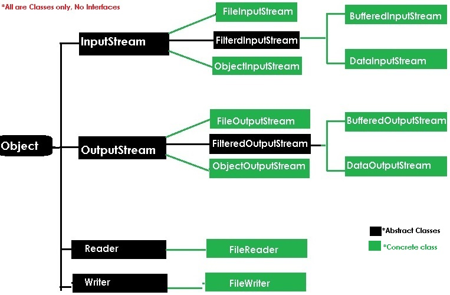

java.io package
==========

For dealing with input & Output Operations in java we have **java.io.\***
package

In java we will write two types of programs

**1. volatile programs** : whose result are stored in main Memory
(RAM),Temporally (Ex. Console Applications)

**2. Non-Volatile programs** : whose results are saved permanently in secondary
memory like Drives,Harddisks, Databases & files.

**Stream** : flow of data/bites/bytes from source to destination

We have following types of streams to handle IO operations.

 **1. Byte Streams** : perform input and output of 8-bit bytes.
   (**FileInputStream** & **FileOutputStream**)

   **2**. **Character Streams** : I/O of character data, automatically handling
 translation to and from the local character set (**FileReader and
   FileWriter)**

   **3. Buffered Streams** : Above are **unbuffered I/O**. This means each read
 or write request is handled **directly by the underlying OS.** Buffered
   input streams read data from a memory area known as a buffer; the native
  input API is called only when the buffer is empty. Similarly, buffered
 output streams write data to a buffer, and the native output API is called
 only when the buffer is full **(BufferedInputStream and
  BufferedOutputStream)**

**4. Data Streams** handle I/O of primitive data type and String values.
   **( DataInputStream & DataOutputStream.)**

  **5. Object Streams** : handle binary I/O of objects**. (ObjectInputStream   and ObjectOutputStream)**

InputStream, OutputStream methods can be used by all their child classes for
performing IO operations

**1. InputStream : read Data from File/Source**

1.  *public int read ();*

2.  *public int length (); // total size of the file*

3.  *public int available (); // available number of bytes only*

4.  *public void close ();*

**2.OutputStream : Write data to file/Destination**

1.  *public void write (int);*

2.  *public int length ();*

3.  *public void available ();*

4.  *public void close ();*

In java End of file (EOF) is indicated by -1
