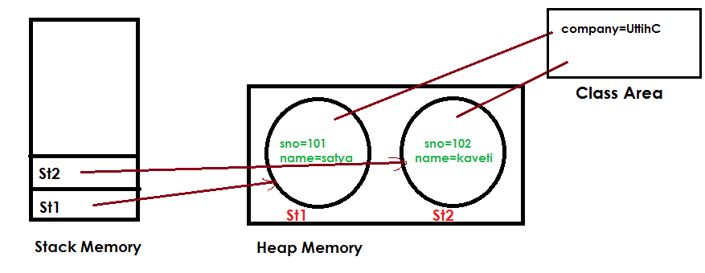

3.Types of Variables
====================

**Declaring Multiple Variables**

```java
int i1, i2, i3 = 0;
```
As you should expect, three variables were declared: i1, i2, and i3. However,
only one of those values was initialized: i3. The other two remain declared but
not yet initialized.  
<br>

```java
int num, String value; // DOES NOT COMPILE
```
This code doesn’t compile because it tries to declare multiple variables of different types in the same statement.  
<br>

###### 1.Instance Variables 

-   If the value of a variable is varied from object to object. Such type of
    variables are called instance variables. For every object a separate copy of
    instance variables will be created.

-   Instance variables will be crated at the time of object creation and will be
    destroyed at the time of object destruction

-   All the Instance variables Stored in **“Heap area"**
    ```java
    public class Demo
    {
        int count = 20;        //1 - Instance variable
    }
    ```
<br>

###### 2.Staic Variables 

Static variable will get the memory only once, if any object changes the value
of the static variable, it will retain its value



-   If the value of a variable is fixed for all objects, then we have to declare
    at class level by using static keyword. For the static variables a single
    copy will be created at class level and shared by all objects of that class.

-   Static variables will be created at the time of class loading and destroyed
    at the time of unloading.

-   All Static variables are Stored in **“Method Area"**
    ```java
    public class Test {
    	int i;
    	static int j = 10;
    
    	public static void main(String arg[]) {
    		Test t1 = new Test();
    		t1.i = 100;
    		t1.j = 200;
    		Test t2 = new Test();
    		System.out.println(t2.i + " : " + t2.j); // 0 : 200
    	}
    }
    ```
<br>

###### 3.Local variables

-   If we are declaring a variable with in a method or constants or block such
    type of variables are called local variables.

-   For the local variables JVM won’t provide any default values. **Before using
    a local variable compulsory we should perform initialization explicitly
    otherwise compile time error.**
    ```java
    public class Test {
    public static void main(String arg[]) {
        int i;
        System.out.println(i);
     }
    }
    Exception in thread "main" java.lang.Error: Unresolved compilation problem: 
    	The local variable i may not have been initialized
    ```
    
    If you won't use, No Error  
     ```java
    public class Test {
      public static void main(String arg[]) {
             int i;
             System.out.println("Here i not used");//No error
      }
    }
    ```
<br>

-   It is not recommended to perform initialization of local variables in
    logical blocks because there is no guaranty of execution these blocks at runtime.
    ```java
    public class Test {
    	public static void main(String arg[]) {
    		int i;
    		if (arg.length > 0) {
    			i = 10;
    		}
    		System.out.println(i);
    	}
    }
    Test.java:9: error: variable i might not have been initialized
    System.out.println(i);
    
    
    
    class Test {
    	public static void main(String arg[]) {
    		int i;
    		if (arg.length > 0) {
    			i = 10;
    		} else {
    			i = 20;
    		}
    		System.out.println(i);
    	}
    }
    //Because if we give arguments 10 will be initialized other wise 20 will be initialized.
    //It is not good programming practice to perform initialization in logical blocks for local variables because they may not execute at runtime.
    ```
<br>

-   The only applicable modifier for the local variable is **final**. If we are
    using any other modifier we will get compile time error.
```java
public class Test {
	public static void main(String arg[]) {
 public int a;
 protected int b;
 private int c; 	
	}
}
Test.java:7: error: illegal start of expression
                public int a;
```
<br>

main() method
-------------

JVM always calls main method to start the program. **Compiler is not
responsible** to check whether the class contain main() or not. Hence if we
don’t have main method **we won’t get any C.E. But at runtime JVM raises
NoSuchMethodError:main**
