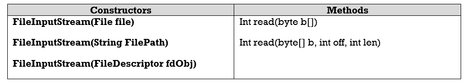
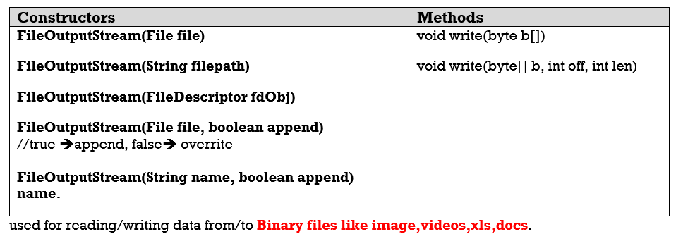

1.Byte Streams
===============

-   Data transfer is **one byte at a time** from source to destination

-   used to read byte-oriented data. For example,  **to read image, audio, video
    etc**

**1. FileInputStream** is meant for reading streams of raw bytes such **as image
data**. For reading streams of characters, consider using **FileReader**. Below
are the constructor’s to use FileInputStream



**2. FileOutputStream**



used for reading/writing data from/to **Binary files like
image,videos,xls,docs**.

Example
```java
public class ByteStreams {
	public static void main(String[] args) throws IOException {
		String filepath = "E:\\users\\Kaveti_s\\Desktop\\Books\\tmp.txt";
		FileOutputStream outputStream = new FileOutputStream(filepath);
		for (int i = 0; i < 10; i++) {
			outputStream.write(i);
		}
		FileInputStream inputStream = new FileInputStream(filepath);
		int i;
		while ((i = inputStream.read()) != -1) {
			System.out.println("I : " + i);
		}
	}
}

---------------------------------------
I : 0,I : 1,I : 2,I : 3,I : 4,I : 5,I : 6,I : 7,I : 8,I : 9
```


 If we open **tmp.txt** , the data in the form of bytes. That means we can’t
read that data. For above example the file data is **Ā̂Ԅ܆ई**
