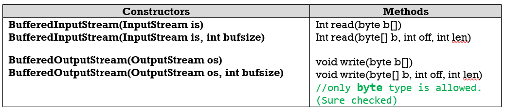

3.Buffered Streams
===================

-   Buffering can speed up IO quite a bit. Rather than read one byte at a time
    from the network or disk, the **BufferedInputStream reads a larger block at
    a time into an internal buffer**.

-   When you read a byte from the BufferedInputStream you are therefore reading
    it from its internal buffer.

-   When the buffer is fully read, the BufferedInputStream reads another larger
    block of data into the buffer.

-   This is typically much faster than reading a single byte at a time from an
    InputStream, especially for disk access and larger data amounts.

To convert an unbuffered stream into a buffered stream, we need to pass the
unbuffered stream object to the constructor for a buffered stream class

**Example**
```java
inputStream = new BufferedReader(new FileReader("xanadu.txt"));
outputStream = new BufferedWriter(new FileWriter("characteroutput.txt"));
```


**1. BufferedInputStream:**  
**BufferedInputStream** class is used for reducing number of physical read
operation. When we
create an object of BufferedInputStream, we get a temporary peace of memory
space **whose default size is 1024 bytes** and it can be increased by multiples of 2.

**2.BufferedOutputStream:**  
BufferedOutputStream class is used for reducing number of physical write
operation when we create an object of BufferedOutputStream, we get a temporary peace of memory space whose **default size is 1024 bytes** and it can be increased by multiple of 2.

used for reading/writing data from/to **Files**.

Example
```powershell
public class BufferedStreams {
	public static void main(String[] args) throws IOException {
		String filepath = "E:\\users\\Kaveti_s\\Desktop\\Books\\sl.txt";
		// 1.Create Stream Object
		FileOutputStream fos = new FileOutputStream(filepath);
		// 2.pass Stream object to BufferStream constructor
		BufferedOutputStream bos = new BufferedOutputStream(fos);
		String s = "SmlCodes.com -Programmimg Simplified";
		byte[] b = s.getBytes();
		bos.write(b);
		bos.flush();

		// 1.Create Stream Object
		FileInputStream fis = new FileInputStream(filepath);
		// 2.pass Stream object to BufferStream constructor
		BufferedInputStream bis = new BufferedInputStream(fis);
		int i;  
	    while((i=bis.read())!=-1){  
	     System.out.println((char)i);  
	    } 
	}
}
```


-   Byte streams will transfer 1 byte of data at a time

-   Character streams will transfer 2 bytes of data at a time

-   Buffered Streams will transfer 1024 bytes of data at a time
