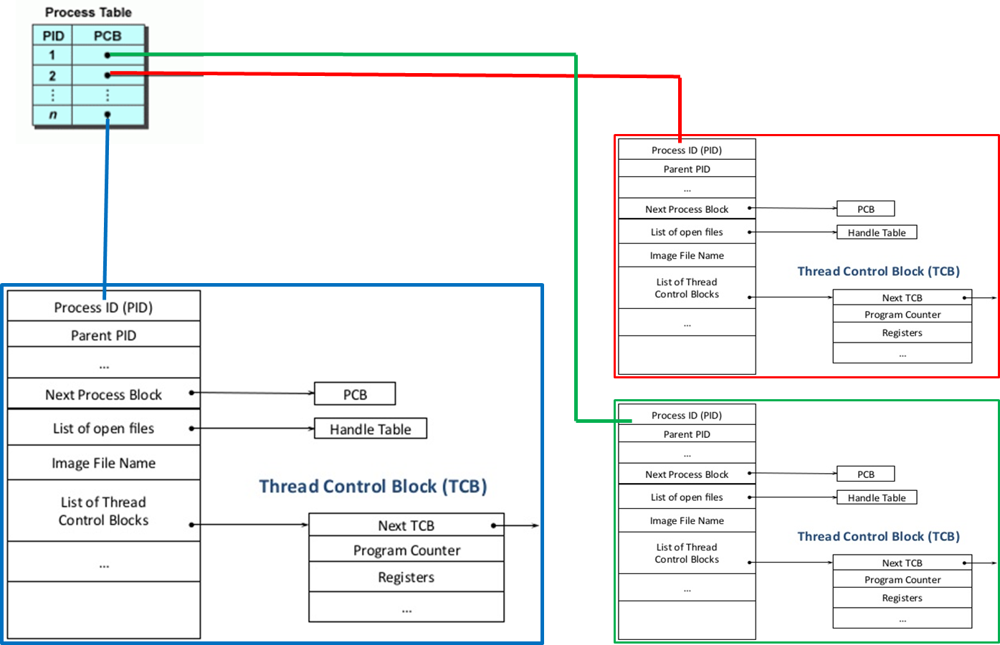
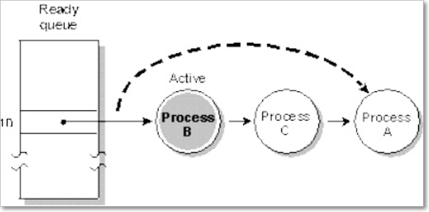
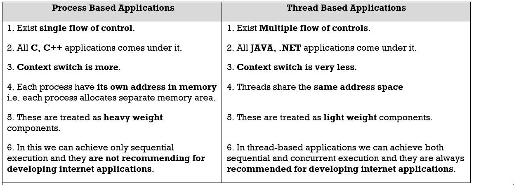

Threads
==========

Introduction to Multi-threading
-------------------------------

If a program contains **multiple flow of controls for achieving concurrent
execution,** then that program is known as **multi**-**threaded** program

The languages like **C, C++ comes under single threaded modeling languages**,
since there exists single flow of controls whereas the languages **like JAVA,
.NET are treated as multi-threaded modeling languages**, since there is a
possibility of creating multiple flow of controls

When we write any JAVA program there exist two threads they are

1.fore ground thread (main Thread)  
2.Back ground thread.

**1. Fore ground threads** are those which are **executing user defined
sub-programs**. There is a possibility of creating **‘n’ number of fore ground
threads**

**2. Back ground threads** are those which are **monitoring the status of fore
ground thread.** And always there exist **single back ground thread.**

In information technology we can develop two types of applications. They **are
process based applications** and **thread based applications.**

# Context Switch

<u>Context Switch in Process</u>  
Single flow of Execution is process. Each and every process has Process Control
Block**(PCB), the** state of the process is represented in PCB by the operating
system.

Whenever CPU want to execute the another process it will save the State of
current process in **PCB(Process Control Block)** with their PID, and loads the
new process to execute.

Here **Context Switch time is very high** because Process are running two
Different address spaces.

<u>Control Switch in Threads</u>  
A thread is a sequential execution stream within a process. This means that a
single process may be broken up into multiple threads. Each thread has its own
**Program Counter, registers, and stack**, but **they all share the same address
space within the process**.

When we switch between two threads all threads share the same address space cost
of switching between threads is much smaller than the cost of switching between
processes.
