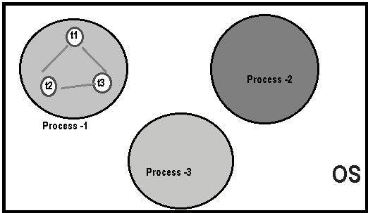

What is Thread
=================

A thread is a lightweight sub process, a smallest unit of processing. It is a
separate path of execution. Threads are independent, shares a common memory
area. if there occurs exception in one thread, it doesn't affect other threads.

As shown in the above figure, thread is executed inside the process. There is
context-switching between the threads. There can be multiple processes inside
the OS and one process can have multiple threads

At a time one thread is executed only.

Thread Life Cycles (Thread States)
----------------------------------

See below picture which compares Interview process & Thread Execution process.

Based on the process of execution of thread, people said there are 5 states of a
thread

**1. New**: Thread is created and about to enter into main memory. **i.e.**, New
Thread Object is created but **before the invocation of start() method.**

**2. Ready/Runnable**: thread memory space allocated and it is waiting for CPU
for executing. i.e., **after invocation of start() method**, but the thread
scheduler has not selected

**3. Running**: thread is under the control of CPU. i.e., **thread scheduler has
selected (run() executing)**.

**4. Waiting:** This is the state when the thread is still alive, but is
currently not eligible to run. Thread is waiting because of the following
factors:

-   For the repeating CPU burst time of the thread

-   Make the thread to sleep for some specified amount of time.

-   Make the thread to suspend.

-   Make the thread to wait for a period of time.

-   Make the thread to wait without specifying waiting time.

**5. Terminated:** thread has completed its total execution. i.e., Exit form run
() method

 

<u>We have two ways of creating Thread,</u>
-   **by extending java.lang.Thread class**
-   **By implementing java.lang.Runnable interface.**

In multi-threading we get only one exception known as
`java.lang.InterruptedException.`
