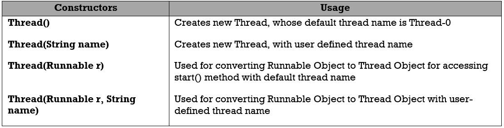

java.lang.Thread class
=========================

Creating a flow of control in Java is nothing but creating an object of
**java.lang.Thread** class.

An object of Thread class can be created in three ways. They are:

-   Directly **Thread t=new Thread ();**

-   Using factory method **Thread t1=Thread.currentThread ();**

-   Using sub-class that **extends Thread class**

public class **Thread** *extends* **Object** *implements*   

 

<u>Instance Thread State Methods</u>

**1. void start ()** Used for making the **Thread to start to execute the thread
logic**. The method start is **internally calling** the method **run ().**

**2. void run ():** The thread that logic must be defined only in run () method.
When the thread is started, the JVM looks for the appropriate run () method for
executing the logic of the thread. **Thread class is a concrete class and it
contains all defined methods and all these methods are being to final except run
() method. run () method is by default contains a definition with null body**.
Since we are providing the logic for the thread in run () method. Hence it must
be overridden by extending Thread class into our own class.

**3. void suspend() -** This method is used for **suspending the thread from
current execution** of thread. When the thread is suspended**, it sends to
waiting state by keeping the temporary results in Thread control block (TCB) &
Process control block (PCB)**. (deprecat**ed)**

**4. void resume() -**resumes suspend() Thread. Resumed to start executing from
where it left out previously by **retrieving the previous result from PCB**
(deprecated)

**5. void interrupt() -**Interrupts this thread

**6. void join() -**Waits for this thread to die.

**7. void join(long mil) -**Waits at most milliseconds for this **thread to
die**

**8. void stop() -**is used to stop the thread(deprecated).

 

<u>Static Methods</u>  
**Static void sleep(long ms)** - sleeps/temporary block the thread for specified amount of time

**Static void yield ()** - pause current thread and allow other threads to execute

**Static Thread currentThread()** -Get currently running thread Object. mainly used in **run()**

**Static int activeCount()** -Counts the no.of active threads in current thread group& subgroups.
