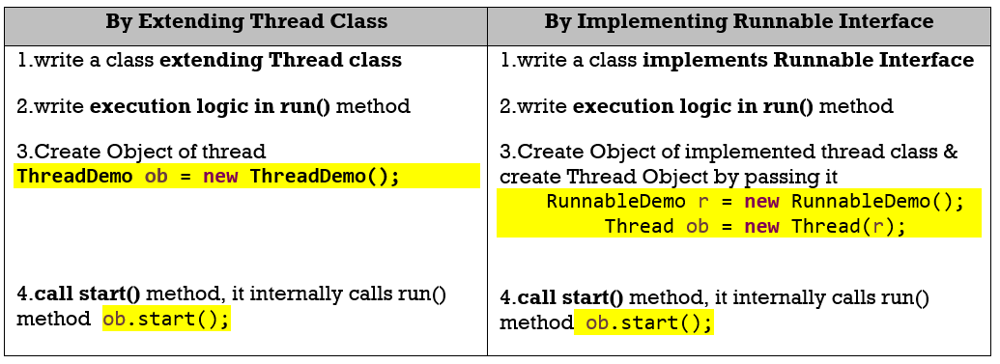

39.java.lang.Runnable Interface
===============================

Runnable Interface has only one abstract method run(). Thread class is
implemented Runnable interface run() method as null body method

**public void run():** is used to perform action for a thread

As said we can use either of Thread class /Runnable interface to implement
threads.

**<u>By Extending Thread Class</u>**
```java
public class ThreadDemo extends Thread {
	@Override
	public void run() {
 System.out.println("Iam Running");
	}
	public static void main(String[] args) {
 ThreadDemo ob = new ThreadDemo();
 ob.start();
	}
}
```


**<u>By Implementing Runnable Interface</u>**
```java
public class RunnableDemo implements Runnable {
	@Override
	public void run() {
 System.out.println("Iam Running");
	}
	public static void main(String[] args) {
 RunnableDemo r = new RunnableDemo();
 Thread ob = new Thread(r);
 ob.start();
	}
}
```



Example 1:
```java
public class ThreadExample extends Thread {
	@Override
	public void run() {
 System.out.println("----- \n Im Run() Running....\n -----");
	}
	public static void main(String[] args) throws InterruptedException {
 ThreadExample th = new ThreadExample();
 System.out.println(th.getState().name());
 th.start();
 System.out.println(th.getState().name());
 System.out.println("getId : " + th.getId());
 System.out.println("getName : " + th.getName());
 System.out.println("getPriority : " + th.getPriority());
 System.out.println("isAlive : " + th.isAlive());
 System.out.println("isDaemon : " + th.isDaemon());
 System.out.println("getThreadGroup : " + th.getThreadGroup().getName());
 th.setName("SmlCodes-Thread");
 System.out.println("getName : " + th.getName());
 Thread.sleep(2500);//
 System.out.println(th.getState().name());
	}
}
-------------------------------------
NEW
RUNNABLE
getId : 9
getName : Thread-0
getPriority : 5
isAlive : true
isDaemon : false
getThreadGroup : main
getName : SmlCodes-Thread
----- 
 Im Run() Running....
 -----
TERMINATED
```

<br>

Example 2: Thread program which displays 1 to 10 numbers after each and every 1
second
```java
public class SleepDemo extends Thread {
	public void run() {
 for (int i = 1; i <= 10; i++) {
 	System.out.println(i);
 	try {
  Thread.sleep(1000);
 	} catch (InterruptedException e) {
  e.printStackTrace();
 	}
 }
	}
	public static void main(String[] args) {
 SleepDemo ob1 = new SleepDemo();
 SleepDemo ob2 = new SleepDemo();
 ob1.start();
 ob2.start();	}
}
-----------------------------
1
1
2
2
3
3
4
4
5
5
6
6
7
7
8
8
9
9
10
10
```


Example 3: What happens if we start same Thread(ob) Twice?
```java
public class ThreadDemo extends Thread {
	@Override
	public void run() {
 System.out.println("Iam Running");
	}
	public static void main(String[] args) {
 ThreadDemo ob = new ThreadDemo();
 ob.start();
 ob.start();
	}
}
--------------------------------------
Exception in thread "main" java.lang.IllegalThreadStateException
	at java.lang.Thread.start(Thread.java:705)
	at threads.ThreadDemo.main(ThreadDemo.java:11)
Iam Running
```

<br>

**What happens if we call run() method instead of start()**  
If we start **run()** method directly JVM treats it as a normal method **& it
does have characteristics like concurrent execution**. In **Example 2** if you
see both threads are executing parallel. Here below example we are calling
**run()** method directly. See the output

```java
public class SleepDemo extends Thread {
	public void run() {
 for (int i = 1; i <= 10; i++) {
 	System.out.println(i);
 	try {
  Thread.sleep(1000);
 	} catch (InterruptedException e) {
  e.printStackTrace();
 	}
 }
	}
	public static void main(String[] args) {
 SleepDemo ob1 = new SleepDemo();
 SleepDemo ob2 = new SleepDemo();
 ob1.run();
 ob2.run();
	}
}
------------Output-------------------
1
2
3
4
5
6
7
8
9
10
1
2
3
4
5
6
7
8
9
10
```


> Remember: only one exception `InterruptedException`


# Callable Interface
```java
public interface Callable<V> {
    V call() throws Exception;
}
```


```java
public class Demo implements Callable<String>{
	
	@Override
	public String call() throws Exception {
 return "Hello";
	}	
	
	public static void main(String[] args) throws Exception {
 String msg = new Demo().call();
 System.out.println(msg);
	}
}
Hello
```
