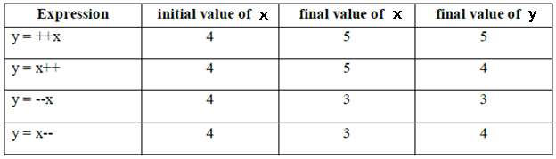

4.Operators
===========
```java
System.out.print(9 / 3); // Outputs 3
System.out.print(9 % 3); // Outputs 0

System.out.print(10 / 3); // Outputs 3
System.out.print(10 % 3); // Outputs 1

System.out.print(11 / 3); // Outputs 3
System.out.print(11 % 3); // Outputs 2

System.out.print(12 / 3); // Outputs 4
System.out.print(12 % 3); // Outputs 0
```
<br>

###### Numeric Promotion Rules

1. If two values have different data types, Java will automatically promote one
of the values to the larger of the two data types.

2. If one of the values is integral and the other is floating-point, Java will
automatically promote the integral value to the floating-point value’s data
type.

3. Smaller data types, namely byte, short, and char, are first promoted to int
any time they’re used with a Java binary arithmetic operator, even if neither of
the operands is int.

4. After all promotion has occurred and the operands have the same data type,
the resulting value will have the same data type as its promoted operands. 

<br>

**What is the data type of x / y?**
```java
short x = 10;
short y = 3;
```
In this case, we must apply the third rule, namely that
-   first x and y will both be promoted to int
-   After promotion, operation will perform, resulting output of int type.

<br>


**What is the data type of x \* y / z?**

**All expressions will calculated from left to right (------)**
```java
short x = 14;

float y = 13;

double z = 30;
```
we evaluate the multiple and division from left-to-right. In this case, we must
apply all of the rules. First, x will automatically be promoted to int solely
because it is a short and it is being used in an arithmetic binary operation.
The promoted x value will then be automatically promoted to a float so that it
can be multiplied with y. The result of x \* y will then be automatically.

<br>

###### 1.Increment/ Decrement



-   For the final variables we can’t apply increment or decrement operators
    ```java
    final int i=10;
    	i++;  
     (or)		 
    i=20;
    Test.java:8: error: cannot assign a value to final variable i
                     i++;
                     ^
    ```
<br>

-   We can apply increment or decrement operators even for **floating point data
    types** also.
```java
double d = 10.5;
d++;
System.out.println(d);// 11.5
```
<br>

**How this following expression is evaluated?**
 ```java
int x = 3;
int y = ++x * 5 / x-- + --x;
	(------------)
// All expressions will calculated from left to right (------)


System.out.println("x is " + x);
System.out.println("y is " + y);

int y = 4 * 5 / x-- + --x; // x assigned value of 4
int y = 4 * 5 / 4 + --x; // x assigned value of 3
int y = 4 * 5 / 4 + 2; // x assigned value of 2
```
we evaluate the multiple and division from left-to-right, and finish with the
addition. The result is then printed: x is 2 & y is 7

<br>

**Does it work?**
```java
long t = 192301398193810323; // DOES NOT COMPILE
```


It does not compile because Java interprets the literal as an int and notices
that the value is larger than int allows. The literal would need a postfix L to
be considered a long
```java
short x = 10;
short y = 3;
short z = x * y; // DOES NOT COMPILE

short x = 10;
short y = 3;
short z = (short)(x * y);

long x = 10;
int y = 5;
y = y * x; // DOES NOT COMPILE
```
In last line could be fixed with an explicit cast to (int), but there’s a better
way using the compound assignment operator:

<br>

```java
long x = 10;
int y = 5;
y \*= x; //is equals to y =(int) y\*x;
```


The compound operator will first cast x to a long, apply the multiplication of
two long values, and then cast the result to an int.
```java
long x = 5;
long y = (x=3);
System.out.println(x); // Outputs 3
System.out.println(y); // Also, outputs 3
```
<br>

**Infinity and -Infinity**

-   In Integer Athematic (byte,int,short), if anything divide 0 will get `Runtime Exception:ArithematicException: Divide by 0.`

-   But In Floating point athematic, if anything divide by 0.0, we will get
    **Infinity/ -Infinity**

    ```java
    System.*out*.println(10 / 0.0); // Infinity
    
    System.*out*.println(-10 / 0.0);// -Infinity
    ```
<br>

**NaN – Not a Number**

-   In Integer Athematic (byte,int,short), 0 divide 0 will get R.E: A.E: Divide
    by 0.

-   But In Floating point athematic, 0 divide by 0.0, we will get **Nan (no -Nan
    is there)**
    ```java
    System.*out*.println(0.0 / 0.0); // NaN
    
    System.*out*.println(-0.0 / 0.0);// NaN
    ```

<br>

###### Equality Operators (==)

The comparisons for equality are limited to same Data Types, so you cannot mix
and match types. For example, each of the following would result in a compiler
error:
```java
boolean x = true == 3; // DOES NOT COMPILE
boolean y = false != "Giraffe"; // DOES NOT COMPILE
boolean z = 3 == "Kangaroo"; // DOES NOT COMPILE
```

<br>

###### Conditional Statements

```java
int x = 1;
if(x) { // DOES NOT COMPILE
...
}

int x = 1;
if(x = 5) { // DOES NOT COMPILE
...
}

System.out.println((y > 5) ? 21 : "Zebra");
int animal = (y < 91) ? 9 : "Horse"; // DOES NOT COMPILE
```
> ^ (X-OR) - Homogeneous are FALSE(T,T F,F), Heterogeneous are TRUE(T,F  F,T)
