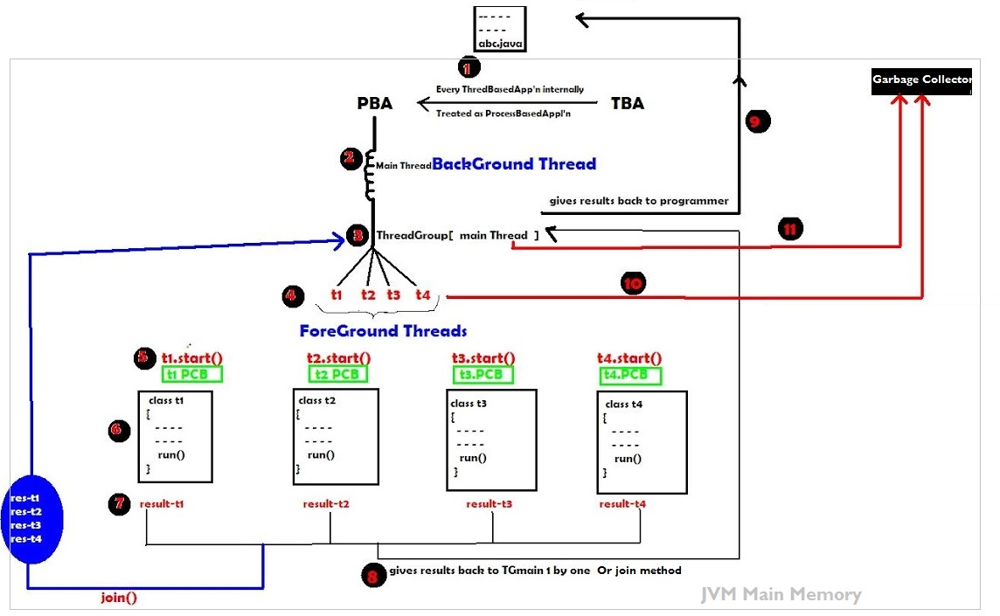
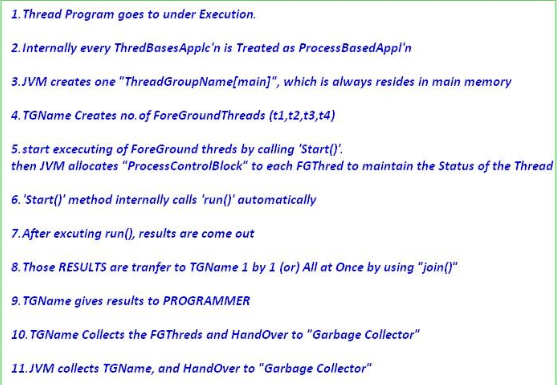

Joining a Thread 
====================================

> Thread internal working







In above after completion of thread execution result are given to one by one /
All at once using **join() method to Thread Group name**

This method is used for making the **fore ground threads to join together**, so
that JVM can call the garbage collector only one time for collecting all of them
instead of collecting individually.

<br>

<u>We have two join() methods</u>

`1.public void join() throws InterruptedException` :Waits for this thread to die.

It will wait until Thread logic completion & after that it will joins the
    Thread & Gives to Garbage collector
```java
package threads;

public class JoinExample extends Thread {
	@Override
	public void run() {
		for (int i = 1; i <= 10; i++) {
			try {
				Thread.sleep(500);
			} catch (InterruptedException e) {
				// TODO Auto-generated catch block
				e.printStackTrace();
			}
			System.out.println(i);
		}
	}

	public static void main(String[] args) {
		JoinExample t1 = new JoinExample();
		JoinExample t2 = new JoinExample();
		JoinExample t3 = new JoinExample();

		t1.start();
		try {
			t1.join();
		} catch (InterruptedException e) {
			// TODO Auto-generated catch block
			e.printStackTrace();
		}
		t2.start();
		t3.start();
	}
}
-------------------------------
1
2
3
4
5
6
7
8
9
10
1
1
2
2
3
3
4
4
5
5
6
6
7
7
8
8
9
9
10
10
```


In above t2, t3 threads waits for t1 thread to die. After completion of t1
thread execution t12, t3 are started.

`2.public void join(long milliseconds)throws InterruptedException` : Waits at most milliseconds for this thread to die. That means it waits for thread to die in give milliseconds. If it won’t die in give time treated as normal thread & executes parallel with other threads if any.

```java
public class JoinExample extends Thread {
	@Override
	public void run() {
		for (int i = 1; i <= 10; i++) {
			try {
				Thread.sleep(1000);
			} catch (InterruptedException e) {
			// TODO Auto-generated catch block
				e.printStackTrace();
			}
			System.out.println(i);
		}
	}

	public static void main(String[] args) {
		JoinExample t1 = new JoinExample();
		JoinExample t2 = new JoinExample();
		JoinExample t3 = new JoinExample();

		t1.start();
		try {
			t1.join(5000);
		} catch (InterruptedException e) {
			// TODO Auto-generated catch block
			e.printStackTrace();
		}
		t2.start();
		t3.start();
	}
}
------------------
1
2
3
4
5
1
1
6
7
2
2
3
3
8
9
4
4
10
5
5
6
6
7
7
8
8
9
9
10
10
```


If you see in above example t2, t3 threads are waiting for t1 thread to die in
2500 milliseconds. But in given time t1 did not die. So, t2, t3 threads start
their execution parallel with t1 thread
