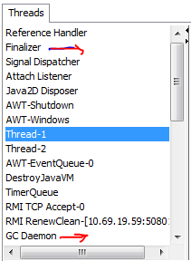

Daemon Thread
================

**Daemon thread** is a thread that provides services to the user thread. There
are many java daemon threads running automatically **e.g. gc, finalizer etc.**
JVM terminates these thread automatically**.**

We can see all daemon threads using **JConsole**
(C:\\ProgramFiles\\Java\\jdk1.8.0_45\\bin\\jconsole.exe)



-   It provides services to user threads for background supporting tasks. It has
    no role in life than to serve user threads.

-   Its life depends on user threads.

-   It is a low priority thread.

We have two methods to dealing the Demon Threads

**1.public void setDaemon(boolean status)** : set  scurrent thread as daemon
thread or user thread.

**2. public boolean isDaemon()** : is used to check that current is daemon.

Example
```java
public class DemonEx extends Thread {
	@Override
	public void run() {
 Thread th = Thread.currentThread();
 if (th.isDaemon()) {
 	System.out.println("DEMON THREAD " + th.getName());
 } else {
 	System.out.println("NORMAL THREAD " + th.getName());
 }
	}

	public static void main(String[] args) {
 DemonEx t1 = new DemonEx();
 DemonEx t2 = new DemonEx();

 t1.setDaemon(true);
 t1.start();
 t2.start();
	}
}
---------------------------
DEMON THREAD Thread-0
NORMAL THREAD Thread-1
```


If you want to make a user thread as Daemon, **it must not be started**
otherwise it will throw **IllegalThreadStateException**
```java
public static void main(String[] args) {
 DemonEx t1 = new DemonEx();
 DemonEx t2 = new DemonEx();
 t1.start();
 t1.setDaemon(true); 
 t2.start();
	}
	-------------------------------------
Exception in thread "main" java.lang.IllegalThreadStateException
	at java.lang.Thread.setDaemon(Thread.java:1352)
	at threads.DemonEx.main(DemonEx.java:18)
```


Thread Group
------------

Thread Group is a process of grouping multiple threads in to a single object. We
can suspend, interrupt & resume in a single method call.

<u>Constructors</u>
* `ThreadGroup(String name)` : creates a thread group with given name.
* `ThreadGroup(ThreadGroup parent, String name)`:creates a thread group with given parent group & name.  


<u>Methods</u>

* `int activeCount()` returns no. of threads running in current group.
* `int activeGroupCount()`	returns a no. of active group in this thread group.
* `void destroy()` 	destroys this thread group and all its sub groups.
* `String getName()` returns the name of this group.
* `ThreadGroup getParent()`	returns the parent of this group.
* `void interrupt()` interrupts all threads of this group.
* `void list()` 	prints information of this group to standard console.

```java
class ThreadEx extends Thread {
	@Override
	public void run() {
	Thread th = Thread.currentThread();
    System.out.println("Thread Name:"+th.getName()+"Name:"+ th.getThreadGroup());
	}
}
public class ThreadGroupDemo {
	public static void main(String[] args) throws InterruptedException {
 ThreadGroup tg = new ThreadGroup("SmlCodes Group");
 ThreadEx thread = new ThreadEx();
 // adding thraeds to Theard Group
 Thread t1 = new Thread(tg, thread, "Thread-1");
 t1.start();
 Thread t2 = new Thread(tg, thread, "Thread-2");
 t2.start();
 Thread t3 = new Thread(tg, thread, "Thread-3");
 t3.start();
 tg.list();
	}
}
---------Output---------------
java.lang.ThreadGroup[name=SmlCodes Group,maxpri=10]
Thread Name: Thread-3 	 Thread Group Name: java.lang.ThreadGroup[name=SmlCodes Group,maxpri=10]
Thread Name: Thread-1 	 Thread Group Name: java.lang.ThreadGroup[name=SmlCodes Group,maxpri=10]
Thread Name: Thread-2 	 Thread Group Name: java.lang.ThreadGroup[name=SmlCodes Group,maxpri=10]
    Thread[Thread-1,5,SmlCodes Group]
    Thread[Thread-2,5,SmlCodes Group]
    Thread[Thread-3,5,SmlCodes Group]
```
