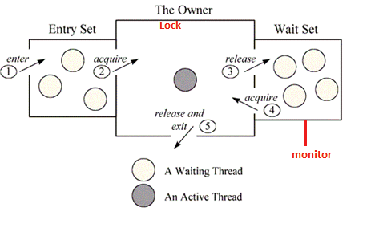

Inter Thread Communication
=============================

If a Thread is synchronized only one thread should be access at a time. To
access multiple threads on synchronized resource their should be some
communication between them. Inter-thread communication or Co-operation is all
about allowing synchronized threads to communicate with each other.

**Inter-thread communication** is a mechanism in which **a thread is paused
running in its critical section and another thread is allowed to enter (or lock)
in the same critical section to be executed**. It is implemented by following
**methods of Object class**:

-   **void wait()** - waits the current thread until another thread invokes the
    notify()

-   **void wait (long ms)-** waits the current thread until another thread
    invokes the notify()/specified amount of time

-   **void notify()** -Wakes up a single thread that is waiting on this object's
    monitor.

-   **void notifyAll()** -Wakes up all threads that are waiting on this object's
    monitor.

### 1. What is a Monitor?

In general terms monitor can be considered as a building which contains a
special room. The special room can be occupied by only one customer(thread) at a
time. The room usually contains some data and code.


 A monitor is mechanism to control concurrent access to an object.

```java
Thread 1:
public void a()
{
    synchronized(someObject) {
        // do something (1)
    }
}
-------------------
Thread 2:
public void b()
{
    synchronized(someObject) {
        // do something else (2)
    }
}
```

This prevents Threads 1 and 2 accessing the monitored (synchronized) section at
the same time. One will start, and monitor will prevent the other from accessing
the region before the first one finishes.


<br>

### Difference between lock and monitor



Above figure shows the monitor as three rectangles. In the center, a large
rectangle contains a single thread, the monitor’s owner. On the left, a small
rectangle contains the entry set. On the right, another small rectangle contains
the wait set.

Locks help threads to work independently on shared data without interfering with
one another, wait-sets help threads to cooperate with one another to work
together towards a common goal e.g. all waiting threads will be moved to this
wait-set and all will be notified once lock is released. This wait-set helps in
building monitors with additional help of lock (mutex).

<br>

**<u>Example Inter Thread Communication</u>**
```java
class Customer {
	int amount = 10000;

	synchronized void withdraw(int amount) {
 System.out.println("WITHDRAWING \n****************");
 if (this.amount < amount) {
 System.out.println(" LESS BALANCE !!!!");
 try {
	System.out.println("withdraw() is on wait untill deposit() notify ");
  wait();
 	} catch (Exception e) {
 	}
 }
 this.amount -= amount;
 System.out.println(" ******* WITHDRAW COMPLETED **********");
	}

	synchronized void deposit(int amount) {
 System.out.println("\n\n DEPOSITING \n ****************");
 this.amount += amount;
 System.out.println("DEPOSIT COMPLETED ");
 System.out.println("calling nofity on withdraw()");
 notify();
	}
}

public class InterThreadCom {
	public static void main(String args[]) {
 final Customer c = new Customer();
 new Thread() {
 	public void run() {
  c.withdraw(15000);
 	}
 }.start();
 new Thread() {
 	public void run() {
  c.deposit(10000);
 	}
 }.start();
	}
}
----------------------------------------
WITHDRAWING 
****************
 LESS BALANCE !!!!
withdraw() is on wait untill deposit() notify 

 DEPOSITING 
 ****************
DEPOSIT COMPLETED 
calling nofity on withdraw()
 ******* WITHDRAW COMPLETED **********
```

<br>

### Difference between wait and sleep

Let's see the important differences between wait and sleep methods.

| **wait()**                                            | **sleep()**                                             |
|-------------------------------------------------------|---------------------------------------------------------|
| wait() method releases the lock                       | sleep() method doesn't release the lock.                |
| is the method of Object class                         | is the method of Thread class                           |
| is the non-static method                              | is the static method                                    |
| should be notified by notify() or notifyAll() methods | after the specified amount of time, sleep is completed. |

`wait(), notify()` and `notifyAll()` methods are defined in Object class s because
they are related to lock and object has a lock
