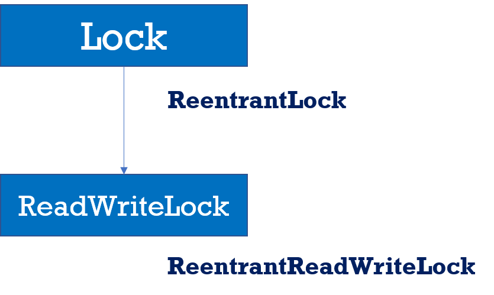
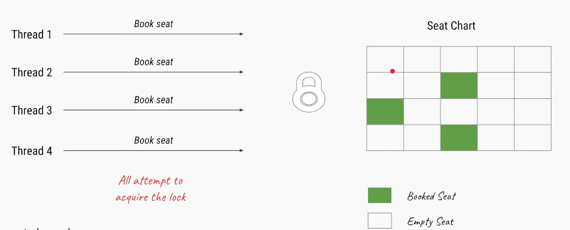
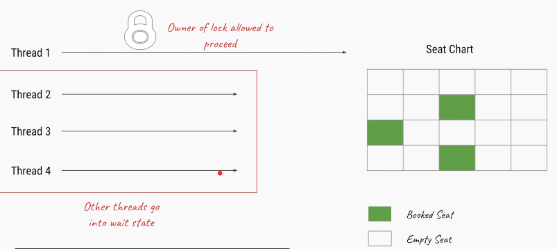
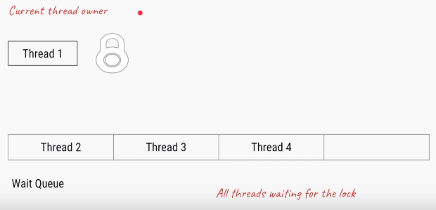
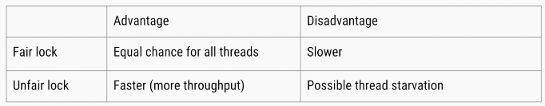
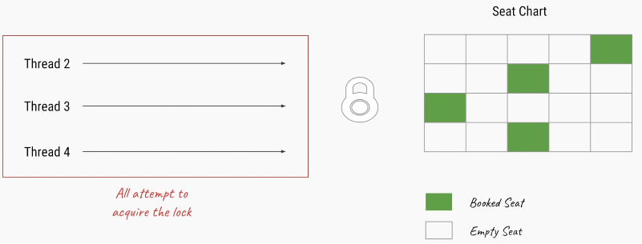
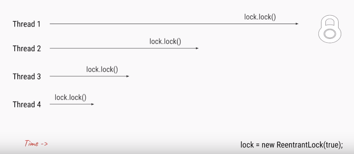

java.util.Concurrency 
=========================

**java.util.concurrent** package introduced in version 5.0 with following
features

-   [Lock
    objects](https://docs.oracle.com/javase/tutorial/essential/concurrency/newlocks.html) support
    locking idioms that simplify many concurrent applications.

-   [Executors](https://docs.oracle.com/javase/tutorial/essential/concurrency/executors.html) define
    a high-level API for launching and managing threads. Executor
    implementations provided by java.util.concurrentprovide thread pool
    management suitable for large-scale applications.

-   [Atomic
    variables](https://docs.oracle.com/javase/tutorial/essential/concurrency/atomicvars.html) have
    features that minimize synchronization and help avoid memory consistency
    errors.

-   [ThreadLocalRandom](https://docs.oracle.com/javase/tutorial/essential/concurrency/threadlocalrandom.html) (in
    JDK 7) provides efficient generation of pseudorandom numbers from multiple
    threads.

-   [Concurrent
    collections](https://docs.oracle.com/javase/tutorial/essential/concurrency/collections.html) make
    it easier to manage large collections of data, and can greatly reduce the
    need for synchronization.

Lock Interface
--------------

**java.util.concurrent.locks.Lock** interface is used to as a **thread
synchronization mechanism similar to synchronized blocks.**



<https://www.youtube.com/watch?v=ahBC69_iyk4&index=13&t=1s&list=PLhfHPmPYPPRk6yMrcbfafFGSbE2EPK_A6>


1.In BookTicket only one thread is allowed to Book Ticket



2.Here Thread-1 get the lock, other threads will wait until in waiting Queu, t1
releases the Lock







3.Once Lock got released, remaiing threads will try to get the Lock. Process
will continue.



<br>

**<u>Methods</u>**

**1.void lock()** – To aquire Lock.if lock is already availabale current thread
will get that lock.if lock is not available it waits untill get the lock.it is
similar to sysnchronized keyword.

**2.void unlock()** – Releases the lock.**if we call on thread which is not
having lock it will thorws runtime exception IllegalMonitorStateException**

**3.boolean tryLock()** – To quire lock waitout waiting.if it aquires lock
returns true, if not false & continues it execution without waiting.in this case
thread never goes into waiting state
```java
if(l.tryLock())
{//perform safe operations
}else{
	//perform alternative operations 
}
```

**4.boolean tryLock(long time, TimeUnit unit) –** Same as above, but specifying
time.TimeUnit is Enum having values as NANOSECONDS,SECONDS,MINITUES,HOURS,DAYS
```java
if(l.tryLock(1000,TimeUnit.MINITUES)) //waiting for 1000 minitues
{//perform safe operations
}else{
	//perform alternative operations 
}
```


**5. void lockInterruptibly()** – Aquires lock if available & returns
immdefiatly. Not available it will wait.while waiting if thread is interruped
then thread wont get the lock.

# **ReentrantLock** Interface
it is the **implementation** class of **Lock interface** & direct child class of
Object.Reentrant means **A thread can aquire same lock multiple times without
any issue**.

In ReentrantLock maintians **holdcount** variable**.** when ever we call
**lock()** it increments threads **holdcount++** & when ever thread calls
**unlock()** it decrements **holdcount--** value. Lock will realesed when ever
count reaches 0.

<u>1.lock on a resource more than once</u>  
ReentrantLock allow threads to enter into **lock on a resource more than once**.
When the thread first enters into lock, a **hold count** is set to one. Before
unlocking the thread can re-enter into lock again and every time hold count is
incremented by one. For every unlock request, hold count is decremented by one
and when hold count is 0, the resource is unlocked

<u>2.offer a fairness parameter</u>  
after a thread unlocks the resource, the lock would go to the thread which has
been waiting for the longest time. This fairness mode is set up by passing true
to the constructor of the lock.
```java
Lock lock = new ReentrantLock(true); //Setting Fairness Policy
```



<u>Methods</u>  
It has all the methods which are thir in Lock interface, additoionally it has
following methods.

**getHoldCount():** This method returns the count of the number of locks held on
the resource

**isHeldByCurrentThread():** This method returns true if the lock on the
resource is held by the current thread.

<u>NoramlLock Example</u>
```java
public class NormalLock extends Thread {
	static int i = 0;
	Lock lock = new ReentrantLock();

	@Override
	public void run() {
 increment();
	}

	public void increment() {
 try {
 	// WAIT FOR 2 Seconds to get the Lock
 	lock.lock();
 	i++;
 	S.O.P(Thread.currentThread().getName() + " Got Lock: incremented, i=" + i);
 	Thread.sleep(3000);
 	lock.unlock();

 } catch (InterruptedException e) {
 	e.printStackTrace();
 } finally {

 }
	}

	public static void main(String[] args) {	 

 NormalLock ob = new NormalLock();

 Thread t1 = new Thread(ob, "One");
 Thread t2 = new Thread(ob, "Two");
 Thread t3 = new Thread(ob, "Three");

 t1.start();
 t2.start();
 t3.start();
	}

}
-----------------------------------
One Got Lock: incremented, i=1
Three Got Lock: incremented, i=2
Two Got Lock: incremented, i=3
```
Here all the Threads are excuted, because each thread will wait until they get
the lock & in above we haven’t set fairness true, so order of thread excured
randomly(1, 3, 2)

If we set fairness is true output is like

`Lock lock = new ReentrantLock(true);`
```dos
One Got Lock: incremented, i=1
Two Got Lock: incremented, i=2
Three Got Lock: incremented, i=3
```

<br>

**<u>Example : tryLock()</u>**
```dos
public class TryLockDemo extends Thread {
	static int i = 0;
	Lock lock = new ReentrantLock();

	@Override
	public void run() {
 increment();
	}

	
   public void increment() {
 try {
 	// WAIT FOR 2 Seconds to get the Lock
 	if (lock.tryLock(2, TimeUnit.SECONDS)) {
  i++;
  SOP(Thread.currentThread().getName() + " Got Lock: incremented, i=" + i);
  Thread.sleep(3000);
  lock.unlock(); // Unlocks here
 	} else {
  SOP(Thread.currentThread().getName() + " Iam doing Something else");
 	}

 } catch (InterruptedException e) {
 	e.printStackTrace();
 } finally {
 	System.out.println("Final i : "+i);
 }
	}

	public static void main(String[] args) {
 // TODO Auto-generated method stub

 TryLockDemo ob = new TryLockDemo();

 Thread t1 = new Thread(ob, "One");
 Thread t2 = new Thread(ob, "Two");
 Thread t3 = new Thread(ob, "Three");

 t1.start();
 t2.start();
 t3.start();
	}
}
Three Got Lock: incremented, i=1
Two Iam doing Something else
One Iam doing Something else
Final i : 1
```

Here all thraeds trying to getlock, but Three Thraed got lock, remaining threads
wont wait for lock , they are executing else block some kind of alternative job
without waiting. So final count is 1.

**<u>HoldCount Example</u>**
```dos
package locks;

import java.util.concurrent.locks.ReentrantLock;

public class HoldCount extends Thread {
	static int i = 1;

	ReentrantLock lock = new ReentrantLock();

	@Override
	public void run() {
 lock.lock();
 System.out.println("one");

 lock.lock();
 System.out.println("Two");

 System.out.println("HOLD Count : " + lock.getHoldCount());
 lock.unlock();

 System.out.println("isHeldByCurrentThread : " + lock.isHeldByCurrentThread());

 System.out.println("HOLD Count : " + lock.getHoldCount());
 lock.unlock();

 System.out.println("HOLD Count : " + lock.getHoldCount());

	}

	public static void main(String[] args) {
 HoldCount t = new HoldCount();
 t.setName("BIG-THREAD");
 t.start();
	}

}
one
Two
HOLD Count : 2
isHeldByCurrentThread : true
HOLD Count : 1
HOLD Count : 0
```
