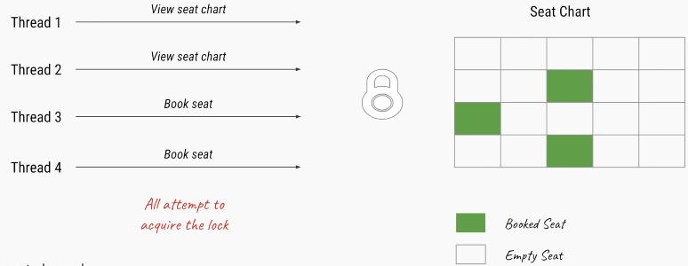

ReadWriteLock interface 
===========================

In addition to Lock interface,we have a *ReadWriteLock* interface which
maintains a pair of locks, one for read-only operations, and one for the write
operation.

### ReentrantReadWriteLock class

*ReentrantReadWriteLock* class is implementation of it

-   `Lock readLock()`– returns the lock that’s used for reading

-   `Lock writeLock()` – returns the lock that’s used for writing


```java
public class ReadWriteLockDemo implements Runnable {

	ArrayList list = new ArrayList<>();

	ReadWriteLock rwlock = new ReentrantReadWriteLock(true);

	Lock readLock = rwlock.readLock();
	Lock writeLock = rwlock.writeLock();

	public void write() {
 writeLock.lock();
 int ele = 100;
 list.add(ele);
 System.out.println(Thread.currentThread().getName() + " : Write : " + ele);
 try {
 	Thread.sleep(5000);
 } catch (InterruptedException e) {
 	// TODO Auto-generated catch block
 	e.printStackTrace();
 }
 writeLock.unlock();
	}

	public void read() {
 if (readLock.tryLock()) {
 	int index = list.size();
 	int ele = (int) list.get(index - 1);
 	System.out.println(Thread.currentThread().getName() + " : Read : " + ele);
 	readLock.lock();
 } else {
 	S.O.println(Thread.currentThread().getName() + ": Write Lock Not avaialble");
 }

	}

	@Override
	public void run() {
 String thname = Thread.currentThread().getName();
 if (thname.contains("write")) {
 	write();
 } else {
 	read();
 }
	}

	public static void main(String[] args) throws InterruptedException {
 ReadWriteLockDemo ob = new ReadWriteLockDemo();

 new Thread(ob, "write1").start();
 Thread.sleep(2000);
 new Thread(ob, "read1").start();
 Thread.sleep(5000);
 new Thread(ob, "read2").start();

	}

}
---------------------------
write1 : Write : 100
read1: Write Lock Not avaialble
read2 : Read : 100
```


