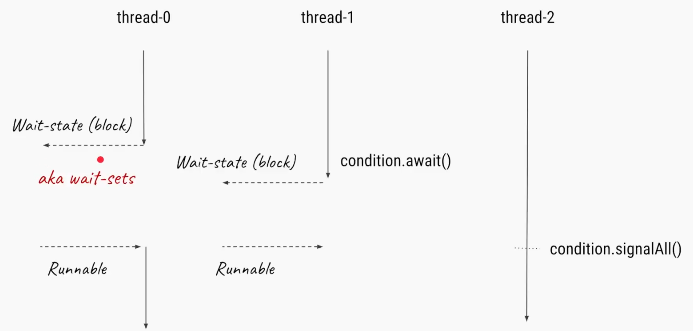
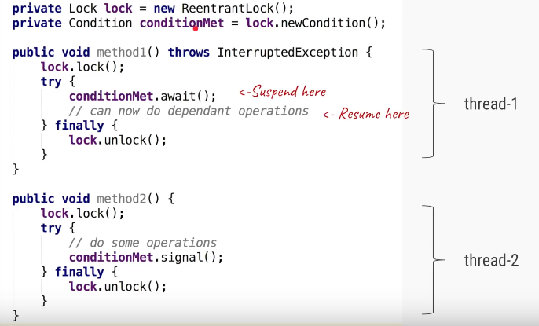
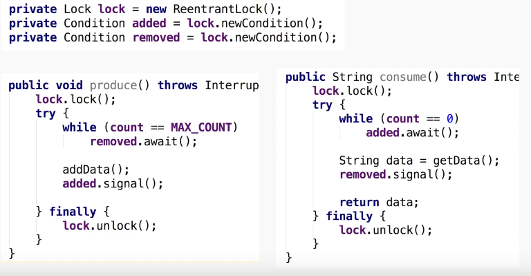

Conditions
=============

A `java.util.concurrent.locks.Condition` interface provides a thread ability to
suspend its execution, until the given condition is **true**.

> Alternative for `wait & notify`


We can Create Condition object by
using `ReentrantLock & ReentrantReadWriteLock` Which are implementation
classes of Lock interface. You can create condition variable by
calling **lock.newCondtion()** method

**Methods**

-   [await()](https://docs.oracle.com/javase/8/docs/api/java/util/concurrent/locks/Condition.html#await--):The
    current thread suspends its execution until it is signalled or interrupted.

-   [await(long time, TimeUnit
    unit)](https://docs.oracle.com/javase/8/docs/api/java/util/concurrent/locks/Condition.html#await-long-java.util.concurrent.TimeUnit-) :The
    current thread suspends its execution until it is signalled, interrupted, or
    the specified amount of time elapses.

-   [awaitNanos(long
    nanosTimeout)](https://docs.oracle.com/javase/8/docs/api/java/util/concurrent/locks/Condition.html#awaitNanos-long-) :The
    current thread suspends its execution until it is signalled, interrupted, or
    the specified amount of time elapses.

-   [awaitUninterruptibly()](https://docs.oracle.com/javase/8/docs/api/java/util/concurrent/locks/Condition.html#awaitUninterruptibly--) :The
    current thread suspends its execution until it is signalled (cannot be
    interrupted).

-   [await(long time, TimeUnit
    unit)](https://docs.oracle.com/javase/8/docs/api/java/util/concurrent/locks/Condition.html#awaitUntil-java.util.Date-) :The
    current thread suspends its execution until it is signalled, interrupted, or
    the specified deadline elapses.

-   [signal()](https://docs.oracle.com/javase/8/docs/api/java/util/concurrent/locks/Condition.html#signal--): This
    method wakes a single thread which is waiting for a longtime on this
    condition.

-   [signalAll()](https://docs.oracle.com/javase/8/docs/api/java/util/concurrent/locks/Condition.html#signalAll--): This
    method wakes all threads waiting on this condition.

Condition variables are instance
of **java.util.concurrent.locks.Condition** class, which provides inter thread
communication methods similar to wait, notify and notifyAll
e.g. **await()**, **signal()** and **signalAll()**.

if one thread is waiting on a condition by calling **condition.await()** then
once that condition changes, second thread can call **condition.signal()** or
**condition.signalAll()** method to notify that its time to wake-up.





Locks are used for Sychronization.We will use Lock and Condition variables for
solving classic Producer Consumer problem.



<br>

<u>Example : solving classic Producer Consumer problem. //Not Imp</u>
```java
public class ProducerConsumerSolutionUsingLock {

	public static void main(String[] arg) {

 // Object on which producer and consumer thread will operate.
 ProducerConsumerImpl sharedObject = new ProducerConsumerImpl();

 // creating producer and consumer threads.
 Productor p = new Productor(sharedObject);
 Consumer c = new Consumer(sharedObject);

 // starting producer and consumer threads.
 p.start();
 c.start();

	}
}

class ProducerConsumerImpl {

	// Productor consumer problem data.
	private static final int CAPACITY = 10;
	private final Queue queue = new LinkedList<>();
	private final Random theRandom = new Random();

	// Lock and condition variables.
	private final Lock aLock = new ReentrantLock();
	private final Condition bufferNotFull = aLock.newCondition();
	private final Condition bufferNotEmpty = aLock.newCondition();

	public void put() throws InterruptedException {
 aLock.lock();
 try {
 	while (queue.size() == CAPACITY) {
  System.out.println(Thread.currentThread().getName() + ": Buffer is full, waiting.");
  bufferNotEmpty.await();
 	}

 	int number = theRandom.nextInt();
 	boolean isAdded = queue.offer(number);
 	if (isAdded) {
  System.out.printf("%s added %d into queue %n", Thread.currentThread().getName(), number);

  // signal consumer thread that, buffer has element now
  System.out.println(Thread.currentThread().getName() + ": Signalling that buffer is no more empty now.");
  bufferNotFull.signalAll();
 	}
 } finally {
 	aLock.unlock();
 }
	}

	public void get() throws InterruptedException {

 aLock.lock();
 try {
 	while (queue.size() == 0) {
  System.out.println(Thread.currentThread().getName() + ": Buffer is empty, waiting.");
  bufferNotFull.await();
 	}

 	Integer value = (Integer) queue.poll();
 	if (value != null) {
  System.out.printf("%s consumed %d from queue %n ", Thread.currentThread().getName(), value);

  // Signal producer thread that, buffer me be empty now
  System.out.println(Thread.currentThread().getName() + ": Signalling that buffer may be empty now.");
  bufferNotEmpty.signalAll();
 	}
 } finally {
 	aLock.unlock();
 }
	}
}

class Productor extends Thread {

	ProducerConsumerImpl producerConsumer;

	public Productor(ProducerConsumerImpl sharedObject) {
 super("PRODUCER");
 this.producerConsumer = sharedObject;
	}

	@Override
	public void run() {
 try {
 	producerConsumer.put();
 } catch (InterruptedException e) {
 	e.printStackTrace();
 }
	}
}

class Consumer extends Thread {

	ProducerConsumerImpl producerConsumer;

	public Consumer(ProducerConsumerImpl sharedObject) {
 super("CONSUMER");
 this.producerConsumer = sharedObject;
	}

	@Override
	public void run() {
 try {
 	producerConsumer.get();
 } catch (InterruptedException e) {
 	e.printStackTrace();
 }
	}
}
```
