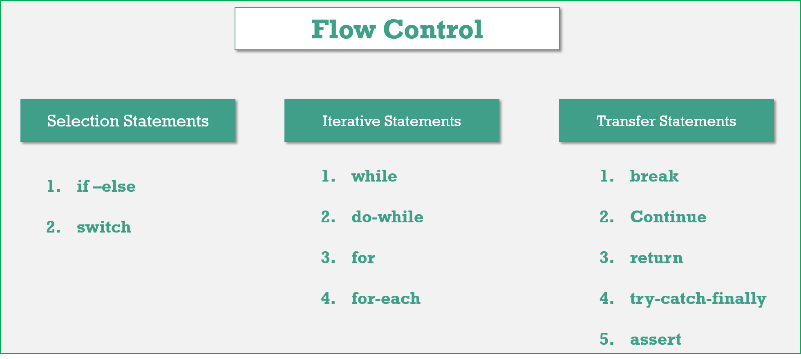
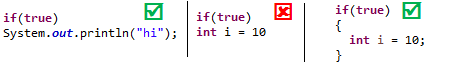
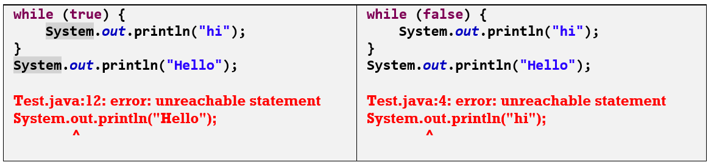
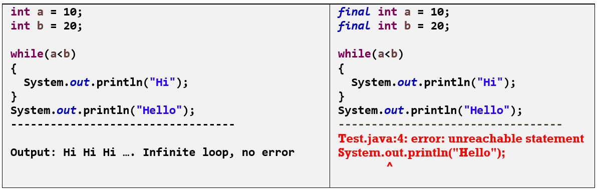
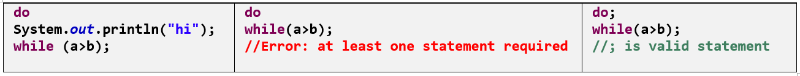
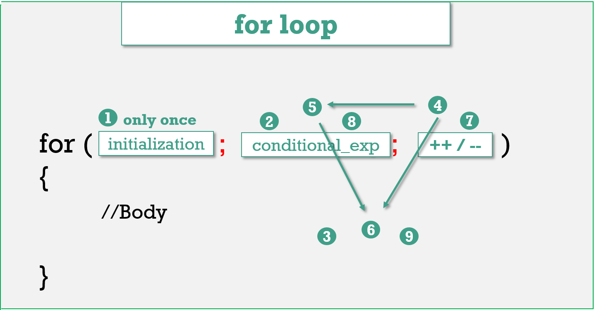

5.Flow Control
==============

Flow control describes the order in which all the statements will execute at run
time



# Selection Statements

###### 1.if-else :

-   The argument in the if statement Should be ‘boolean’. If we provide other datatype, it will generate Compile time Error
    ```java
    int x=0;
    if (x) {
       System.out.println("Hello");
    } else {
       System.out.println("Hi");
    }
    incompatible types: int cannot be converted to boolean	boolean b=false;
    ---------------------------------------------------
    if (b=true) {
       System.out.println("Hello");
    } else {	
       System.out.println("Hi");
    }
    //o/p Hello
    ```


-   In the case of if-else statements else part & **curly braces are optional**.
    Without curly braces we are allowed to take 1 statement under ‘if’, that
    statement never be declarative statement otherwise compile time error.

    

<br>

###### 2.Switch :

Syntax:

```java
int i = 0;
switch (i) {
case 1:
   ACTION 1;
case 2:
   ACTION 2;
case n:
   ACTION N;
default:
   Def. Action
}
```


-   **Curly bases are mandatory**

-   Inside a Switch **both case and default are optional**
    ```java
    int i = 10;
    switch (i)
    {
    	// CORRECT
    }
    ```


-   Within switch every statement should be under some case or default i.e
    independent statements are not allowed inside switch.
    ```java
    int i = 10;
    switch(i){
    	   System.out.println("Hello");
    }
    //CE : error: case, default, or '}' expected
    ```


-   All **Integer Datatypes(int, short except floating point datatypes), Wrapper
    Classes, enums (1.5v ), Strings(1.7v)** are allowed in switch statements.

-   Case labels **must be compiled time constants(final variables),** variables are not allowed.
    ```java
    int i = 10; //final int i=10 - No Error		
    switch (i) {
    case i:
    	System.out.println("Hello");
    	break;
    }
    error: constant expression required : case i:
    ```
<br>

-   The ‘case’ labels must be in the range supported by switch argument.
    ```java
            byte b = 100;
    		switch (b)
    		{
    		case 10 :System.out.println("10");
    				 break;
    		case 100 :System.out.println("100");
    				  break;
    		case 1000 :System.out.println("1000");
    				   break;
    		}
    error: incompatible types: possible lossy conversion from int to byte
    ```
<br>

-   The case labels and the switch arguments can be expressions also but case    label must be constant expression
     ```java
    int x=10, y=10;
    byte b = 100;
    switch (b + 1) {
    case 10:
    	System.out.println("10");
    case 20:
    	System.out.println("20");
    case 30 + 40:
    	System.out.println("30+40 = 70");
    case x + y:
    	System.out.println("30+40 = 70"); //ERROR
    }
    Test.java:16: error: constant expression required
                    case x + y:
    ```
 
-   Duplicate case labels are not allowed.

<br>

**default Case**:
In the switch statement we can place default case anywhere but
it is convention to take default case always at least.

In side switch once we got matched case, then from that statement on words all
the statements will execute from top to bottom until break or end of switch
```java
switch (x) {
		default:
			System.out.println("default");
		case 0:
			System.out.println("0");
			break;
		case 1:
			System.out.println("1");
		case 2:
			System.out.println("2");
	}
Here if ‘x’ is 0 then output is 0.
if ‘x’ is 1 then output is 1,2.
if ‘x’ is 2 then output is 2.
if ‘x’ is 3 then output is default, 0.
```


# Iterative Statements

###### 1.While:

Syntax:
```java
while(boolean){

//statements…

}
```


-   The argument in the while Statement Should be Boolean, otherwise we will get
    C.E

-   **curly braces are optional**. Without curly braces we are allowed to take 1
    statement under ‘while’, that statement never be declarative statement
    otherwise compile time error.

-   If we wrote **boolean argument as Constant value**, it leads to
    **“UnReachable Statement"**
    

-   If we wrote constant expression which is never change, it leades to
    **infinite loop**. If **any final Constant expression**, then the next statement after while will be **“UnReachable Statement"**
    

<br>

###### 2.do-while:

In the loop body has to execute at least once then we should go for do-while
loop.

Syntax: **Here `‘;’` is mandatory**.
```java
do
{
}while (boolean);
```


-  Curly braces are optional; with out curly braces we should take only 1 statement b/w do-while, that statement never be declarative statement.



-   Like while, we will get **Unreachable statement** error, in following case
    ```java
    final int a = 10;
    final int b = 20;
    do
    {
    System.out.println("Hi");
    }
    while (a<b);
    System.out.println("Hello");
    ```

<br>

###### 3.for:

The most commonly used loop



All the 3 parts of for loop are independent of each other & optional.

```java
for(; ;); //valid
```


Curly braces are optional, without curly braces we should take only 1 statement,
that statement never be declarative statement.

<br>

**a. Initialization Section**

-   This will be executed only once

-   Here we can declare multiple variables of same type, but multiple variables
    of different types are not allowed. Because **break between the variables
    leads to C.E**
    ```java
    for (int x=10, y=20 ; ; ) // No Error
    for (int x=10, byte  y=20 ; ; ) // ERROR : error: <identifier> expected
    ```


-   In the initialization section we can **take any valid java statement**,
    including **s.o.p** also.
```java
int i = 0;
for(System.out.println("Hi"); i<5; i++)
{
System.out.print("Hello");
}
//O/p : Hi, Hello …(5 times)
```
<br>

**b. Conditional Expression**

-   Here We can **take any valid Conditional expression**, but result should be
    boolean type.

-   Conditional statement is Optional; if wont specifies anything, **default**
    should be **‘TRUE’**

<br>

**c. Increment/Decrement**

-   This statement also Optional.

-   In this section we can **take any valid java statement**, including
    **s.o.p** also.

-   Unreachable Statement
    ```java
    Case:1
    ----------
    for (int i = 0; ; i++)
    {
    	System.out.println("Hello");
    }
    System.out.println("Hi");
    // unreachable statement--> System.out.println("Hi");
    
    
    Case:2
    ----------
    for (int i = 0;false;i++)
    {
      System.out.println("Hello");
    }
    System.out.println("Hi");
    // unreachable statement---> System.out.println("Hello");
    
    
    
    Case:3
    ----------
    final int a = 10, b = 20;
    for(int i = 0;a<b; i++)
    {
      System.out.println("Hello");
    }
    System.out.println("Hi");
    // unreachable statement--->System.out.println("hi");
    ```

<br>


# Transfer Statements

###### 1.break:

It can be used in the following places.

-   **within the loops** to come out of the loop.

-   **inside switch** statement to come out of the switch.

-   **If we are using break any where else, we will get a compile time error.**
    ```java
    int x = 0;
    if(x!=5)
    break;
    System.out.println("if");
    C.E: error: break should not outside switch or loop
    ```

<br>

###### 2.continue:

-   we should use ‘**continue’ only in the loops to skip current iteration** &
    continue for the next iteration.

-   If we are using ‘continue’ anywhere except loops we will get compile time
    error saying, **“continue outside of loop".**
    ```java
    for(int i=0;i<10;i++)
    {
    if((i%2) == 0)
    continue;
    System.out.print(i);
    }
    O/P:- 13579
    ```

