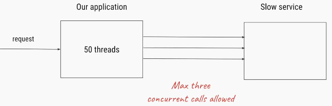
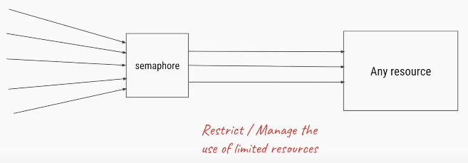
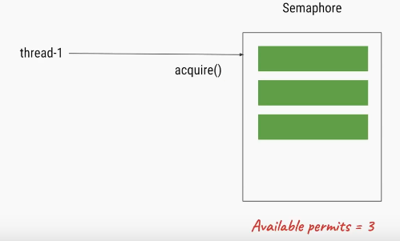
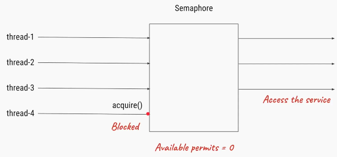
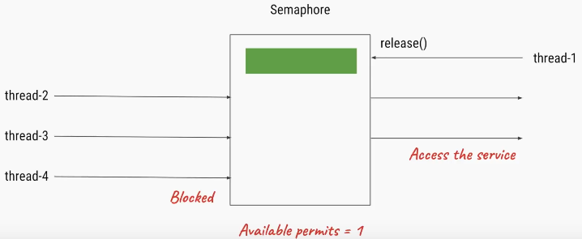
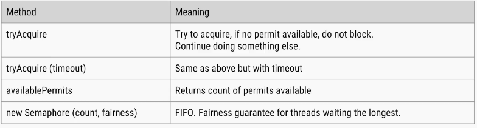

Synchronization utilities
============================

1.Semaphore(CountDownSemaphore)
-------------------------------

**Semaphore** is one of the synchronization aid provided by Java concurrency
util in Java 5 along with other synchronization aids like **CountDownLatch,
CyclicBarrier, Phaser and Exchanger**.

The Semaphore **class** present in **java.util.concurrent** package is a
counting semaphore in which a semaphore, conceptually, maintains a set of
permits.

Semaphore **class** in Java has two methods that make use of permits-

-   **acquire()-** Acquires a permit from **this** semaphore, blocking until one
    is available, or the thread is interrupted. It has another overloaded
    version **acquire(int permits).**

-   **release**()- Releases a permit, returning it to the semaphore. It has
    another overloaded method **release(int permits).**

<u>How Semaphore works in Java</u>

-   Thread that wants to access the shared resource tries to acquire a permit
    using **acquire()** method. At that time if the Semaphore's count is greater
    than zero thread will acquire a permit and Semaphore's count will be
    decremented by one.

-   If Semaphore's count is zero and thread calls **acquire()** method, then the
    thread will be blocked until a permit is available.

-   When thread is done with the shared resource access, it can call the
    **release()** method to release the permit. That results in the Semaphore's
    count incremented by one.

<u>Java Semaphore constructors</u>  
-   **`Semaphore(int permits)`**
-   **`Semaphore(int permits, boolean fair)`**


<br>

50 thraeds are trying to access a slow service , where only 3 threads are
allowed.













<br>

**<u>Java semaphore example</u>**  
Let's see one example where Semaphore is used to control shared access. Here we
have a shared counter and three threads using the same shared counter and trying
to increment and then again decrement the count. So every thread should first
increment the count to 1 and then again decrement it to 0.
```java
import java.util.concurrent.Semaphore;

class SharedCounter implements Runnable{
 
    private int c = 0;
    private Semaphore s;
    SharedCounter(Semaphore s){
     this.s = s;
    }
    // incrementing the value
    public void increment() {
        try {
         // used sleep for context switching
            Thread.sleep(10);
        } catch (InterruptedException e) {
            // TODO Auto-generated catch block
            e.printStackTrace();
        }
        c++;
    }
    // decrementing the value
    public void decrement() {    
        c--;
    }

    public int getValue() {
        return c;
    }
    
    @Override
    public void run() {
     try {
         // acquire method to get one permit
         s.acquire();
         this.increment();
         SOP("Value for Thread After increment-"+Thread.currentThread().getName()+" " +this.getValue());

         this.decrement();
         SOP("Value for Thread at last"+Thread.currentThread().getName() + " " + this.getValue());
         // releasing permit
         s.release();
     }
        catch (InterruptedException e) {
   // TODO Auto-generated catch block
   e.printStackTrace();
  }
    }
}

public class SemaphoreDemo {
 public static void main(String[] args) {
  
  Semaphore s = new Semaphore(1);
  SharedCounter counter = new SharedCounter(s);
  // Creating three threads
  Thread t1 = new Thread(counter, "Thread-A");
  Thread t2 = new Thread(counter, "Thread-B");
  Thread t3 = new Thread(counter, "Thread-C");
  t1.start();
  t2.start();
  t3.start();
 }
}
------------- Output ---------------------
Value for Thread After increment - Thread-A 1
Value for Thread at last Thread-A 0
Value for Thread After increment - Thread-B 1
Value for Thread at last Thread-B 0
Value for Thread After increment - Thread-C 1
Value for Thread at last Thread-C 0
```
