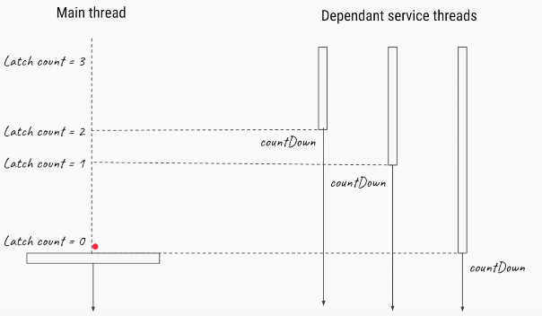
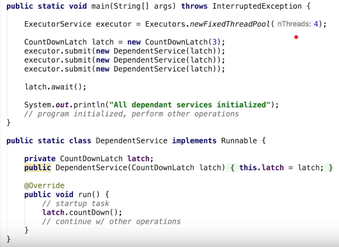

3.CountDownLatch
==================

CountdownLatch is a synchronization mechanisum. If there is a Situation like All
Threads must complete login(), getAccountNumber() execution before actual
Exceution, in that case it allows one or more threads to wait until a these
operations completed by remaining threads.

<u>*Methods*</u>

-   **await()**

-   **countDown()**






```java
public class CountDownLatchDemo {
	public static void main(String args[]) {
 final CountDownLatch latch = new CountDownLatch(3);
 Thread cacheService = new Thread(new Service("CacheService", 1000, latch));
 Thread alertService = new Thread(new Service("AlertService", 1000, latch));
 Thread validationService = new Thread(new Service("ValidationService", 1000, latch));

 cacheService.start(); // separate thread will initialize CacheService
 alertService.start(); // another thread for AlertService initialization
 validationService.start();

 // application should not start processing any thread until all service is up
 // and ready to do there job.
 // Countdown latch is idle choice here, main thread will start with count 3
 // and wait until count reaches zero. each thread once up and read will do
 // a count down. this will ensure that main thread is not started processing
 // until all services is up.

 // count is 3 since we have 3 Threads (Services)

 try {
 	latch.await(); // main thread is waiting on CountDownLatch to finish
 	System.out.println("All services are up, Application is starting now");
 } catch (InterruptedException ie) {
 	ie.printStackTrace();
 }

	}

}
/**
 * Service class which will be executed by Thread using CountDownLatch * synchronizer. */
class Service implements Runnable {
	private final String name;
	private final int timeToStart;
	private final CountDownLatch latch;

	public Service(String name, int timeToStart, CountDownLatch latch) {
 this.name = name;
 this.timeToStart = timeToStart;
 this.latch = latch;
	}

	@Override
	public void run() {
 try {
 	Thread.sleep(timeToStart);
 } catch (InterruptedException ex) {
 	 
 }
 System.out.println(name + " is Up");
 latch.countDown(); // reduce count of CountDownLatch by 1
	}
}
```
