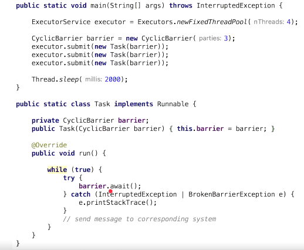

4.CyclicBrarrier
=================

CyclicBrarrier is a synchronization mechanisum that allows a set of threads to
**all wait for each other to reach a common barrier point.**

First a **new** instance of a CyclicBarriers is created specifying the number of
threads that the barriers should wait upon.

```java
CyclicBarrier newBarrier = new CyclicBarrier(numberOfThreads);
```


*Methods*-   **await()**

Each and every thread does some computation and after completing it  s execution,
calls await() methods as shown:
```java
public void run()
{
    // thread does the computation
    newBarrier.await();
}
```


Once the number of threads that called await() equals numberOfThreads, the
barrier then gives a way for the waiting threads. The CyclicBarrier can also be
initialized with some action that is performed once all the threads have reached
the barrier. This action can combine/utilize the result of computation of
individual thread waiting in the barrier.
```java
Runnable action = ... 
//action to be performed when all threads reach the barrier;
CyclicBarrier newBarrier = new CyclicBarrier(numberOfThreads, action);
```




```java
class Task implements Runnable {

	private CyclicBarrier barrier;

	public Task(CyclicBarrier barrier) {
 this.barrier = barrier;
	}

	@Override
	public void run() {
 try {
 	System.out.println(Thread.currentThread().getName() + " is waiting on barrier");
 	barrier.await();
 	System.out.println(Thread.currentThread().getName() + " COMPLETED");
 } catch (InterruptedException ex) {

 } catch (Exception ex) {

 }
	}
}

public class CyclicBarrierExample {

	public static void main(String args[]) {

 // creating CyclicBarrier with 3 Threads which, meet at this point
 final CyclicBarrier cb = new CyclicBarrier(3, new Runnable() {
 	@Override
 	public void run() {
  // This task will be executed once all thread reaches barrier
  System.out.println("================================");
  System.out.println("All parties are arrived at barrier, lets play");
  System.out.println("================================");
 	}
 });
 // starting each of thread
 Thread t1 = new Thread(new Task(cb), "Thread 1");
 Thread t2 = new Thread(new Task(cb), "Thread 2");
 Thread t3 = new Thread(new Task(cb), "Thread 3");

 t1.start();
 t2.start();
 t3.start();
	}
}
Thread 1 is waiting on barrier
Thread 3 is waiting on barrier
Thread 2 is waiting on barrier
================================
All parties are arrived at barrier, lets play
================================
Thread 2 COMPLETED
Thread 3 COMPLETED
Thread 1 COMPLETED
```
