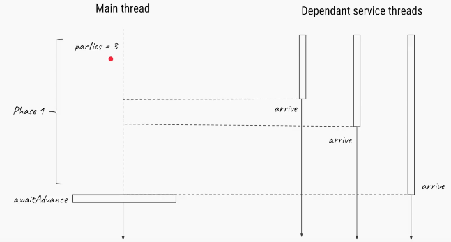
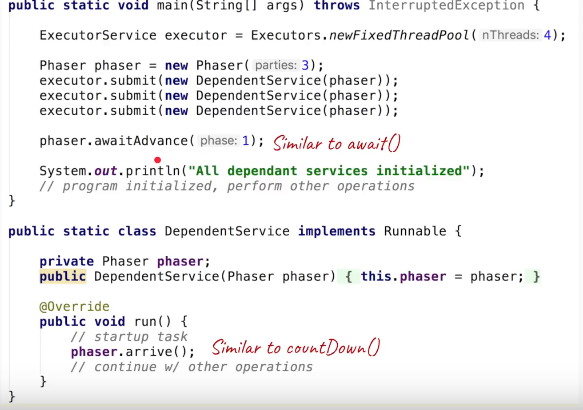
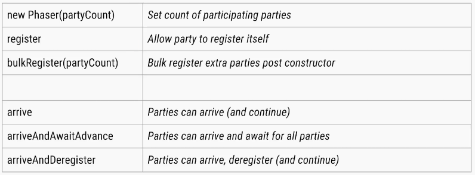

5.Phaser
=========

Phaser is like a **collection of advantages of CountDownLatch and
CyclicBarrierClasses**

**<u>The CountDownLatch is :</u>**

-   Created with a fixed number of threads  
    `final CountDownLatch latch = new CountDownLatch(3);`

-   Cannot be reset

-   Allows threads to wait (**await())** or continue with its execution once
    count becomes 0 **countDown()**

**<u>the CyclicBarrier :</u>**

-   Can be reset.

-   Does not a provide a method for the threads to advance. The threads have to
    wait till all the threads arrive.

-   Created with fixed number of threads.


**<u>Now, the Phaser has following properties</u>** 
-   Number of threads need not be known at Phaser creation time. **Threads can
    be added dynamically.**

-   **Can be reset** and hence is, reusable.

-   Allows threads to wait(Phaser\#**arriveAndAwaitAdvance())** or continue with
    its execution(Phaser\#**arrive(**)).

-   Supports multiple Phases(, hence the name phaser).

We will try to understand how the Phaser Class can be used with an example. In
this example, we are creating a three threads, which will wait for the arrival
all the threads being created.

Once all the threads have arrived(marked by **arriveAndAwaitAdvance()** method)
the Phaser allows them through the barrier.

*Methods*

-   **awaitAdvance()**

-   **arrive()**

Scenario







```java
public class PhaserExample {
	public static void main(String[] args) throws InterruptedException {
 Phaser phaser = new Phaser();
 phaser.register();// register self... phaser waiting for 1 party (thread)
 int phasecount = phaser.getPhase();
 System.out.println("Phasecount is " + phasecount);
 new PhaserExample().testPhaser(phaser, 2000);// phaser waiting for 2 parties
 new PhaserExample().testPhaser(phaser, 4000);// phaser waiting for 3 parties
 new PhaserExample().testPhaser(phaser, 6000);// phaser waiting for 4 parties
 // now that all threads are initiated, we will de-register main thread
 // so that the barrier condition of 3 thread arrival is meet.
 phaser.arriveAndDeregister();
 Thread.sleep(10000);
 phasecount = phaser.getPhase();
 System.out.println("Phasecount is " + phasecount);

	}

	private void testPhaser(final Phaser phaser, final int sleepTime) {
 phaser.register();
 new Thread() {
 	@Override
 	public void run() {
  try {
  System.out.println(Thread.currentThread().getName() + " arrived");
  phaser.arriveAndAwaitAdvance();// threads register arrival to the phaser.
  	Thread.sleep(sleepTime);
  }

  catch (InterruptedException e) {
  	e.printStackTrace();
  }
 	System.out.println(Thread.currentThread().getName() + " after passing barrier");
 	}
 }.start();
	}
}
```
