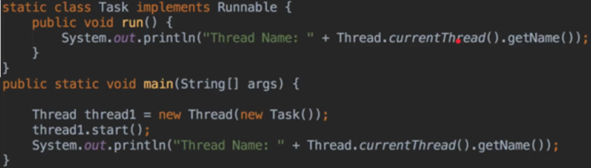
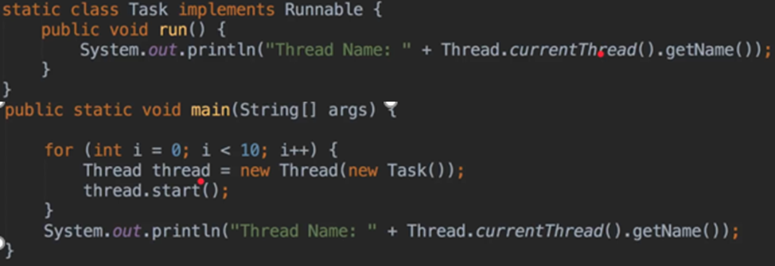
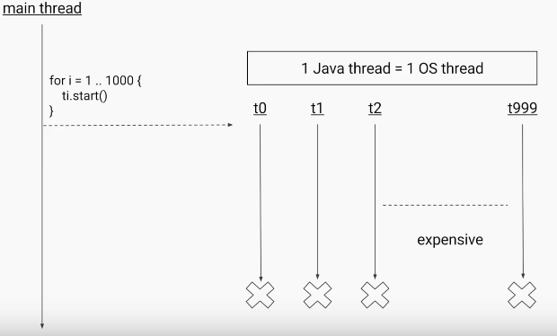
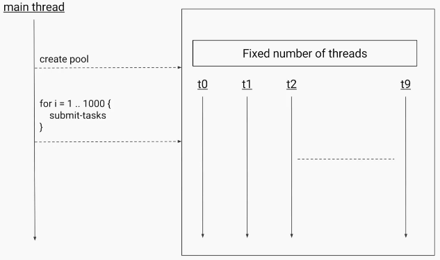
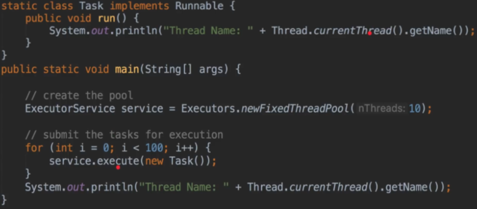
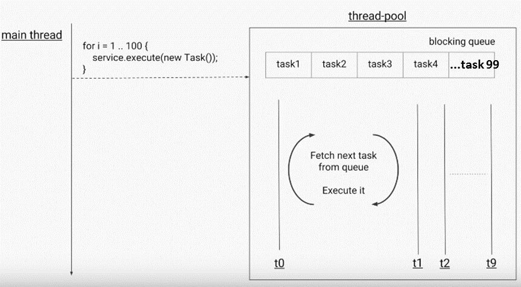
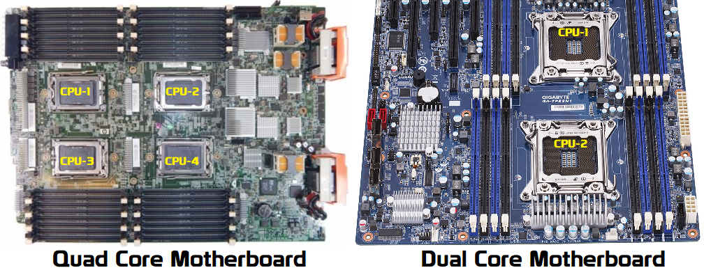
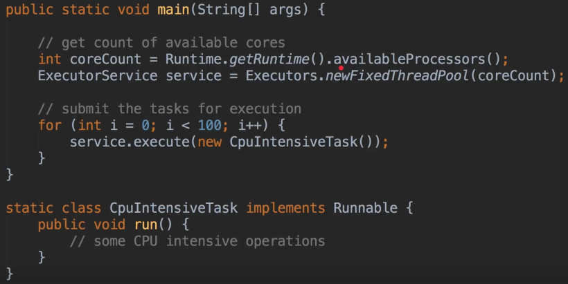
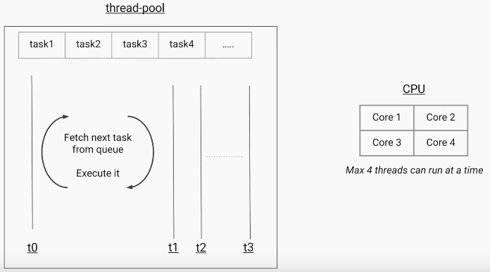

Executor Framework
=====================

Normally we will create & execute Threads in following way.

If we want to run 10 threads, we will do in following way

It we want to run 1000 Threads, then it will become more expensive (more OS
Threads, more Heap). Java will create 1000 OS level Threads to process this.

We can avoid above situation by create only 10 OS level Threads & submit 1000
jobs to them.

The code for above example will become

We may heard **Dual Core , QuadCore proceesors**. Core is nothing but **CPU**.
Each “core" is the part of the chip that does the processing work. Essentially,
each core is [a central processing unit
(CPU)](https://www.makeuseof.com/tag/cpu-technology-explained/)**.**

If we have QuadCore system, we can able to exceute 4 Threads at a time, each
Thread will execute by one CPU unit of QuadCore.

In above examples, we created threadPool of 10, but the best way to provide
no.of threads is by getting CPU count(Processor Count)

The IdealPool size will be no.of CPU cores your system have.

