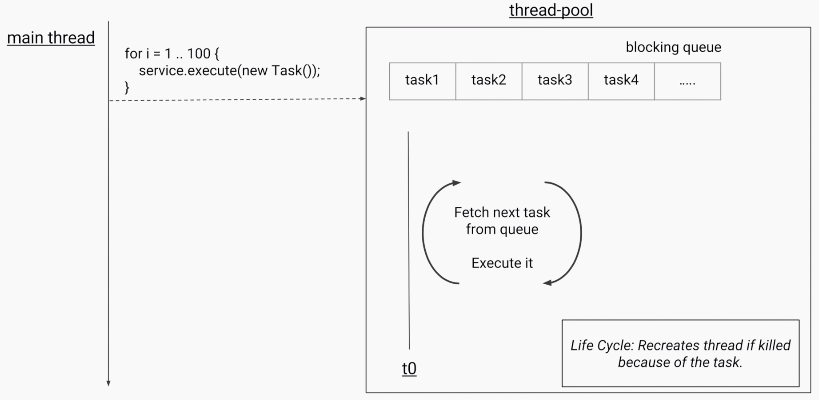
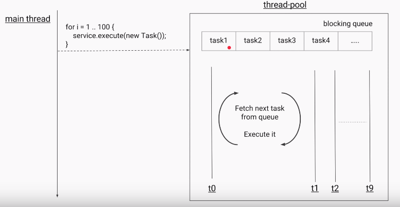
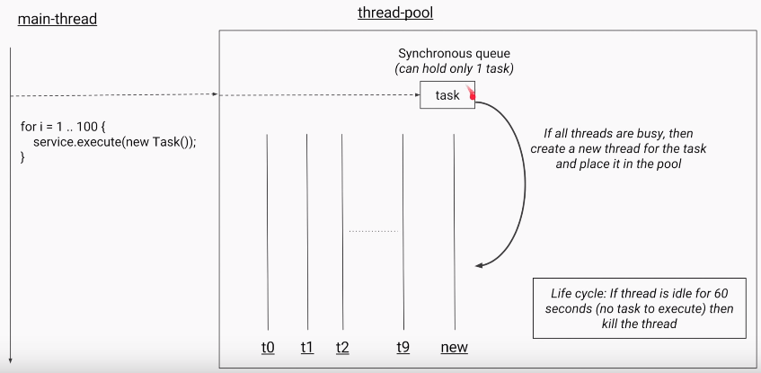
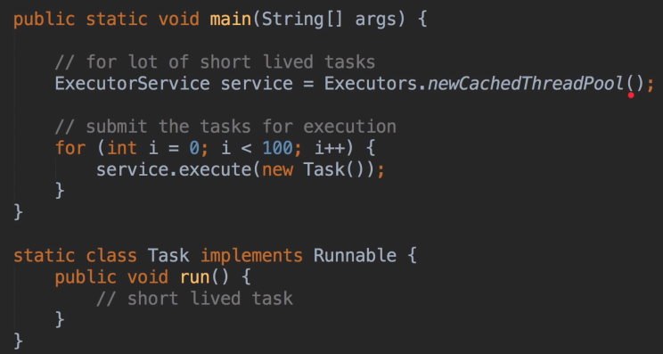
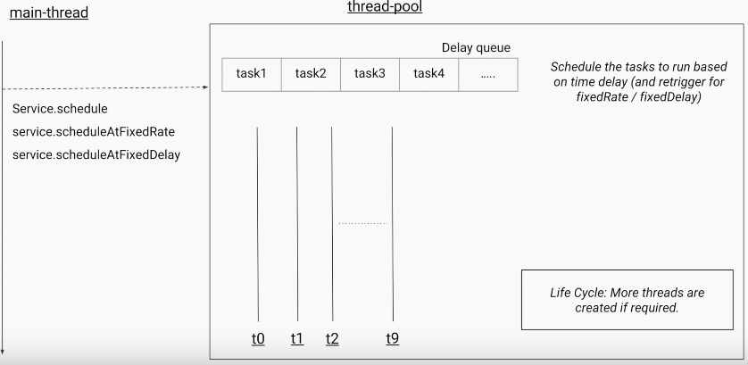
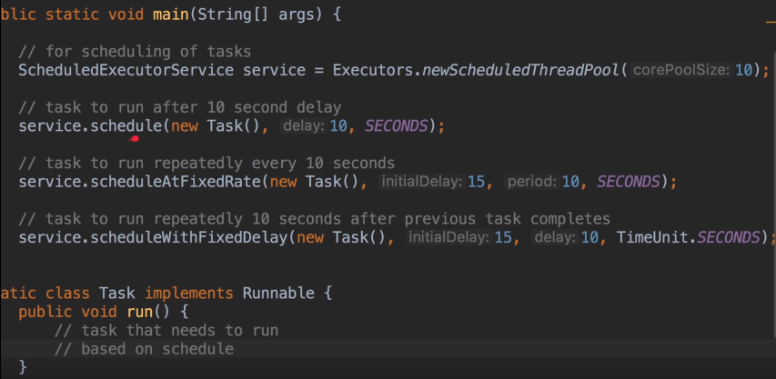
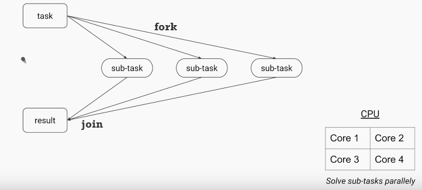

5Types of ThreadPools
=======================

We have following types of ThreadPools
**1.SingleThread Pool**

**2.FixedThreadPool**

**3.CachedThreadPool**

**4.ScheduledThreadPool**

**5.Fork/Join pool**

<br>


<u>1.SingleThread Pool</u>

A thread **pool with only one thread** with an unbounded queue, which only
executes one task at a time.

 ```java
static ExecutorService newSingleThreadExecutor()
```



<u>2.FixedThreadPool</u>

A thread **pool with a fixed number of threads** which share an unbounded queue;
if all threads are active when a new task is submitted, they will wait in queue
until a thread becomes available

```java
static ExecutorService newFixedThreadPool(int nThreads)
```





<u></u>**3.CachedThreadPool**

Creates a thread pool that **creates new threads as needed**, but will reuse
previously constructed threads when they are available
```java
static ExecutorService newCachedThreadPool()

static ExecutorService newCachedThreadPool(ThreadFactory threadFactory)
```




-   It doesn’t have any Queue like FixedThreadPool, instead it has **synchronous
    Queue which holds one task at a time.**

-   On Submitting Task, it will search for any Thread is free in current
    ThreadPool, if not It will create another thread to do the job.

-   It will kill the useless threads like, if Threads idle for more than 60
    sec.,




<u>4.ScheduledThreadPool</u>

creates an executor that can schedule tasks to execute after a given delay, or
to execute periodically.
```java
static ScheduledExecutorService newSingleThreadScheduledExecutor()
static ScheduledExecutorService newScheduledThreadPool(int poolSize)
```


It will store the all the tasks which are submitted in Delay Queue






<u>5.Fork/Join pool:</u>

It is a special thread pool that uses the Fork/Join framework to take advantages
of multiple processors to perform heavy work faster by breaking the work into
smaller pieces recursively.



**Remember method names,**
> 
> -   For Single Thread ends with - **Excecutor()** 
> -   For Multiple Threads end with - **ThreadPool()**

