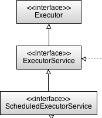

ExecutorService API
======================



In the java.util.concurrent package we have following interfaces to work with
Thread pools

**Executors** — Utility class for getting ExceutorService Objects.

**Executor** — Parent class for all Excecutor services

**ExecutorService** — A subinterface of Executor that adds methods to manage lifecycle of threads used to run the submitted tasks and methods to produce a Future to get a result from an asynchronous computation.

**ScheduledExecutorService** — A subinterface of ExecutorService, to execute commands periodically or after a given delay


<br>

# 1.Executors Utility class

Factory and utility methods
for [Executor](https://docs.oracle.com/javase/8/docs/api/java/util/concurrent/Executor.html),[ExecutorService](https://docs.oracle.com/javase/8/docs/api/java/util/concurrent/ExecutorService.html),[ScheduledExecutorService](https://docs.oracle.com/javase/8/docs/api/java/util/concurrent/ScheduledExecutorService.html), [ThreadFactory](https://docs.oracle.com/javase/8/docs/api/java/util/concurrent/ThreadFactory.html),
and [Callable](https://docs.oracle.com/javase/8/docs/api/java/util/concurrent/Callable.html) classes
defined in this package. This class supports the following kinds of methods:

-   Methods that create and return an ExecutorService set up with commonly
    useful configuration settings.

-   Methods that create and return a ScheduledExecutorService set up with
    commonly useful configuration settings.

-   Methods that create and return a "wrapped" ExecutorService, that disables
    reconfiguration by making implementation-specific methods inaccessible.

-   Methods that create and return a ThreadFactory that sets newly created
    threads to a known state.

-   Methods that create and return
    a [Callable](https://docs.oracle.com/javase/8/docs/api/java/util/concurrent/Callable.html) out
    of other closure-like forms, so they can be used in execution methods
    requiring Callable.

# 2.Executor Interface

The [Executor](https://docs.oracle.com/javase/8/docs/api/java/util/concurrent/Executor.html) interface
provides a single method, execute

void execute([Runnable](https://docs.oracle.com/javase/8/docs/api/java/lang/Runnable.html) command)

It designed to be a drop-in replacement for older start() & run(), it a
combination of both of them.

# 3.ExecutorService Interface
```java
void execute([Runnable command)
//inherited from Executor

Future submit(Callable task)

Future submit(Runnable task)
```


-   The [ExecutorService](https://docs.oracle.com/javase/8/docs/api/java/util/concurrent/ExecutorService.html) interface
    implements Executor interface with additional **submit()** method.

-   Like execute, submit accepts Runnable objects, but also
    accepts [Callable](https://docs.oracle.com/javase/8/docs/api/java/util/concurrent/Callable.html) objects,
    which allow the task to return a value.

-   The submit method returns
    a [Future](https://docs.oracle.com/javase/8/docs/api/java/util/concurrent/Future.html) object,
    which is used to retrieve the Callable return value and to manage the status
    of both Callable and Runnable tasks.

-   ExecutorService also provides methods for submitting large collections
    of Callable objects. Finally, ExecutorService provides a number of methods
    for managing the shutdown of the executor. To support immediate shutdown,
    tasks should
    handle [interrupts](https://docs.oracle.com/javase/tutorial/essential/concurrency/interrupt.html) correctly.


**<u>Methods</u>** 
```java
Future submit(Callable<T> task); 

// Executes given tasks, returns list of Future results when all complete.
List<Future<T>> invokeAll(Collection<Callable<T> tasks)      
List<Future<T>> invokeAll(Collection<Callable<T>> tasks,long timeout, TimeUnit unit)

// Executes the given tasks, returns the result of one of the task completed successfully
T invokeAny(Collection<Callable<T> tasks)      
T invokeAny(Collection<Callable<T>> tasks,long timeout, TimeUnit unit)

// Initiates shutdown signal, wait for Tasks to complete,but no new tasks will be accepted.
void shutdown();

// Attempts to stop all tasks& returns a list of the tasks that were awaiting execution.
List shutdownNow();

boolean isShutdown();
boolean isTerminated();
boolean awaitTermination(long timeout, TimeUnit unit)
```

##### **<u>Callable Interface</u>**

The Callable interface is similar to Runnable, contaings call() method which
returns a Value & throws CheckedException.
```java
public interface Callable<V> {
    V call() throws Exception;
}
```


##### **<u>Feature Interface</u>**

When ever we use sumbit() method, the result will stored in Feature Object. We
have following methods to process the results from Feature Object.

-   `V get()`:  returns an actual result of the Callable task’s execution
    or null in the case of Runnable task. Calling the get() method while the
    task is still running will cause execution to block until the task is
    properly executed and the result is available.
    ```java
    Future<String> future = executorService.submit(callableTask);
    String result = null;
    try {
        result = future.get();
    } catch (InterruptedException | ExecutionException e) {
        e.printStackTrace();
    }
    ```


-   `V get(long timeout, TimeUnit unit)`: We can avoid blocking, by specicifing time limit to get the result.
    ```java
    String result = future.get(200, TimeUnit.MILLISECONDS);
    ```
    If the execution period is longer than specified (in this case 200 milliseconds), a TimeoutExceptionwill be thrown.


-   And also we can use cancel() methods if get() taking more time.
    ```java
    boolean canceled = future.cancel(true);
    boolean isCancelled = future.isCancelled();
    ```


-   `boolean isDone()` :used to check if the assigned task is already processed
    or not.
```java
class IntCall implements Callable<Integer> {
	@Override
	public Integer call() throws Exception {
 int value = (int) (Math.random() * 50 + 1);
 System.out.println("Generated : " + value);
 return value;
	}
}

public class ExcecutorServiceDemo {

	public static void main(String[] args) throws  Exception {

 // submit(Callable<T> task)
 ExecutorService service = Executors.newSingleThreadExecutor();
 Future<Integer> future = service.submit(new IntCall());
 System.out.println("Future : " + future.get());

               //invokeAll(Collection<Callable<T> tasks)
 System.out.println("=================== invokeAll ================= ");
                List<Callable<Integer>> list = new ArrayList<>();
 list.add(new IntCall());
 list.add(new IntCall());
 list.add(new IntCall());

 List<Future<Integer>> futures = service.invokeAll(list);
 for (Future<Integer> f : futures) {
 	System.out.println(f.get());
 }

 //Executes the given tasks, returns the result of one of the task completed successfully
  System.out.println("=================== invokeAny ================= ");
 Integer any = service.invokeAny(list);
 System.out.println("invokeAny : " + any);

 // In general, the ExecutorService will not be automatically destroyed when
 // there is not task to process.
 service.shutdown();
 System.out.println("=================== Shutdown ================= ");
 System.out.println("isShutdown : " + service.isShutdown());
 System.out.println("isTerminated : " + service.isTerminated());
 System.out.println("shutdownNow : " + service.shutdownNow());
	}
}
Generated : 34
Future : 34
=================== invokeAll ================= 
Generated : 27
Generated : 24
Generated : 3
27
24
3
=================== invokeAny ================= 
Generated : 32
Generated : 44
invokeAny : 32  (gives 1st completed task result)
=================== Shutdown ================= 
isShutdown : true
isTerminated : true
shutdownNow : []
```


# 4.ScheduledExecutorService Interface

-   The [ScheduledExecutorService](https://docs.oracle.com/javase/8/docs/api/java/util/concurrent/ScheduledExecutorService.html) interface
    is child interface ExecutorService .

-   It executes a Runnable or Callable task after a specified delay. In
    addition, the interface
    defines **scheduleAtFixedRate** and **scheduleWithFixedDelay**, which
    executes specified tasks repeatedly, at defined intervals.

-   The ScheduledExecutorService runs tasks after some predefined delay and/or
    periodically.

**1.schedule()**  
There are two **schedule()** methods that allow you to execute Runnable or
Callable tasks, which will start after the delay
```java
ScheduledFuture schedule (Runnable command, long delay, TimeUnit unit)
ScheduledFuture schedule (Callable callable, long delay, TimeUnit unit)
```


**2.scheduleAtFixedRate()** method lets execute a task periodically after a fixed delay
```java
scheduleAtFixedRate(Runnable r, long initialDelay, long period, TimeUnit u)
```


The following block of code will execute a task after an initial delay of 100
milliseconds, and after that, it will execute the same task every 450
milliseconds.
```java
Future<String> resultFuture = service.scheduleAtFixedRate(runnableTask, 100, 450, TimeUnit.MILLISECONDS);
```


If the processor needs more time to execute an assigned task than the period
parameter of the scheduleAtFixedRate() method, the ScheduledExecutorService will
wait until the current task is completed before starting the next.

**3.scheduleWithFixedDelay()** If it is necessary to have a fixed length delay
between iterations of the task, scheduleWithFixedDelay() should be used. For
example, the following code will guarantee a 150-millisecond pause between the
end of the current execution and the start of another one.
```java
ScheduledFuture scheduleWithFixedDelay (Runnable command, long initialDelay, long delay, TimeUnit unit)
```


below scheduleWithFixedDelay, scheduleAtFixedRate methods are applicable only for Runnabler typoes butr not Callable Types
```java
service.scheduleWithFixedDelay(task, 100, 150, TimeUnit.MILLISECONDS);
```
<br>

```java
ScheduledExecutorService executor = ...;
Runnable command1 = ...;
Runnable command2 = ...;
Runnable command3 = ...;

// Will start command1 after 50 seconds
executor.schedule(command1, 50L, TimeUnit.SECONDS);

// Will start command 2 after 20 seconds, 25 seconds, 30 seconds ...
executor.scheduleAtFixedRate(command2, 20L, 5L, TimeUnit.SECONDS);

// Will start command 3 after 10 seconds and if command3 takes 2 seconds to be
// executed also after 17, 24, 31, 38 seconds...
executor.scheduleWithFixedDelay(command3, 10L, 5L, TimeUnit.SECONDS);
```
<br>

**<u>Example</u>**
```java
class IntCal implements Callable<Integer> {
	@Override
	public Integer call() throws Exception {
 int value = (int) (Math.random() * 50 + 1);
 System.out.println("Generated : " + value);
 return value;
	}
}

class MyRun implements Runnable{
	@Override
	public void run() {
 System.out.println("Run End @ : "+new Date());
 
	}
}

public class ScheduledExecutorServiceDemo {

public static void main(String[] args) throws InterruptedException, ExecutionException {
 
 ScheduledExecutorService service = Executors.newSingleThreadScheduledExecutor();
 
 	System.out.println("========= schedule : Start : "+new Date()); 
 	Future f1 = service.schedule(new IntCal(), 5, TimeUnit.SECONDS);
 	System.out.println("========= schedule get():"+f1.get()+": End : ");  
 

 	System.out.println("========= scheduleAtFixedRate : Start : "+new Date());
  	service.scheduleAtFixedRate(new MyRun(), 2, 2, TimeUnit.SECONDS);
 

 	System.out.println("=========  scheduleWithFixedDelay : Start : "+new Date()); 
 	service.scheduleWithFixedDelay(new MyRun(), 2, 2, TimeUnit.SECONDS);  
	}
}
========= schedule : Start : Wed Dec 26 18:16:15 IST 2018
Generated : 15
========= schedule get():15: End : 
========= scheduleAtFixedRate : Start : Wed Dec 26 18:16:21 IST 2018
=========  scheduleWithFixedDelay : Start : Wed Dec 26 18:16:21 IST 2018
Run End @ : Wed Dec 26 18:16:23 IST 2018
Run End @ : Wed Dec 26 18:16:23 IST 2018
Run End @ : Wed Dec 26 18:16:25 IST 2018
Run End @ : Wed Dec 26 18:16:25 IST 2018
Run End @ : Wed Dec 26 18:16:27 IST 2018
Run End @ : Wed Dec 26 18:16:27 IST 2018
```
