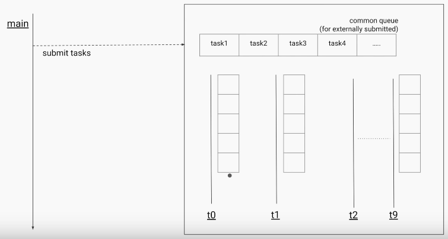
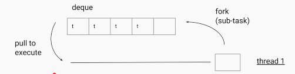
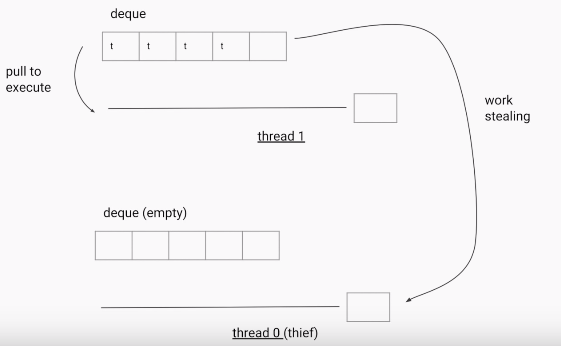
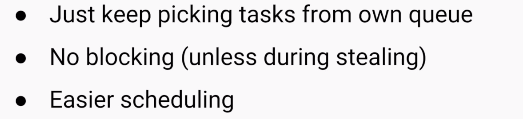
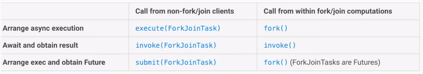

Fork/Join
============

The fork/join framework is an implementation of the ExecutorService interface
that helps you take advantage of multiple processors.

It is designed for **work can be broken into smaller pieces recursively**. The
goal is to use all the available processing power to enhance the performance of
your application


Here Each of the Thread has it’s own Queue(DeQue – Double ended Queue).



When on submitting task, the task is divided into no. of sub-tasks (4 subtasks
for example), each sub-task will store in one of the location in DeQue like
below



If a Thread doesn’t have any tasks to execute, it will steale the tasks from
other threads from backside of Queue.







The core classes supporting the Fork-Join mechanism are **ForkJoinPool** and
**ForkJoinTask**

<br>

###### <u>ForkJoinPool</u>

The ForkJoinPool is basically a specialized implementation of ExecutorService
implementing the work-stealing algorithm we talked about above. We create an
instance of ForkJoinPool by providing the target parallelism level i.e. the
number of processors as shown below:

ForkJoinPool pool = new ForkJoinPool(numberOfProcessors);

Where numberOfProcessors = Runtime.getRunTime().availableProcessors();

If you use a no-argument constructor, by default, it creates a pool of size that
equals the number of available processors obtained using above technique.

There are three different ways of submitting a task to the ForkJoinPool.

**1.execute()** method //Desired asynchronous execution; call its fork method to
split the work between multiple threads.

**2.invoke()** method: //Await to obtain the result; call the invoke method on
the pool.

**3.submit()** method: //Returns a Future object that you can use for checking
status and obtaining the result on its completion.

<br>

###### <u>ForkJoinTask</u>

This is an abstract class for creating tasks that run within a ForkJoinPool.

The Recursiveaction and RecursiveTask are the only two direct, known subclasses
of ForkJoinTask.

The only difference between these two classes is that the RecursiveAction does
not return a value while RecursiveTask does have a return value and returns an
object of specified type.

In both cases, you would need to implement the compute method in your subclass
that performs the main computation desired by the task.

The ForkJoinTask class provides several methods for checking the execution
status of a task.

-   The **isDone()** method returns true if a task completes in any way

-   The **isCompletedNormally()** method returns true if a task completes
    without cancellation or encountering an exception

-   **isCancelled()** returns true if the task was cancelled.
    Lastly, isCompletedabnormally() returns true if the task was either
    cancelled or encountered an exception.


```java
public class ForkJoinDemo {
	public static void main(final String[] arguments) throws Exception {

 int nThreads = Runtime.getRuntime().availableProcessors();
 System.out.println("No.of Threads : "+nThreads);

 int[] numbers = new int[1000];

 for (int i = 0; i < numbers.length; i++) {
 	numbers[i] = i;
 }

 ForkJoinPool forkJoinPool = new ForkJoinPool(nThreads);
 Long result = forkJoinPool.invoke(new Sum(numbers, 0, numbers.length));
 System.out.println("Sum of 1000 num : "+result);
	}

	static class Sum extends RecursiveTask<Long> {
 int low;
 int high;
 int[] array;

 Sum(int[] array, int low, int high) {
 	this.array = array;
 	this.low = low;
 	this.high = high;
 }
 protected Long compute() {

 	if (high - low <= 10) {
  long sum = 0;

  for (int i = low; i < high; ++i)
  	sum += array[i];
  return sum;
 	} else {
  int mid = low + (high - low) / 2;
  Sum left = new Sum(array, low, mid);
  Sum right = new Sum(array, mid, high);
  left.fork();
  long rightResult = right.compute();
  long leftResult = left.join();
  return leftResult + rightResult;
 	}
 }
	}
}
No.of Threads : 2
Sum of 1000 num : 499500
```
