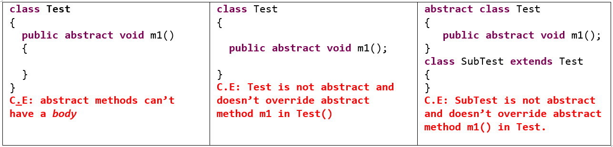
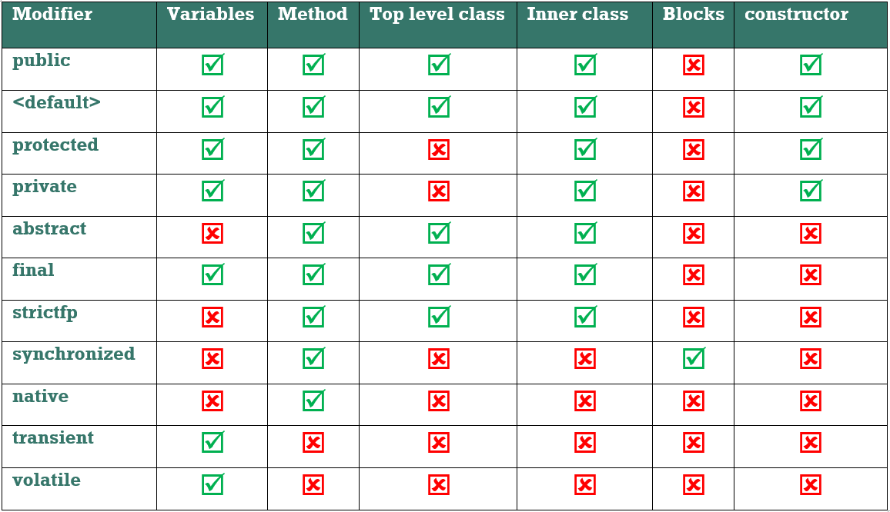

Access Modifiers
==================

#### Java Source File Structure


-   A java Source file can contain **any no of classes** but at most one class can
    be declared as the **public**.

-   if there is any public class then compulsory the name of the source file and
    the name of the public class must be matched otherwise we will get compile
    time error.

-   If there is no public class, then any name we can use for the source file

<br>

Java Access Modifiers
---------------------

1.  **`public`** – accessible everywhere

2.  **`protected`** – accessible in the same package and in sub-classes

3.  **`default`** – accessible only in the same package

4.  **`private`** – accessible only in the same class

**(Top most) Classes and interfaces cannot be private. private members are
accessible within the same class only.**

<br>

There are two levels of access control.

-   **Class level** — Allowed modifiers are public, default only

-   **Method level** — Allowed modifiers are public, private, protected, or
    package-private (default)

A class may be declared with the modifier public, in which case that class is
visible to all classes everywhere. If a class has no modifier (the default, also
known as package-private), it is visible only within its own package.  

<br>

Class Modifiers – Applicable only for classes
---------------------------------------------

<table>
<thead>
	<tr>
 <th>For Top – Level Class</th>
 <th>For Inner classes</th>
	</tr>
</thead>
<tbody>
	<tr>
 <td>public</td>
 <td>public</td>
	</tr>
	<tr>
 <td>default</td>
 <td>default</td>
	</tr>
	<tr>
 <td>final</td>
 <td>protected</td>
	</tr>
	<tr>
 <td>abstract</td>
 <td>private</td>
	</tr>
	<tr>
 <td>strictfp</td>
 <td>final</td>
	</tr>
	<tr>
 <td>If we are using any other modifier
 we will get C.E : error: 
 `modifier private not allowed here`</td>
 <td>abstract<br>strictfp<br>static</td>
	</tr>
</tbody>
</table>


<br>


## final:

**final** is the modifier applicable for **classes, methods and variables**.

<br>

**1.final at Class level**  
If a class declared as final, **inheritance is not allowed**.
```java
final class P {
	
}
class C extends P {
	
}
Test.java:18: error: cannot inherit from final P
class C extends P {
```
<br>

**2.final at Method level**  
If a method declared as final, **we are not allowed to override** that method in
child classes
```java
class P {
public final void marry() {
     System.out.println("Bujji");
  }
}
class C extends P {
public void marry() {
    System.out.println("Preeti");
  }
}
Test.java:21: error: marry() in C cannot override marry() in P
        public void marry() {
```
<br>

**3.final at variable level**  
-   If a variable declared as final, **we are not allowed to change it’ s
    value.**

-   For the final instance variables JVM won’t provide any default values,
    compulsory we should perform initialization **before completion of
    constructor.** The following are the places to perform this

    -   At the time of declaration:
        ```java
        final int i = 0;
        ```


    -   Inside instance initialization class
        ```java
        final int i;
        {
        i = 0;
        }
        ```


    -   Inside constructor
        ```java
           final int i;
           test()
           {
             i = 0;
           }
        ```


    -   Inside static blocks, for static final variables
        ```java
        static
        {
        i = 0;
        }
        ```


-   For the local variables the only applicable modifier is final.

-   Before using a local variable (whether it is final or non-final) we should
    perform initialization. If we are not using local variable, then no need of
    perform initialization even though it is final.

-   **Every `method` presents in final class by `default final`, but `variables are not
    final`**.

<BR>

## abstract:
-   abstract modifier is applicable only for **classes and methods**, but not
    for variables.

-   abstract method should have only declaration but not implementation hence
    abstract method declaration should end with `;`(semicolon)
    ```java
    public abstract void m1(); //CORRECT
    public abstract void m1(){} //WRONG
    ```


-   If a class contain at least one abstract method then the corresponding class
    should be declared as abstract otherwise we will get C.E.

-   Even though class doesn’t contain any abstract method still we can declare
    that class with abstract modifier.i. e abstract class can contain zero no of
    abstract methods.


<br>

## strictfp:  
-   strictfp modifier is applicable only for **methods and classes** but not for
    variables.

-   If a method declared as a strictfp **all floating point calculations in that
    method will follows IEEE standard so** that we can get platform independent
    results.

-   strictfp and abstract is always illegal combination for methods, but allowed
    for classes

-   If a class declared as strictfp all concrete methods in that class will
    follow IEEE standard for floating point arithmetic.

<br>

# Member modifiers – Applicable for methods & variables
 
1.	**public**
2.	**protected**
3.	**< default >**
4.	**private**	
5.	**final**
6.	**static**
7.	**native**
8.	**synchronized**
9.	**transient**
10.	**volatile**

<br>


**1.public members**  
we can access public members from anywhere but the corresponding class must be
visible

<br>


**2.protected members**  
If a member declared as protected then we can access that member from anywhere
with in the current package and only in child classes from outside package.

<br>

**3.default members**  
If a member declared as a default, we can access that member only in the current
package.

<br>

**4.private members**  
If a member declared as private, we can access that member only in the current
class.

<br>

**5.final members**  
-   A final class cannot be inherited. You cannot create subclasses of final
    classes.

-   If a method declared as final, **we are not allowed to override** that
    method in child classes

-   We cannot change the value of a final variable once it is initialized.

<br>

 **6.Static**   
static is the modifier is applicable for methods and variables but not classes
(inner classes allowed).

-   **Overloading** is possible for static methods.

-   **Inheritance** concept is applicable for static methods, including
    main().for example, while executing child class, if child class main()
    method is not present then parent class main() will execute.
    ```java
    class A{
    	public static void main(String[] args) {
     System.out.println("Parent class");
    	}
    }
    public class B extends A{
    
    }
    -----------------------------------------------
    C:\Users\kaveti_S\Downloads\JUnitHelloWorld\src\main\java>java B
    A
    ```


-   It seems Overriding concept is applicable for static methods, **but it’s not
    Overriding, it is “method hiding"**
    ```java
    class A{
    	public static void main(String[] args) {
     System.out.println("Parent class");
    	}
    }
    public class B extends A{
    	public static void main(String[] args) {
     System.out.println("Child class");
    	}
    }
    -------------------------------------------------------------
    C:\Users\kaveti_S\Downloads\JUnitHelloWorld\src\main\java>java A
    Parent class
    
    C:\Users\kaveti_S\Downloads\JUnitHelloWorld\src\main\java>java B
    Child class
    ```

<br>

**7.native modifier**

-   The methods which are implemented in non-java(like C,C++) are called
    “**native methods**". The main objectives of native keyword are

    -   To improve performance of the system.

    -   To communicate with already existing legacy systems.

-   native is the modifier applicable only for methods , **but not classes and
    variables**.

-   native method should end with ;(semicolon).because we are not responsible to
    provide implementation, it is already available.so *abstract* and *native*
    is *illegal combination* of modifier

-   For the native methods *overloading*, *Inheritance* and *overriding*
    concepts are applicable.

-   The use of native keyword breaks the platform independent nature of java.  

```java
class Native {
	static {
	         System.loadLibrary("Path of native library") ;// Loading the native library.
	}
	public native void m1(); // Declaring a native method.
}

class client
{
Native n = new Native();
n.m1();//Invoking a native method.
}
```


<br>

**8. Synchronized**

-   It is a keyword applicable only for methods and blocks. We can’t declare
    variables and classes with synchronized keyword.

-   If a method declared as synchronized at a time only one thread is allowed to
    execute on the given object. Hence the main advantage of synchronized
    keyword is we can overcome data inconsistency problem.

-   Synchronized methods are implemented methods, so abstract combination is
    illegal for the methods.

<br>

**9.Transient Modifier**

-   Transient is the keyword applicable only for variables, but not methods and
    classes.

-   While performing serialization if u don’t want to save the value of a
    particular variable, that variable we have declared with transient keyword.

-   At the time of serialization, JVM ignores the value of transient variable
    and saves it’s default value.

<br>

**10.Volatile** 

-   Volatile keyword is used with only variable in Java

-   it guarantees that value of volatile variable will always be read from main
    memory and not from Thread's local cache.

-   So, we can use volatile to achieve synchronization because its guaranteed
    that all reader thread will see updated value of volatile variable once
    write operation completed.

-   volatile provides the guarantee, changes made in one thread is visible to
    others.

<br>

**What is the difference between the volatile and atomic variable in Java?**  
For example count++ operation will not become atomic just by declaring count
variable as volatile. On the other hand AtomicInteger class provides atomic
method to perform such compound operation atomically e.g. getAndIncrement() is
atomic replacement of increment operator. It can be used to atomically increment
current value by one. Similarly, you have atomic version for other data type and
reference variable as well.

# Conclusion
