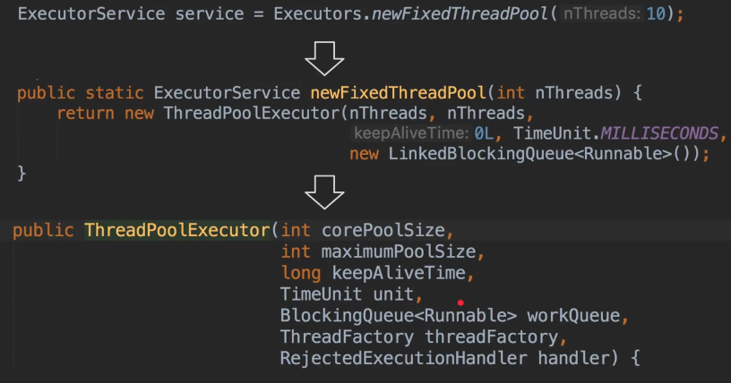
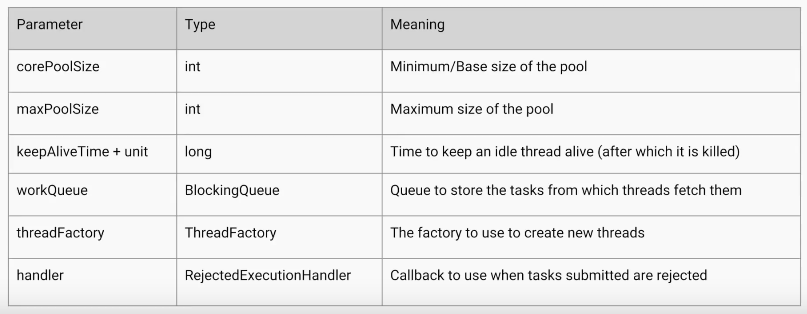
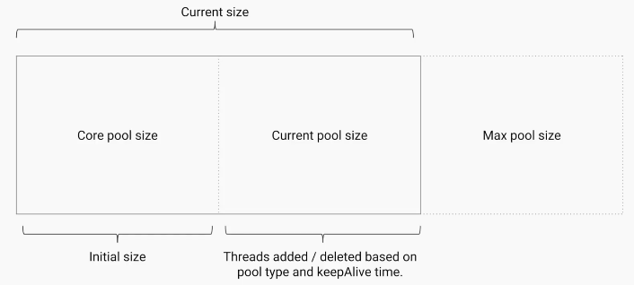
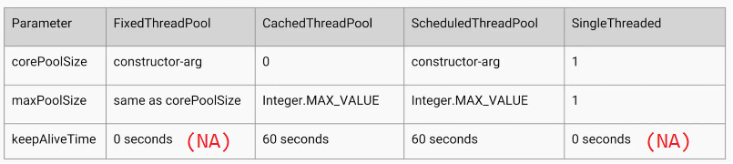
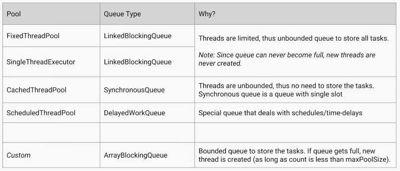
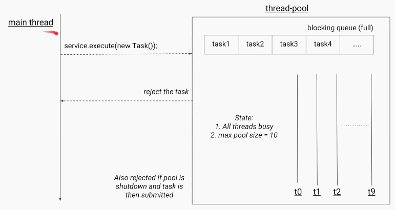
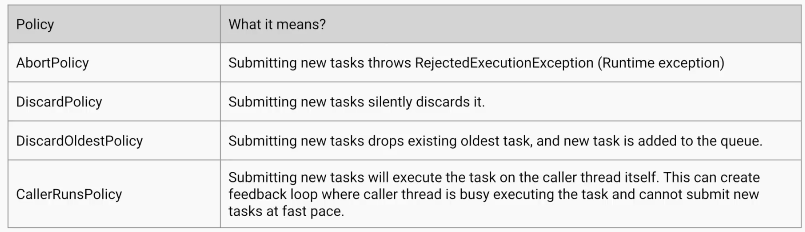
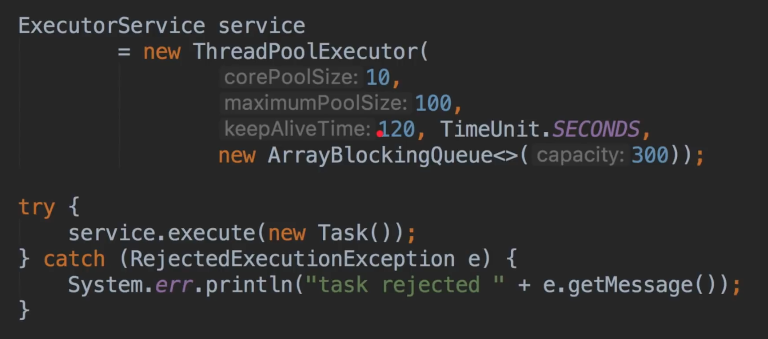

Custom ThreadPool
====================

If you the Source code of ExceutorService, few have below method with
parameters. So let  s understand that.

By Defining above parameters properly we can create our own ThreadPoolExecutor.

