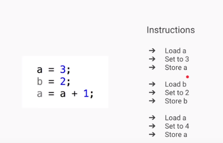
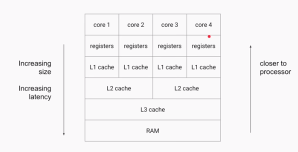

Atomic Variables
===================

###### Volatile Example

-   If **writerThread()** is executed by one thread & **readerThread()** is
    executed by another thread

-   the ‘x’ value is different for two threads because they are reading value
    from their LocalCache.

-   Here the changes of X value is not **visible** globally (Field Visibility),
    because they are changing in **LocalCache.**

**To avoid this, we need to use ‘volatile’ keyword for fields.**

-   The Java **volatile** keyword is used to mark a Java variable as **"being
    stored in main memory**".

-   that means, every **read** of a volatile variable will **be read from the
    main memory(Shared Memory)**, and not from the CPU cache

-   **every write** to a volatile variable will be **written to main memory**,
    and not just to the CPU cache.

-   In the above diagram two threads t1, t2 are trying to change the value of
    flag.

-   If Thread1 changes value flag=false, then it will flush(push) the changes
    from LocalCache to SharedCache and it will refresh the all Thread
    LocalCaches with updated value.

-   If Thread 2 is trying to read, it will get updated value.

-   Volatile solves the visibility problem, where Only one operation is perform

###### Amtomic Problem

 Atomic - forming a single irreducible unit or component in a larger system.

Increment (++) is an **Compound Operation(multiple). AtomicVaribles** makes
compound operations as **Atomic(Single)**

We can solve this problem using Synchronization

Another Way using Atomic Variables

###### Atomic Varibles

The java.util.concurrent.atomic package defines classes that support atomic
operations on single variables. All classes have **get and set methods** that
work like reads and writes on volatile variables.

We have following Atomic classes

-   AtomicInteger

-   AtomicLong

-   AtomicBoolean

-   AtomicReference

-   AtomicIntegerArray

-   AtomicLongArray

-   AtomicReferenceArray

Common methods

-   **incrementAndGet()**: Atomically increments by one the current value.

-   **decrementAndGet()**: Atomically decrements by one the current value.

-   **addAndGet(int delta)**: Atomically adds the given value to the current
    value.

-   **compareAndSet(int expect, int update):** Atomically sets the value to the
    given updated value if the current value == the expected value.

-   **getAndAdd(int delta):** Atomically adds the given value to the current
    value.

-   **set(int newValue):** Sets to the given value.

Terms
-----

**Liveness(live-less):**

A liveness failure occurs when an activity gets into a state such that it is
permanently unable to make forward progress. For example, if thread A is waiting
for a resource that thread B holds exclusively, and B never releases it, A will
wait forever.

**Race Conditions**

A race condition occurs when the correctness of a computation depends on the
relative timing or interleaving of multiple threads by the runtime; in other
words, when getting the right answer relies on lucky timing.
