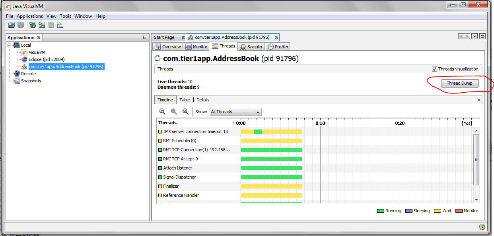

Threads Interview Questions
==============================

StampedLock

Same as ReadWriteLock, but it returns a stamp represented by a **long** value.
Each Stamp is a unique value, that stamp value compared at unlockWrote()

ExecutorService executor = Executors.newFixedThreadPool(2);

Map<String, String> map = new HashMap<>();

StampedLock lock = new StampedLock();

executor.submit(() -> {

long stamp = lock.writeLock();

try {

sleep(1);

map.put("foo", "bar");

} finally {

lock.unlockWrite(stamp);

}

});

Runnable readTask = () -> {

long stamp = lock.readLock();

try {

System.out.println(map.get("foo"));

sleep(1);

} finally {

lock.unlockRead(stamp);

}

};

executor.submit(readTask);

executor.submit(readTask);

stop(executor);

###### What happens if we starts same Thread(ob) Twice?

public class ThreadDemo extends Thread {

    @Override

    public void run() {

        System.out.println("Iam Running");

    }

    public static void main(String[] args) {

        ThreadDemo ob = new ThreadDemo();

        ob.start();

        ob.start();

    }

}

Exception in thread "main" java.lang.IllegalThreadStateException

at java.lang.Thread.start(Thread.java:705)

at threads.ThreadDemo.main(ThreadDemo.java:11)

Iam Running

###### What guarantee volatile variable provides?

volatile provides the guarantee, changes made in one thread is visible to
others.

###### [What is busy spin?](https://netjs.blogspot.com/2016/06/busy-spinning-in-multi-threading.html)

Busy spinning or busy wait in a multi-threaded environment is a technique where
other threads loop continuously waiting for a thread to complete its task and
signal them to start.

while(spinningFlag){

System.out.println("Waiting busy spinning");

}

**What is Thread Dump? How do you take thread dump in Java?**  
Process has multiple Threads. **Thread dump** is a summary of the state of
all **threads** of the process

-   ‘**jstack’** is an effective command line tool to capture thread dumps

-   **Java VisualVM** is a GUI tool that provides detailed information about the
    applications

    

###### Why Swing is not thread-safe in Java?

User can’t click two buttons at a time right ? Since GUI screens are mostly
updated in response of user action e.g. when user click a button, and since
events are handled in the same Event dispatcher thread, it's easy to update GUI
on that thread.

###### What is a ThreadLocal variable in Java?

Thread-local variables are variables restricted to a thread, it’s like thread's
own copy which is not shared between multiple threads. Java provides
a **ThreadLocal** class to support thread-local variables, It extends Object
class.

-   Basically it is an another way to achieve thread safety apart from writing
    immutable classes.

-   Since Object is no more shared there is no requirement of Synchronization
    which can improve scalability and performance of application.

-   ThreadLocal provides thread restriction which is extension of local
    variable. ThreadLocal are visible only in single thread. No two thread can
    see each other’s thread local variable.

-   These variable are generally **private static** field in classes and
    maintain its state inside thread.

-   **void set(Object value), Object get(), void remove()** methods are
    available

public class ThreadLocalExample {

public static class MyRunnable implements Runnable {

private ThreadLocal<Integer> threadLocal = new ThreadLocal<Integer>();

public void run() {

threadLocal.set((int) (Math.*random*() \* 100D));

System.*out*.println(threadLocal.get());

}

}

public static void main(String[] args) throws InterruptedException {

MyRunnable sharedRunnableInstance = new MyRunnable();

Thread thread1 = new Thread(sharedRunnableInstance);

Thread thread2 = new Thread(sharedRunnableInstance);

thread1.start();

thread2.start();

thread1.join(); // wait for thread 1 to terminate

thread2.join(); // wait for thread 2 to terminate

}

}

\-----------

36

16

This example creates a single MyRunnable instance which is passed to two
different threads. Both threads execute the run() method, and thus sets
different values on the ThreadLocal instance. If the access to the set() call
had been synchronized, and it had not been a ThreadLocal object, the second
thread would have overridden the value set by the first thread

**Write code for thread-safe Singleton in Java?**

When we say thread-safe, which means Singleton should remain singleton even if
initialization occurs in the case of multiple threads. 

public class DoubleCheckedLockingSingleton {

private volatile DoubleCheckedLockingSingleton INSTANCE;

private DoubleCheckedLockingSingleton() {

}

public DoubleCheckedLockingSingleton getInstance(){

if(INSTANCE == null){

synchronized(DoubleCheckedLockingSingleton.class){

//double checking Singleton instance

if(INSTANCE == null){

INSTANCE = new DoubleCheckedLockingSingleton();

}

}

}

return INSTANCE;

}

}

**When to use Runnable vs Thread in Java? (Think Inheritance)**  
it's better to implement Runnable then extends Thread if you **also want to
extend another class**  

###### Difference between Runnable and Callable in Java?  

Callable was added on JDK 1.5. Main difference between these two is that
Callable's **call()** method can return value and throw Exception, which was not
possible with Runnable's run() method. Callable return **Future** object, which
can hold the result of computation.

public class CallableDemo {

public static void main(String[] args) throws Exception {

ExecutorService service = Executors.newSingleThreadExecutor();

SumTask sumTask = new SumTask(20);

Future<Integer> future = service.submit(sumTask);

Integer result = future.get();

System.out.println(result);

}

}

class SumTask implements Callable<Integer> {

private int num = 0;

public SumTask(int num){

this.num = num;

}

@Override

public Integer call() throws Exception {

int result = 0;

for(int i=1;i<=num;i++){

result+=i;

}

return result;

}

}

###### How to stop a thread in Java?

There was some control methods in JDK 1.0 e.g**.  suspend() and resume()** which
are deprecated. To manually stop, programmers either take advantage of volatile
boolean variable and check in every iteration if run method has loops or
**interrupt** threads to abruptly cancel tasks.

**Why wait, notify and notifyAll are not inside thread class?**  
Java provides lock at object level not at thread level. Every object has lock,
which is acquired by thread. Now if thread needs to wait for certain lock it
make sense to call wait() on that object rather than on that thread.
Had wait() method declared on Thread class, it was not clear that for which lock
thread was waiting. In short, since wait, notify and notifyAll operate at lock
level, it make sense to defined it on object class because lock belongs to
object.

**What is the difference between livelock and deadlock in Java?**  
A real-world example of livelock occurs when two people meet in a narrow
corridor, and each tries to be polite by moving aside to let the other pass, but
they end up swaying from side to side without making any progress because they
both repeatedly move the same way at the same time. In short, the main
difference between livelock and deadlock is that in former state of process
change but no progress is made.

**How do you check if a Thread holds a lock or not?**  
There is a method called **holdsLock()** on java.lang.Thread, it returns true if
and only if the current thread holds the monitor lock on the specified object. 

Thread t = Thread.*currentThread*();

System.*out*.println(Thread.*holdsLock*(t));

**What is Semaphore in Java?**  
Semaphore in Java is a new kind of synchronizer. It's a counting semaphore.
Conceptually, a semaphore maintains a set of permits. Each **acquire()** blocks
if necessary until a permit is available, and then takes it. Each **release()**
adds a permit, potentially releasing a blocking acquirer. However, no actual
permit objects are used; the Semaphore just keeps a count of the number
available and acts accordingly. Semaphore is used to protect an expensive
resource which is available in fixed number e.g. database connection in the
pool.

**What is the difference between the submit() and execute() method thread pool
in Java?**

-   **execute(Runnable command)** is defined in Executor interface and executes
    given task in future, but more importantly, it does not return anything. 

-   **submit()** is an overloaded method, it can take
    either **Runnable or Callable** task and can return Future object which can
    hold the pending result of computation. This method is defined
    on ExecutorService interface, which extends Executor interface, and every
    other thread pool class
    e.g. ThreadPoolExecutor or ScheduledThreadPoolExecutor gets these methods.

**Which method of Swing API are thread-safe in Java?**  
I know about **repaint(),** and revalidate() being thread-safe but there are
other methods on different swing components e.g. **setText() method
of JTextComponent, insert() and append()** method of JTextArea class.

**What is the difference between the volatile and atomic variable in Java?**  
For example count++ operation will not become atomic just by declaring count
variable as volatile. On the other hand AtomicInteger class provides atomic
method to perform such compound operation atomically e.g. getAndIncrement() is
atomic replacement of increment operator. It can be used to atomically increment
current value by one. Similarly, you have atomic version for other data type and
reference variable as well.

**What happens if a thread throws an Exception inside synchronized block?**  
To answer this question, no matter how you exist synchronized block, either
normally by finishing execution or abruptly by throwing exception, **thread
releases the lock it acquired while entering that synchronized block.**  

###### How do you ensure that N thread can access N resources without deadlock

Key point here is order, if you acquire resources in a particular order and
release resources in reverse order you can prevent deadlock. 

###### What is busy spin, and why should you use it?

Busy spinning is a waiting strategy in which one thread loop continuously to
check certain condition and waiting for other thread to change this condition to
break the loop without releasing CPU so that waiting thread can proceed its work
further

###### What’s the difference between Callable and Runnable?

Both of these are interfaces used to carry out task to be executed by a thread.
The main difference between the two interfaces is that

-   Callable can **return a value**, while Runnable cannot.

-   Callable can throw a checked exception, while Runnable cannot.

-   Runnable has been around since Java 1.0, while Callable was introduced as
    part of Java 1.5.

The *Callable* interface is a generic interface containing a
single *call()* method – which returns a generic value *V*:

public interface *Callable*<V> {

V call() throws Exception;

}

class CallableExample implements *Callable*

{

public Object call() throws Exception

{

*Random* generator = new *Random*();

Integer randomNumber = generator.nextInt(5);

Thread.*sleep*(randomNumber \* 1000);

return randomNumber;

}

}

###### What is false sharing in the context of multi-threading? 

false sharing is one of the well-known performance issues on multi-core systems,
where each process has its local cache.

False sharing is very hard to detect because the thread may be accessing
completely different global variables that happen to be relatively close
together in memory. Like many concurrency issues, the primary way to avoid false
sharing is careful code review and aligning your data structure with the size of
a cache line

###### Object level and Class level locks in Java

**Object level lock : **Every object in java has a unique lock. Whenever we are
using synchronized keyword, then only lock concept will come in the picture. If
a thread wants to execute synchronized method on the given object. First, it has
to get lock of that object. Once thread got the lock then it is allowed to
execute any synchronized method on that object. Once method execution completes
automatically thread releases the lock. Acquiring and release lock internally is
taken care by JVM and programmer is not responsible for these activities. Lets
have a look on the below program to understand the object level lock:

| class Geek implements Runnable {     public void run()     {         Lock();     }     public void Lock()     {         System.out.println(Thread.currentThread().getName());         synchronized(this)         {             System.out.println("in block "                 + Thread.currentThread().getName());             System.out.println("in block " +                 Thread.currentThread().getName() + " end");         }     }      public static void main(String[] args)     {         Geek g = new Geek();         Thread t1 = new Thread(g);         Thread t2 = new Thread(g);         Geek g1 = new Geek();         Thread t3 = new Thread(g1);         t1.setName("t1");         t2.setName("t2");         t3.setName("t3");         t1.start();         t2.start();         t3.start();     } } |
|----------------------------------------------------------------------------------------------------------------------------------------------------------------------------------------------------------------------------------------------------------------------------------------------------------------------------------------------------------------------------------------------------------------------------------------------------------------------------------------------------------------------------------------------------------------------------------------------------------------------------------------------------------------------------------------------------------------------------------------------------------------------------------------------------------------------|

Run on IDE

Output:

t1

in block t1

in block t1 end

t2

in block t2

in block t2 end

t3

in block t3

in block t3 end

**Class level lock : **Every class in java has a unique lock which is nothing
but class level lock. If a thread wants to execute a static synchronized method,
then thread requires class level lock. Once a thread got the class level lock,
then it is allowed to execute any static synchronized method of that class. Once
method execution completes automatically thread releases the lock. Lets look on
the below program for better understanding:

| // Java program to illustrate class level lock class Geek implements Runnable {     public void run()     {         Lock();     }      public void Lock()     {         System.out.println(Thread.currentThread().getName());         synchronized(Geek.class)         {             System.out.println("in block "                 + Thread.currentThread().getName());             System.out.println("in block "                 + Thread.currentThread().getName() + " end");         }     }      public static void main(String[] args)     {         Geek g1 = new Geek();         Thread t1 = new Thread(g1);         Thread t2 = new Thread(g1);         Geek g2 = new Geek();         Thread t3 = new Thread(g2);         t1.setName("t1");         t2.setName("t2");         t3.setName("t3");         t1.start();         t2.start();         t3.start();     } } |
|-------------------------------------------------------------------------------------------------------------------------------------------------------------------------------------------------------------------------------------------------------------------------------------------------------------------------------------------------------------------------------------------------------------------------------------------------------------------------------------------------------------------------------------------------------------------------------------------------------------------------------------------------------------------------------------------------------------------------------------------------------------------------------------------------------------------------------------------------------------------------------|

###### Producer-Consumer solution using threads in Java

-   The producer’s job is to generate data, put it into the buffer, and start
    again.

-   same time, the consumer is consuming the data (i.e. removing it from the
    buffer), one piece at a time.

-   producer won’t try to add data into the buffer if it’s full & consumer won’t
    try to remove data from an empty buffer

class Producer extends Thread {

*List* buffer;

int maxsize;

public Producer(*List* buffer, int maxsize) {

this.buffer = buffer;

this.maxsize = maxsize;

}

@Override

public void run() {

int i = 1;

while (true) {

synchronized (buffer) {

try {

if (buffer.size() == maxsize) {

System.*out*.println("Maximum Size Reached, wait until consume");

buffer.wait();

} else {

*buffer.add(i++)*;

System.*out*.println(i + " : Produced, notify wating COnsumer Thread");

buffer.notifyAll();

}

} catch (InterruptedException e) {

// TODO Auto-generated catch block

e.printStackTrace();

}

}

}

}

}

class Consumer extends Thread {

*List* buffer;

int maxsize;

public Consumer(*List* buffer, int maxsize) {

this.buffer = buffer;

this.maxsize = maxsize;

}

@Override

public void run() {

while (true) {

try {

synchronized (buffer) {

if (buffer.isEmpty()) {

System.*out*.println("Consumer : Buffer Empty, wait untill produce");

buffer.wait();

} else {

Object ob = buffer.remove(0);

System.*out*.println(ob + " : Removed, notify Producer waiting for Removing for
maxsize");

buffer.notifyAll();

}

}

} catch (Exception e) {

// TODO: handle exception

}

}

}

}

public class ProducerConsumer {

public static void main(String[] args) {

*List* buffer = new LinkedList<>();

Producer producer = new Producer(buffer, 10);

Consumer consumer = new Consumer(buffer, 10);

producer.start();

consumer.start();

}

}

28054 : Produced, notify wating COnsumer Thread

28055 : Produced, notify wating COnsumer Thread

28056 : Produced, notify wating COnsumer Thread

28057 : Produced, notify wating COnsumer Thread

28058 : Produced, notify wating COnsumer Thread

28059 : Produced, notify wating COnsumer Thread

28060 : Produced, notify wating COnsumer Thread

Maximum Size Reached, wait until consume

28050 : Removed, notify Producer waiting for Removing for maxsize

28051 : Removed, notify Producer waiting for Removing for maxsize

28052 : Removed, notify Producer waiting for Removing for maxsize

28053 : Removed, notify Producer waiting for Removing for maxsize

28054 : Removed, notify Producer waiting for Removing for maxsize

28055 : Removed, notify Producer waiting for Removing for maxsize

28056 : Removed, notify Producer waiting for Removing for maxsize

28057 : Removed, notify Producer waiting for Removing for maxsize

28058 : Removed, notify Producer waiting for Removing for maxsize

28059 : Removed, notify Producer waiting for Removing for maxsize

Consumer : Buffer Empty, wait untill produce

###### Thread. yield () 

**yield() method:** Theoretically, **to ‘yield’ means to let go, to give up, to
surrender**. A yielding thread tells the virtual machine that it’s willing to
let other threads be scheduled in its place.

This indicates that it’s not doing something too critical. Note that *it’s only
a hint*, though, and not guaranteed to have any effect at all.

-   Yield is a Static method and Native too.

-   Yield tells the currently executing thread to give a chance to the threads
    that have equal priority in the [Thread
    Pool](https://howtodoinjava.com/java-5/java-executor-framework-tutorial-and-best-practices/).

-   There is no guarantee that Yield will make the currently executing thread to
    runnable state immediately.

-   **It can only make a thread from Running State to Runnable State, not in
    wait or blocked state**.

###### What do you understand about Thread Priority?

Every thread has a priority, usually higher priority thread gets precedence in
execution but it depends on Thread Scheduler implementation that is OS
dependent. We can specify the priority of thread but it doesn’t guarantee that
higher priority thread will get executed before lower priority thread.

###### How can we make sure main() is the last thread to finish in Java Program?

We can use Thread join() method to make sure all the threads created by the
program is dead before finishing the main function.

###### Why wait(), notify() and notifyAll() methods have to be called from synchronized method or block?

When a Thread calls wait() on any Object, it must have the monitor on the Object
that it will leave and goes in wait state until any other thread call notify()
on this Object. Similarly when a thread calls notify() on any Object, it leaves
the monitor on the Object and other waiting threads can get the monitor on the
Object. Since all these methods require Thread to have the Object monitor, that
can be achieved only by synchronization, they need to be called from
synchronized method or block.

###### How can we achieve thread safety in Java?

There are several ways to achieve thread safety in java – **synchronization,
atomic concurrent classes, implementing concurrent Lock interface, using
volatile keyword**, using immutable classes and Thread safe classes.

###### What is volatile keyword in Java

When we use volatile keyword with a variable, all the threads read it’s value
directly from the memory and don’t cache it. This makes sure that the value read
is the same as in the memory.

###### What is ThreadLocal?

Java ThreadLocal is used to create thread-local variables. We know that all
threads of an Object share it’s variables, so if the variable is not thread
safe, we can use synchronization but if we want to avoid synchronization, we can
use ThreadLocal variables.  
Every thread has it’s own ThreadLocal variable and they can use it’s get() and
set() methods to get the default value or change it’s value local to Thread.
ThreadLocal instances are typically private static fields in classes that wish
to associate state with a thread

###### What is BlockingQueue? implement Producer-Consumer using Blocking Queue?

-   java.util.concurrent.BlockingQueue is a Queue that supports operations that
    wait for the queue to become non-empty when retrieving and removing an
    element, and wait for space to become available in the queue when adding an
    element.

-   BlockingQueue doesn’t accept null values and throw NullPointerException if
    you try to store null value in the queue.

-   BlockingQueue implementations are thread-safe. All queuing methods are
    atomic in nature and use internal locks or other forms of concurrency
    control.

-   BlockingQueue interface is part of [java collections
    framework](https://www.journaldev.com/1260/collections-in-java-tutorial) and
    it’s primarily used for implementing producer consumer problem.  
    Check this post for [producer-consumer problem implementation using
    BlockingQueue](https://www.journaldev.com/1034/java-blockingqueue-example).

###### What is Executors Class?

Executors class provide utility methods for Executor, ExecutorService,
ScheduledExecutorService, ThreadFactory, and Callable classes.

Executors class can be used to easily create Thread Pool in java, also this is
the only class supporting execution of Callable implementations.

**What happens when an Exception occurs in a thread?**   
**Thread.UncaughtExceptionHandler** is an interface, defined as nested interface
for handlers invoked when a Thread abruptly terminates due to an uncaught
exception.

When a thread is about to terminate due to an uncaught exception the Java
Virtual Machine will query the thread for
its UncaughtExceptionHandler using Thread.getUncaughtExceptionHandler() and will
invoke the handler's uncaughtException() method, passing the thread and the
exception as arguments.

**Why wait, notify and notifyAll are not inside thread class?**   
One reason which is obvious is that Java provides lock at object level not at
thread level.

**How do you check if a Thread holds a lock or not?**  
Boolean Thread.*holdsLock*(Obj)
