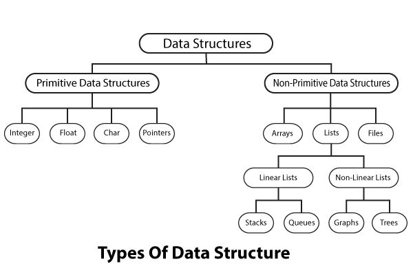
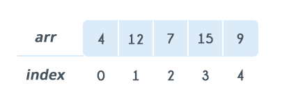

Traditional Data Structures
==============================

Data structure is a particular way of storing and organizing data in a computer
so that it can be used efficiently.

Depending on the organization of the elements, data structures are classified
into two types:

**1) Linear data structures** : Elements are accessed in a sequential order but
it is not compulsory to store all elements sequentially (say, Linked Lists).
**Examples: Linked Lists, Stacks and Queues**.

**2) Non – linear data structures** : Elements of this data structure are
stored/accessed in a non-linear order. **Examples: Trees and graphs**.

 

###### Analysis of Algorithms?

To go from city *“A"* to city *“B"*, there can be many ways of accomplishing
this: by flight, by bus, by train and also by bicycle. Depending on the
availability and convenience, we choose the one that suits us. Similarly, in
computer science, multiple algorithms are available for solving the same problem
(for example, a sorting problem has many algorithms, like insertion sort,
selection sort, quick sort and many more). Algorithm analysis helps us to
determine which algorithm is most efficient in terms of time and space consumed.

**Worst case**

-   Defines the input for which the algorithm takes a long time (slowest time to
    complete).

-   Input is the one for which the algorithm runs the slowest.

**Best case**

-   Defines the input for which the algorithm takes the least time (fastest time
    to complete).

-   Input is the one for which the algorithm runs the fastest.

**Average case**

-   Provides a prediction about the running time of the algorithm.

-   Run the algorithm many times, using many different inputs take the average
    of them.

For analysis (best case, worst case and average), we try to give the **upper
bound (O)** and **lower bound (Ω)** and **average running time (Θ).**

# Types Of Data Structures

-   Primitive data structures

-   Non-primitive data structures

**<u>Primitive Data Structures</u>**

-   Primitive Data Structures are the basic data structures that directly
    operate upon the machine instructions.

-   **Integers**, **Floating point numbers**, **Character constants**, **String
    constants** and **Pointers** come under this category.

**<u>Non-primitive Data Structures</u>**

-   Non-primitive data structures are more complicated data structures and are
    derived from primitive data structures.

-   They emphasize on grouping same or different data items with relationship
    between each data item.**Arrays**, **Lists** and **Files** come under this
    category.

# Data Structures

>   DSA - Data Structure Basics

>   DSA - Array Data Structure

**Linked Lists**

>   **DSA - Linked List**

>   **DSA - Doubly Linked List**

>   **DSA - Circular Linked List**

**Stack & Queue**

>   **DSA - Stack**

>   **DSA - Queue**

**Graph Data Structure**

>   **DSA - Graph Data Structure**

>   **DSA - Depth First Traversal**

>   **DSA - Breadth First Traversal**

**Tree Data Structure**

>   **DSA - Tree Data Structure**

>   **DSA - Tree Traversal**

>   **DSA - Binary Search Tree**

>   **DSA - AVL Tree**

>   **DSA - Spanning Tree**

>   **DSA - Heap**

Arrays

An array is a sequential collection of elements of same data type and stores
**data elements in a continuous memory location**. The elements of an array are
accessed by using an index. The index of an array of size N can range
from 0 to N−1.

**Basic Operations**

Following are the basic operations supported by an array.

-   **Traverse** − print all the array elements one by one.

-   **Insertion** − Adds an element at the given index.

-   **Deletion** − Deletes an element at the given index.

-   **Search** − Searches an element using the given index or by the value.

-   **Update** − Updates an element at the given index.
