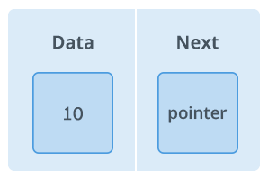
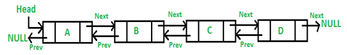

Linked List
==============

Like arrays, Linked List is a linear data structure. Unlike arrays**, linked
list elements are not Stores in a continuous memory location**; the elements are
linked using pointers


**Node** : A node is a collection of two sub-elements or parts. A **data** part
that stores the element and a **next** part that stores the link to the next
node.



**Linked List VS Arrays**  
Arrays can be used to store linear data of similar types, but arrays have
following limitations.  
**1)** The size of the arrays is fixed: So we must know the upper limit on the
number of elements in advance  
**2)** Inserting a new element in an array of elements is expensive, because
room has to be created for the new elements and to create room existing elements
have to shifted.

**<u>Types of Linked List</u>**

Following are the various types of linked list.

-   **Simple Linked List** − Item navigation is forward only.

-   **Doubly Linked List** − Items can be navigated forward and backward.

-   **Circular Linked List** − Last item contains link of the first element as
    next and the first element has a link to the last element as previous.

<br>

#### Simple Linked List

**<u>Basic Operations</u>**

Following are the basic operations supported by a list.

-   **Insertion** − Adds an element at the beginning of the list.

-   **Deletion** − Deletes an element at the beginning of the list.

-   **Display** − Displays the complete list.

-   **Search** − Searches an element using the given key.

-   **Delete** − Deletes an element using the given key.

**<u>Algorithm</u>**

1.A linked list is represented by a pointer to the first node of the linked
list. The first node is called head. If the linked list is empty, then value of
head is NULL.  
2.Each node in a list consists of at least two parts:

-   Data

-   Pointer (Or Reference) to the next node

3.In Java, LinkedList can be represented as a class and **a Node as a separate
class**. The LinkedList class contains a reference of Node class type.
```java
class LinkedList
{
    Node head;  // head of list 
    /* Linked list Node*/
    class Node
    {
        int data;
        Node next;          
        // Constructor to create a new node Next is by default initialized
        // as null
        Node(int d) {data = d;}
    }
}
```


<br>

#### Doubly Linked List

A **D**oubly **L**inked **L**ist (DLL) contains an extra pointer, typically
called *previous pointer*, together with next pointer and data which are there
in singly linked list.



**<u>Basic Operations</u>**

Following are the basic operations supported by a list.

-   **Insertion** − Adds an element at the beginning of the list.

-   **Deletion** − Deletes an element at the beginning of the list.

-   **Insert Last** − Adds an element at the end of the list.

-   **Delete Last** − Deletes an element from the end of the list.

-   **Insert After** − Adds an element after an item of the list.

-   **Delete** − Deletes an element from the list using the key.

-   **Display forward** − Displays the complete list in a forward manner.

-   **Display backward** − Displays the complete list in a backward manner.
```java
public class DLL {
    Node head; // head of list
 
    /* Doubly Linked list Node*/
    class Node {
        int data;
        Node prev;
        Node next;
 
        // Constructor to create a new node
        // next and prev is by default initialized as null
        Node(int d) { data = d; }
    }
}
```

<br>

#### Circular Linked List

Circular Linked List is a variation of Linked list in which the first element
points to the last element and the last element points to the first element.
Both Singly Linked List and Doubly Linked List can be made into a circular
linked list.

**In singly linked list,** the next pointer of the last node points to the first
node.


**In doubly linked list,** the next pointer of the last node points to the first
node and the previous pointer of the first node points to the last node making
the circular in both directions.


