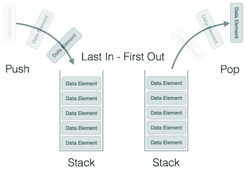

Stack
=========

A stack is an Abstract Data Type (ADT), commonly used in most programming
languages. It is named stack as it behaves like a real-world stack, for example
– a deck of cards or a pile of plates, etc.

**<u>Basic Operations</u>**

-   **push()** − Pushing (storing) an element on the stack.

-   **pop()** − Removing (accessing) an element from the stack.

-   **peek()** − get the top data element of the stack, without removing it.

-   **isFull()** − check if stack is full.

-   **isEmpty()** − check if stack is empty.

**<u>Push operation involves a series of steps −</u>**

-   **Step 1** − Checks if the stack is full.

-   **Step 2** − If the stack is full, produces an error and exit.

-   **Step 3** − If the stack is not full, increments **top** to point next
    empty space.

-   **Step 4** − Adds data element to the stack location, where top is pointing.

-   **Step 5** − Returns success.
