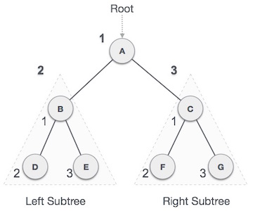
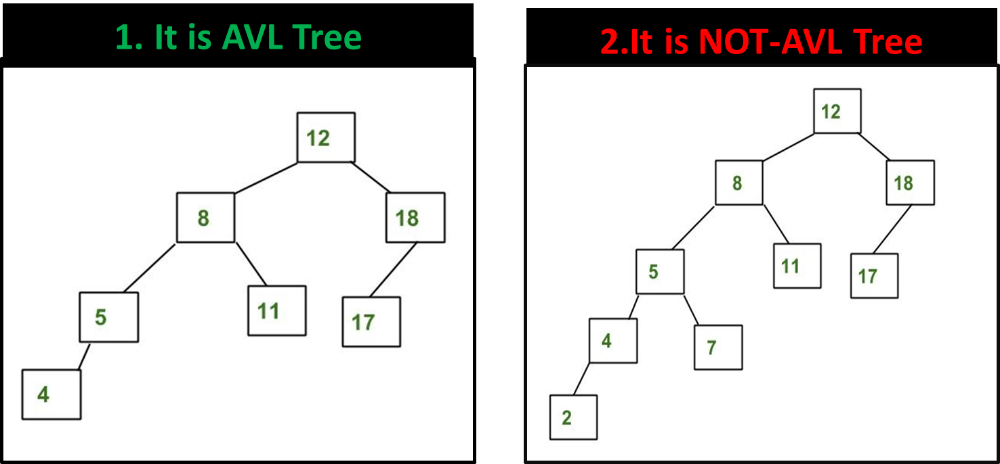

Trees
=========

Unlike Arrays, Linked Lists, Stack and queues, which are linear data structures,
trees are hierarchical data structures.

**Tree Vocabulary:**

-   The topmost node is called **root** of the tree.

-   The elements that are directly under an element are called its **children**.

-   The element directly above something is called its **parent**.
```dos
      j    <-- root
    /   \
   f      k   <-- parents
 /   \      \
a     h      z    <-- leaves
```
<br>

**Why Trees?**  
**1.** One reason to use trees might be because you want to store information
that naturally forms a hierarchy. **For example, the file system on a
computer**:

**2.** Trees (with some ordering e.g., BST) provide moderate access/search
(quicker than Linked List and slower than arrays).  
**3.** Trees provide moderate insertion/deletion (quicker than Arrays and slower
than Unordered Linked Lists).  
**4.** Like Linked Lists and unlike Arrays, Trees don’t have an upper limit on
number of nodes as nodes are linked using pointers.

#### Binary Tree

A binary tree has a special condition that each node can have a maximum of two
children.


#### Binary Search Tree

Binary Search tree exhibits a special behavior.

-   The node's **left child must less than its parent's value**

-   The node's **right child must greater than its parent value.**


<u>BST Basic Operations</u>

The basic operations that can be performed on a binary search tree data
structure, are the following

-   **Insert** − Inserts an element in a tree/create a tree.

-   **Search** − Searches an element in a tree.

-   **Inorder Traversal** − - left subtree first, then the root and later the
    right sub-tree.

-   **Preorder Traversal** − root node is first, then the left subtree and later
    the right sub-tree

-   **Postorder Traversal** − left subtree first, then the right subtree and
    later root node

<u>Algorithm</u>
```java
If root is NULL 
   then create root node
return

If root exists then
   compare the data with node.data
   
   while until insertion position is located

      If data is greater than node.data
         goto right subtree
      else
         goto left subtree

   endwhile 
   
   insert data
	
end If
```


<u>1. In-order Traversal</u>  
left subtree is visited first, then the root and later
the right sub-tree.

We start from **A**, and following in-order traversal, we move to its left
subtree **B**. **B** is also traversed in-order. The process goes on until all
the nodes are visited. The output of inorder traversal of this tree will be −*D
→ B → E → A → F → C → G*

<u>Algorithm</u>

Until all nodes are traversed −

**Step 1** − Recursively traverse left subtree.

**Step 2** − Visit root node.

**Step 3** − Recursively traverse right subtree.

<u>2.Pre-order Traversal</u>  
In this traversal method, the root node is visited first, then the left subtree
and finally the right subtree.



We start from **A**, and following pre-order traversal, we first
visit **A** itself and then move to its left subtree **B**. **B** is also
traversed pre-order. The process goes on until all the nodes are visited. The
output of pre-order traversal of this tree will be −*A → B → D → E → C → F → G*

Until all nodes are traversed −

**Step 1** − Visit root node.

**Step 2** − Recursively traverse left subtree.

**Step 3** − Recursively traverse right subtree.

<u>3.Post-order Traversal</u>   
In this traversal method, the root node is visited last, hence the name. First
we traverse the left subtree, then the right subtree and finally the root node.


We start from **A**, and following Post-order traversal, we first visit the left
subtree **B**. **B** is also traversed post-order. The process goes on until all
the nodes are visited. The output of post-order traversal of this tree will be
−*D → E → B → F → G → C → A*

Until all nodes are traversed −

**Step 1** − Recursively traverse left subtree.

**Step 2** − Recursively traverse right subtree.

**Step 3** − Visit root node.

<br>

## AVL Trees

AVL tree is a self-balancing Binary Search Tree (BST) where the difference
between heights of left and right subtrees cannot be more than one for all
nodes.

*BalanceFactor* = **(height of left subtree)** – **(height of right subtree)**




  
  
**1.Tree-1** is AVL because differences between heights of left and right
subtrees for **every node is less than or equal to 1.**

  
**2.Tree-2** is not AVL because differences between heights of left and right
subtrees for 8 and 18 is greater than 1
