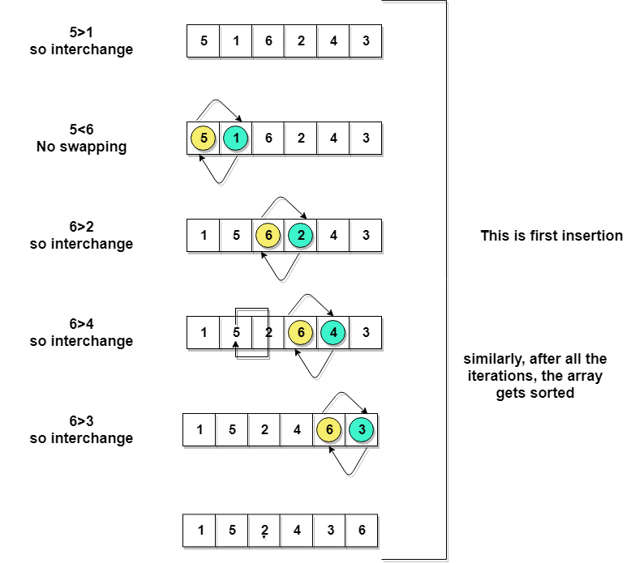

Bubble Sort Algorithm
=========================

This sorting algorithm is comparison-based algorithm in **which each pair of
adjacent elements is compared and the elements are swapped if they are not in
order**. This algorithm is not suitable for large data sets as its average and
worst case complexity are of Ο(n2) where **n** is the number of items.

Let's consider an array with values {5, 1, 6, 2, 4, 3}

Below, we have a pictorial representation of how bubble sort will sort the given
array.



So as we can see in the representation above, after the first iteration, 6 is
placed at the last index, which is the correct position for it.

Similarly, after the second iteration, 5 will be at the second last index, and
so on.
```java
begin BubbleSort(list)

   for all elements of list
      if list[i] > list[i+1]
         swap(list[i], list[i+1])
      end if
   end for
   
   return list
   
end BubbleSort
```
