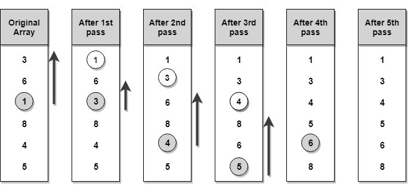

Selection Sort
==================

Selection sort is conceptually the most simplest sorting algorithm. This
algorithm will first find the **smallest** element in the array and swap it with
the element in the **first** position, then it will find the **second
smallest** element and swap it with the element in the **second** position, and
it will keep on doing this until the entire array is sorted.

**Step 1** − Set MIN to location 0

**Step 2** − Search the minimum element in the list

**Step 3** − Swap with value at location MIN

**Step 4** − Increment MIN to point to next element

**Step 5** − Repeat until list is sorted
