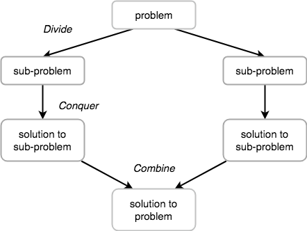
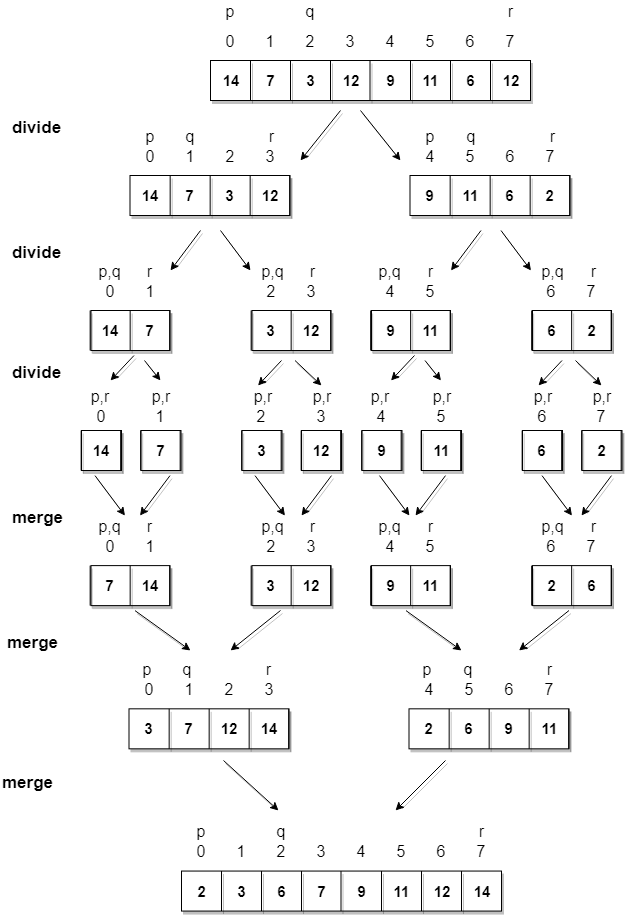

Merge Sort Algorithm
========================

Merge Sort follows the rule of **Divide and Conquer** to sort a given set of
numbers/elements, recursively, hence consuming less time.

<u>Divide and Conquer</u>

If we can break a single big problem into smaller sub-problems, solve the
smaller sub-problems and combine their solutions to find the solution for the
original big problem, it becomes easier to solve the whole problem.

**Algorithm**

Merge sort keeps on dividing the list into equal halves until it can no more be
divided. By definition, if it is only one element in the list, it is sorted.
Then, merge sort combines the smaller sorted lists keeping the new list sorted
too.

**Step 1** − if it is only one element in the list it is already sorted, return.

**Step 2** − divide the list recursively into two halves until it can no more be
divided.

**Step 3** − merge the smaller lists into new list in sorted order.
