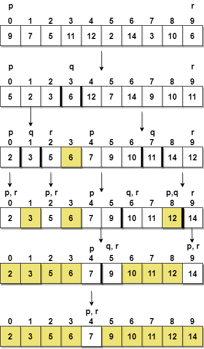

Quick Sort
==============

Quick sort is based on the divide-and-conquer approach based on the idea of
**choosing one element as a pivot element(normally height index value)** and
partitioning the array around it such that:

-   Left side of pivot contains all the elements that are less than the pivot
    element

-   Right side contains all elements greater than the pivot

**For example:** In the array {52, 37, 63, 14, 17, 8, 6, 25}, we
take 25 as **pivot**. So after the first pass, the list will be changed like
this.

{6 8 17 14 **25** 63 37 52}

Hence after the first pass, pivot will be set at its position, with all the
elements **smaller** to it on its left and all the elements **larger** than to
its right. Now 6 8 17 14 and 63 37 52 are considered as two separate subarrays,
and same recursive logic will be applied on them, and we will keep doing this
until the complete array is sorted.

**Step 1** − Choose the highest index value has pivot

**Step 2** − Take two variables to point left and right of the list excluding
pivot

**Step 3** − left points to the low index

**Step 4** − right points to the high

**Step 5** − while value at left is less than pivot move right

**Step 6** − while value at right is greater than pivot move left

**Step 7** − if both step 5 and step 6 does not match swap left and right

**Step 8** − if left ≥ right, the point where they met is new pivot
